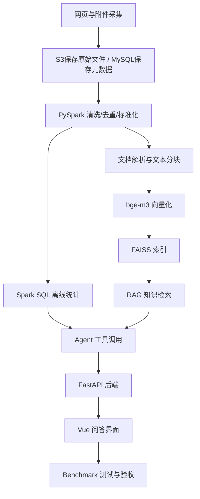

# 1.1 课程项目说明

### （一）项目简介

本课程以 **大数据智能问答系统开发** 为综合实践项目，面向数据科学与大数据技术专业学生。

项目不是若干独立实验的简单组合，而是一条连续的工程实践流程——前一阶段的输出作为后一阶段的输入，从数据采集、处理、检索到智能问答应用形成完整系统。



课程强调工程实现和系统集成，各模块通过统一的 `document_id` 和数据格式衔接。不要求搭建企业级平台或训练大语言模型。

------

### （二）项目目标

完成本项目后，学生应能够：

| # | 方向 | 核心能力 |
|---|------|---------|
| 1 | 数据采集 | 选择公开数据源，采集网页正文和附件信息 |
| 2 | 数据存储与大数据处理 | 使用 S3 保存原始文件、MySQL 管理元数据、PySpark 完成清洗和离线统计 |
| 3 | 知识库与 RAG | 解析多格式文档，完成文本分块、向量化和 FAISS 检索，实现有来源依据的智能问答 |
| 4 | Agent 与 Web 集成 | 使用 Agent 判断任务并调用工具，通过 FastAPI 和 Vue 完成前后端集成 |
| 5 | 测试与验收 | 使用统一 Benchmark 测试系统效果，完成报告和答辩 |

------

### （三）系统总体流程

系统分为 **数据构建** 和 **在线问答** 两条主线：

**数据构建**：网页与附件采集后，原始文件保存到 S3，结构化元数据写入 MySQL。PySpark 对网页记录进行离线清洗、去重、标准化和质量标记，Spark SQL 完成统计查询。清洗后的文档列表进入解析与分块流程，附件正文由文档解析程序独立提取。文本块经 `BAAI/bge-m3` 向量化后构建 FAISS 索引。

**在线问答**：用户通过 Vue 界面提交问题 → FastAPI 接收 → 判断任务类型。普通知识问题直接进入 RAG 检索 FAISS 并调用 DeepSeek 生成回答；统计、网页查询或附件任务由 Agent 选择对应的后端工具，Agent 需要知识时也可调用 RAG 检索。

```text
网页与附件采集
→ S3 保存原始文件、MySQL 保存元数据
→ PySpark 清洗网页记录
→ Spark SQL 离线统计
→ 文档解析与文本分块
→ bge-m3 向量化
→ FAISS 索引
→ FastAPI 接收问题
→ RAG 或 Agent 处理
→ DeepSeek 生成回答
→ Vue 展示答案、来源和附件
→ Benchmark 测试与验收
```

Spark SQL 离线统计结果写入 MySQL 或 Parquet，在线 Agent 不实时启动 Spark 任务。

------

### （四）主要模块

#### 1. 数据采集与存储

选择公开网站，采集网页正文和附件（PDF、Word、Excel 等）。网页 HTML 和附件保存到 S3 兼容对象存储，标题、时间、来源地址和附件元数据写入 MySQL。详见第 2 章和第 3 章。

#### 2. 大数据处理

PySpark 在本地模式下对网页记录进行去重、字段标准化、时间格式转换和数据质量标记，输出 Parquet。Spark SQL 完成栏目分布、发布时间和附件类型的离线统计。PySpark 不负责 PDF、Word 等附件的正文解析。详见 3.4 和 3.5。

#### 3. 知识库与 RAG

文档解析程序从 PySpark 输出中获取已清洗的文档列表，独立提取附件正文，经文本清洗和分块后，使用 `BAAI/bge-m3` 批量生成归一化向量，存入 FAISS `IndexFlatIP`。在线检索时，用户问题经同一模型向量化后执行 Top-K 检索，结果与问题组成提示词，通过 LangChain 调用 DeepSeek 生成带来源引用的回答。详见第 4 章。

#### 4. Agent 与 Web 系统

FastAPI 提供问答接口（`/api/qa`）和附件下载接口。普通知识问题直接执行 RAG；统计、网页和附件查询由 Agent 判断任务并顺序调用工具——RAG 检索工具也是 Agent 可用工具之一。前端选择 Vue 3 聊天开源项目二次开发，展示 Markdown 回答、来源卡片和附件下载按钮。详见第 5 章和第 6 章。

#### 5. 测试与验收

教师提供 JSONL 格式 Benchmark 文件（只含编号和问题），学生通过 FastAPI 接口批量运行，提交含答案、来源网址和附件文件名的结果文件。核心评价指标包括答案 F1、来源命中率、附件命中率和测试完成率。详见第 7 章。

------

### （五）项目成果

| 类别 | 主要内容 |
|------|---------|
| 数据成果 | 采集网页记录、原始附件、S3 存储目录、MySQL 数据、PySpark 清洗结果 |
| 程序成果 | 爬虫、PySpark/SQL、文档解析、向量化、FAISS、RAG/Agent、FastAPI、Vue、Benchmark 测试脚本 |
| 测试成果 | Benchmark 结果 JSONL、运行截图或日志 |
| 文档成果 | 课程设计报告、README 运行说明、答辩 PPT、任务分工表 |

课程考核比例为课堂测试 20%、实验报告 20%、综合设计大报告 60%。评价关注流程完整性、运行稳定性、数据规范和来源可追溯性。

------

### （六）本节任务

完成本节后，应明确：

- 项目的整体技术路线和模块关系；
- 各阶段输入、输出和衔接方式；
- 自己的兴趣方向和可能的任务分工；
- 后续各章节在本项目中的位置和作用。