# 1.2 系统整体流程

### （一）流程划分

大数据智能问答系统由 **数据构建流程** 和 **在线问答流程** 两部分组成。

- **数据构建流程**负责采集网页和附件，完成数据存储、清洗、解析、分块、向量化和索引构建。
- **在线问答流程**负责接收用户问题，判断任务类型，执行知识检索或工具调用，并返回答案、来源和附件信息。

数据构建流程生成的关系数据库、文档数据、文本块和 FAISS 索引，是在线问答流程运行的基础。

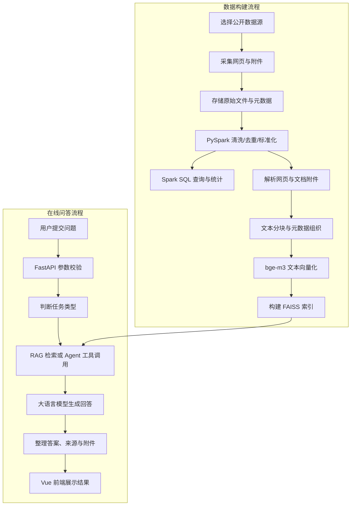

------

### （二）数据构建流程

#### 1. 数据源选择

项目首先选择公开、合法且具有实际问答价值的数据源。数据源可以来自教育网站、政策网站、行业网站、新闻网站或公开知识文档。

选择数据源时，应重点检查：

- 网站内容是否公开；
- 网页和附件是否可以正常访问；
- 数据是否具有一定规模；
- 内容是否适合构建问答系统；
- 是否包含 PDF、Word、Excel 等有价值的附件；
- 是否能够形成知识问答、数据统计和文件查询等任务。

#### 2. 网页与附件采集

采集程序访问栏目页和详情页，提取网页正文及附件信息。

主要采集内容包括：

- 文档标题；
- 发布时间；
- 所属栏目；
- 正文内容；
- 来源地址；
- 附件名称；
- 附件类型；
- 附件下载地址。

系统还需要处理分页请求、动态数据、重复记录、请求失败和附件下载异常。

每条文档记录应生成唯一的 `document_id`，用于关联数据库记录、对象存储文件、文本块和检索结果。

#### 3. 数据存储

采集完成后，根据数据类型分别进行存储。

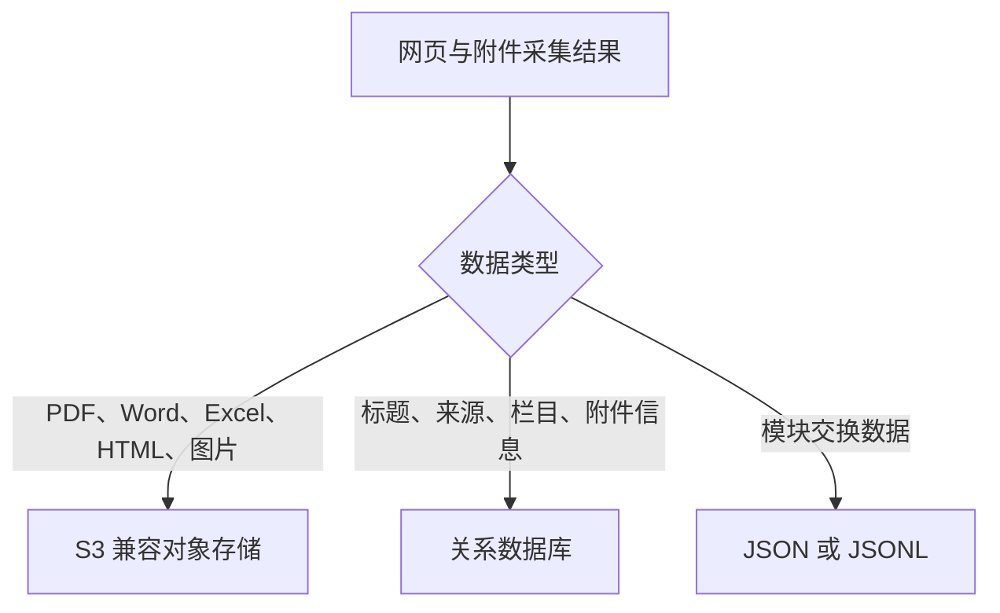

具体存储方式如下：

| 数据内容             | 存储位置        | 关联字段      |
| -------------------- | --------------- | ------------- |
| 网页快照和文档附件   | S3 兼容对象存储 | `object_key`  |
| 文档、来源和附件信息 | 关系数据库      | `document_id` |
| 采集结果和交换数据   | JSON 或 JSONL   | `document_id` |
| 清洗和统计结果       | Parquet         | `document_id` |
| 文本向量             | FAISS 索引      | `chunk_id`    |

关系数据库中的 `document_id` 和 `object_key` 应与对象存储中的文件保持对应，保证后续能够定位原始网页或附件。

#### 4. PySpark 清洗与转换

PySpark 读取采集结果，对数据进行统一清洗和转换。

主要处理内容包括：

- 删除重复记录；
- 处理缺失字段；
- 统一字段名称；
- 规范时间格式；
- 清理无效字符；
- 过滤异常记录；
- 输出 Parquet 数据。

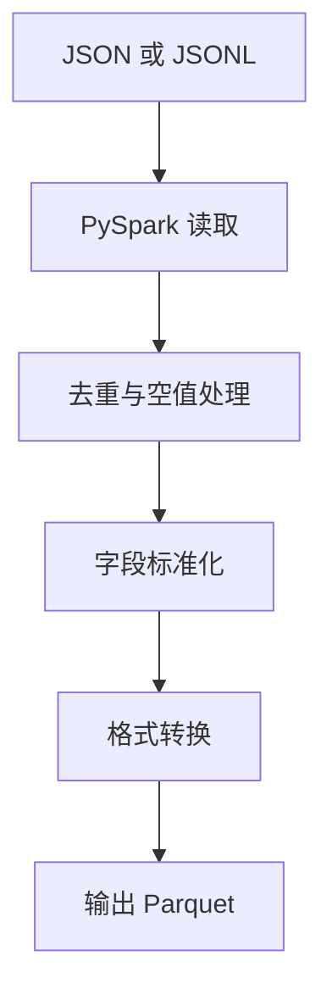

清洗后的网页数据应继续保留 `document_id`、`source_url` 和 `html_object_key`。附件文件路径保存在附件表或附件 JSONL 的 `object_key` 中，避免把网页 HTML 路径和附件对象路径混用。

PySpark 输出的 Parquet 数据是后续所有下游模块的统一数据来源：Spark SQL 基于它完成统计分析，文档解析模块基于它获取已去重和标准化的文档列表，从而保证进入知识库的每篇文档都经过了规范化处理。

#### 5. Spark SQL 查询与统计

将清洗后的数据注册为 Spark SQL 临时视图或数据表，完成数据查询和统计。

可统计的内容包括：

- 文档总数；
- 不同栏目和来源的文档数量；
- 不同时间范围内的发布数量；
- 不同附件类型的数量；
- 清洗前后的数据量变化；
- 重复记录和缺失字段数量。

统计结果既用于检查数据质量，也可以为 Agent 回答数量、时间和分布类问题提供数据依据。

#### 6. 文档解析与文本清洗

系统从 PySpark 输出的 Parquet 中读取已清洗的网页列表。网页正文优先使用清洗后的 `content` 字段；如需重新解析网页 HTML，可根据 `html_object_key` 从 S3 读取。PDF、Word、Excel 等附件应从附件表或附件 JSONL 中读取 `attachment_id`、`document_id`、`file_name` 和 `object_key`，再根据 `object_key` 从 S3 获取原始文件并解析正文。

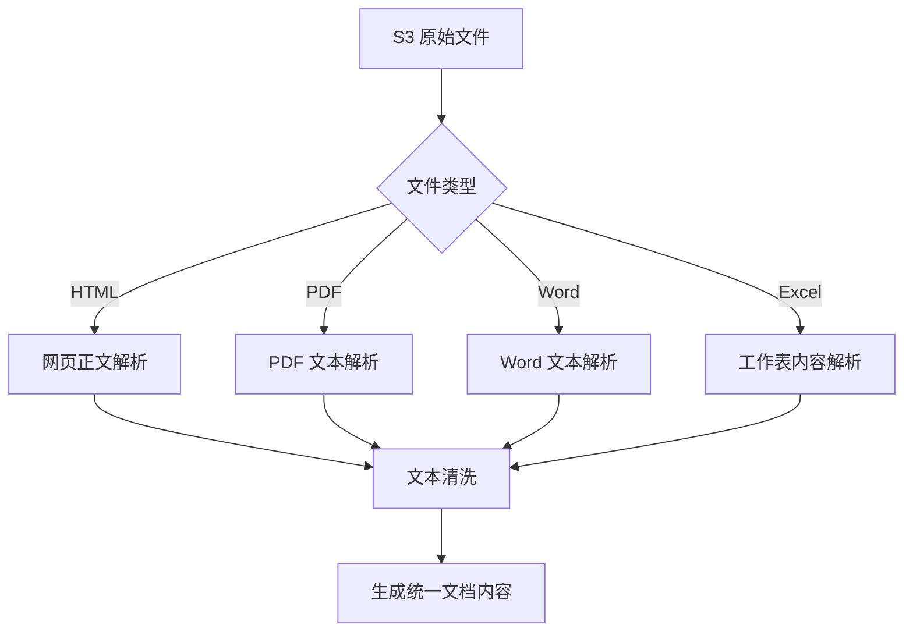

文本清洗主要包括：

- 删除 HTML 标签；
- 合并多余空格和换行；
- 清除乱码和无效字符；
- 去除重复页眉和页脚；
- 删除无意义的导航和广告内容。

解析结果写入统一的 `content` 字段。对于 PDF 和 Excel，可在 `metadata` 中保存页码或工作表名称。

#### 7. 文本分块与向量化

完整文档通常较长，需要切分为适合检索的文本块。

每个文本块应包含：

- `chunk_id`；
- `document_id`；
- `chunk_index`；
- `chunk_text`；
- `source_url`；
- `object_key`；
- 必要的来源元数据。

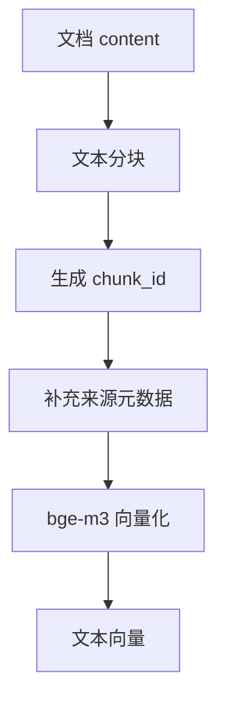

文本块可以保存为 JSONL，每行对应一个独立文本块，便于后续批量读取、向量化和索引构建。

#### 8. FAISS 索引构建

系统将文本向量写入 FAISS 索引，同时保存向量编号与 `chunk_id` 的映射关系。

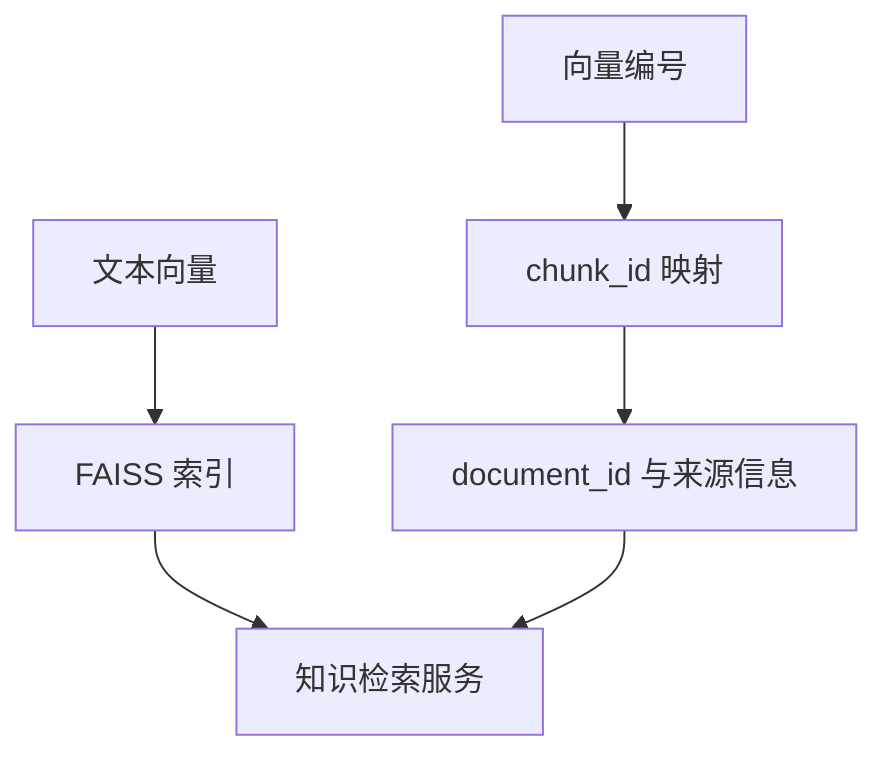

索引中的每个向量都必须能够追溯到对应文本块、原始文档、网页来源和附件文件。

------

### （三）在线问答流程

#### 1. 用户提交问题

用户通过 Vue 聊天界面提交问题，前端将问题和会话信息发送到 FastAPI 后端。

```json
{
  "session_id": "session_001",
  "question": "申请论文答辩需要提交哪些材料？",
  "use_agent": true,
  "top_k": 5
}
```

#### 2. 请求参数校验

FastAPI 接收请求后，检查：

- `question` 是否为空；
- `session_id` 是否有效；
- `use_agent` 是否允许自动判断任务；
- `top_k` 是否在允许范围内；
- 用户输入长度是否合理。

参数不符合要求时，系统应直接返回明确的错误信息，不继续执行后续流程。

#### 3. 任务类型判断

系统根据问题类型决定使用 RAG 或 Agent 工具。

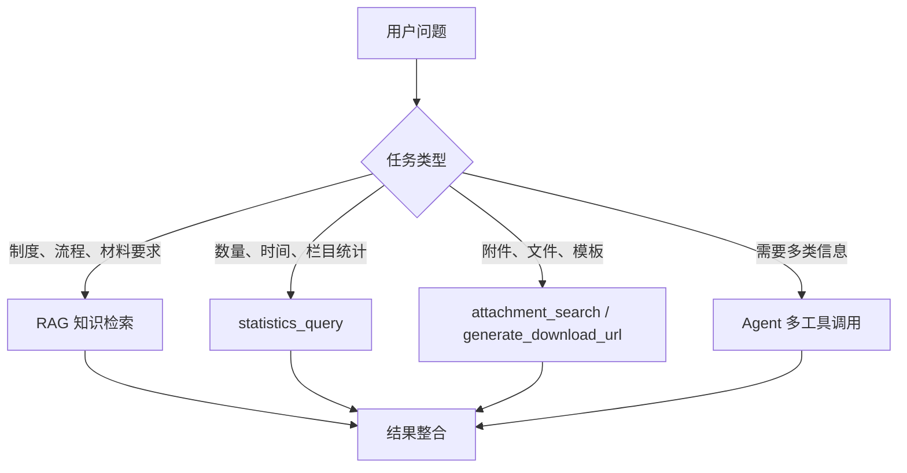

典型任务包括：

| 用户问题                   | 处理方式           |
| -------------------------- | ------------------ |
| 研究生奖学金如何申请？     | RAG 检索网页和附件 |
| 某段时间发布了多少条通知？ | `statistics_query` |
| 某个通知包含哪些附件？     | 附件查询工具       |
| 请提供申请表下载入口       | `attachment_search` 后调用 `generate_download_url` |
| 查询申请要求并提供对应模板 | Agent 多工具调用   |

#### 4. RAG 检索

知识问答任务进入 RAG 流程。

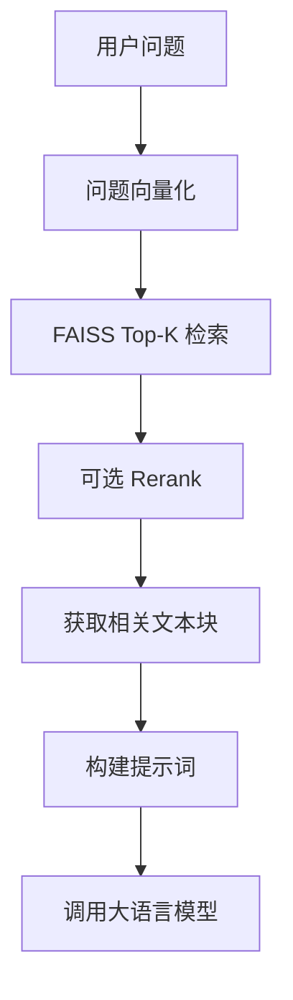

检索结果应包含：

- `chunk_id`；
- `document_id`；
- `chunk_text`；
- 检索得分；
- 文档标题；
- `source_url`；
- `object_key`；
- 附件名称、页码或工作表名称等元数据。

当检索结果缺少有效证据时，系统应说明无法从当前知识库中获得可靠答案。

#### 5. Agent 工具调用

对于结构化查询、统计分析、附件查询或综合任务，Agent 负责选择工具、构造参数并整合结果。

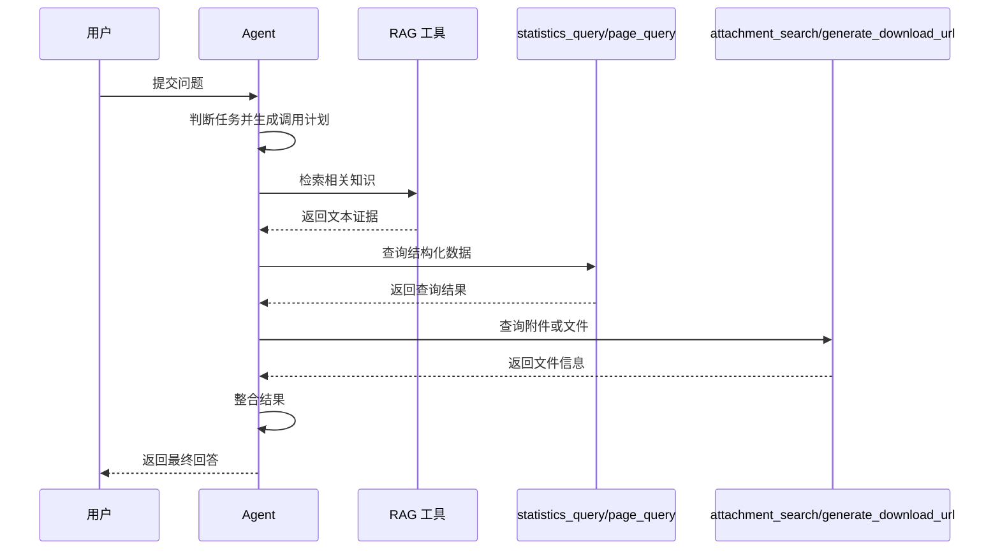

Agent 只负责调度工具，不替代知识检索、数据库查询和文件访问等具体能力。

#### 6. 模型生成与结果整理

系统将用户问题、检索证据和工具结果组合为提示词，再调用大语言模型生成回答。

FastAPI 对结果进行统一整理，返回：

- `answer`：回答正文；
- `sources`：来源列表（文件名、网址、页码和内容摘要）；
- `attachments`：附件列表（编号、名称和类型）；
- `session_id`：会话编号。

```json
{
  "status": "success",
  "question": "申请论文答辩需要提交哪些材料？",
  "answer": "申请论文答辩需要提交答辩申请表、论文评阅材料和相关审核文件。[资料1]",
  "sources": [
    {
      "source_no": 1,
      "document_id": "doc_0001",
      "file_name": "研究生论文答辩管理规定.pdf",
      "source_url": "https://example.edu.cn/info/1234.htm",
      "page_number": 3,
      "sheet_name": null,
      "content_preview": "申请人应提交答辩申请表、论文评阅材料……"
    }
  ],
  "attachments": [
    {
      "attachment_id": "att_0001",
      "file_name": "论文答辩申请表.docx",
      "file_type": "docx"
    }
  ],
  "session_id": "session_001"
}
```

#### 7. 前端展示

Vue 前端接收后端响应后，分别展示：

- Markdown 格式的回答；
- 文档标题和网页来源；
- 附件名称和下载入口；
- 工具调用状态；
- 加载状态和异常提示；
- 当前会话记录。

------

### （四）模块间数据流转

系统各模块之间通过统一数据格式连接。

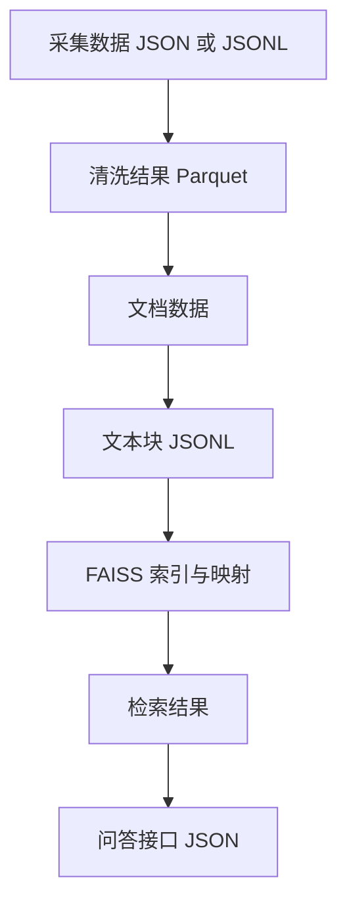

主要数据流转关系如下：

| 上游模块     | 输出                   | 下游模块            |
| ------------ | ---------------------- | ------------------- |
| 数据采集     | 网页、附件、JSON/JSONL | 数据存储与处理      |
| PySpark      | Parquet                | Spark SQL、文档解析 |
| 文档解析     | `content`              | 文本分块            |
| 文本分块     | 文本块 JSONL           | 向量化              |
| 向量化       | 文本向量               | FAISS               |
| FAISS        | Top-K 文本块           | RAG                 |
| RAG 或 Agent | 答案、来源、附件       | FastAPI             |
| FastAPI      | JSON 响应              | Vue 前端            |

任何阶段修改字段名称或数据格式，都需要同步调整后续程序，避免模块之间无法衔接。

------

### （五）系统实施顺序

项目应按照由基础数据到智能应用的顺序实施。

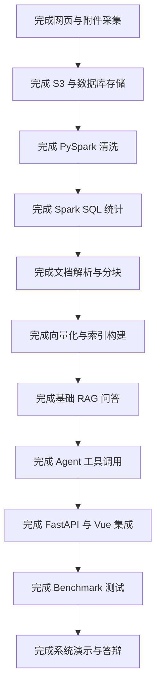

每完成一个阶段，都应保存输入数据、输出结果、运行日志和测试记录。前一阶段未通过测试时，不应直接进入下一阶段。

------

### （六）流程检查要求

系统整体流程应满足以下要求：

- 每个文档具有唯一的 `document_id`；
- 原始文件能够通过 `object_key` 在 S3 中定位；
- 数据库记录能够关联对应网页和附件；
- PySpark 输出能够被 Spark SQL 和文档解析程序读取；
- 每个文本块具有唯一的 `chunk_id`；
- 每个向量能够映射到对应文本块；
- 检索结果能够追溯到原始网页或附件；
- RAG 回答能够展示有效来源；
- Agent 能够选择正确工具并生成有效参数；
- FastAPI 返回结构与 Vue 前端解析结构一致；
- Benchmark 能够覆盖数据处理、知识检索、问答生成、工具调用和系统展示。

这些检查内容将作为后续实验测试和项目验收的主要依据。
