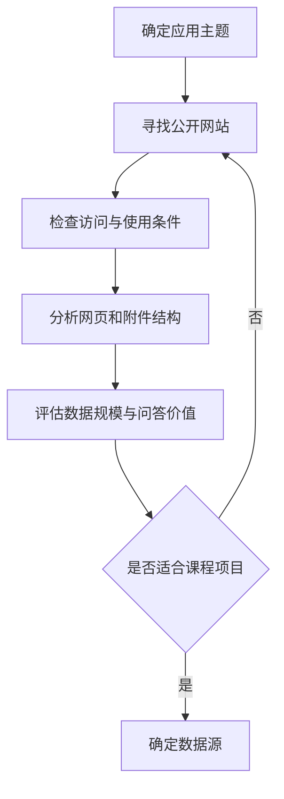
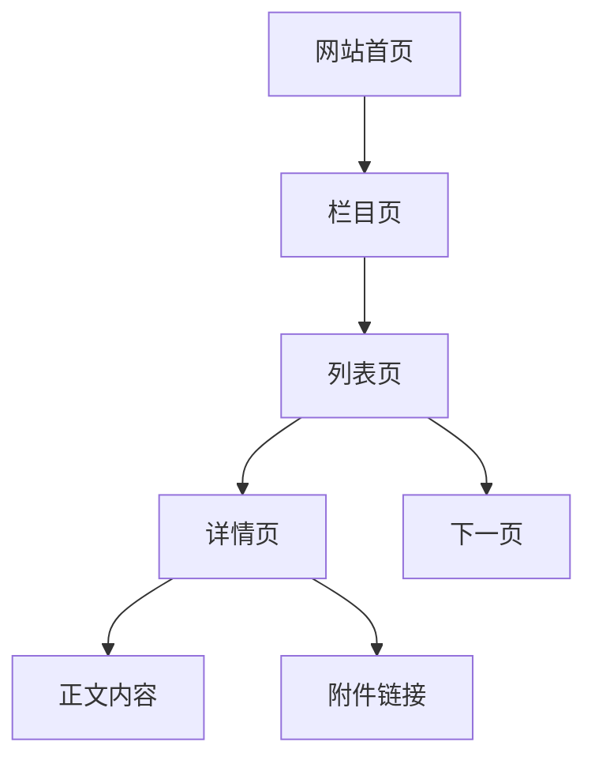

# 2.1 数据源选择

### （一）数据源选择目标

数据源是整个项目的起点。后续的数据采集、存储、Spark 处理、知识库构建和智能问答，都依赖数据源的质量。

本项目应选择 **公开、合法、结构清晰且具有问答价值** 的网站或文档资源。数据源不宜过于复杂，也不应只包含少量、重复或缺乏实际内容的数据。

合适的数据源通常应满足：

- 内容可以公开访问；
- 网页数量达到课程实践需要；
- 页面结构相对稳定；
- 正文内容具有明确主题；
- 包含标题、时间、栏目和来源地址等信息；
- 可以设计知识问答、数据统计或附件查询任务；
- 最好包含 PDF、Word、Excel 等附件；
- 不涉及个人隐私、账号权限和敏感数据。



------

### （二）应用主题选择

学生应先确定项目应用主题，再选择对应的数据源。

可选主题包括：

| 应用主题     | 可采集内容                         | 可设计的问题                 |
| ------------ | ---------------------------------- | ---------------------------- |
| 高校信息服务 | 通知、培养方案、奖助政策、答辩要求 | 申请条件、办理流程、材料下载 |
| 政策法规问答 | 政策文件、实施办法、解读材料       | 政策内容、适用范围、发布时间 |
| 行业新闻问答 | 新闻、公告、行业动态               | 最新消息、时间统计、主题分类 |
| 招聘信息问答 | 职位、单位、要求、截止时间         | 招聘条件、岗位数量、截止日期 |
| 科技文献问答 | 论文摘要、技术报告、研究资料       | 研究方法、主要结论、文献来源 |
| 农业知识问答 | 种植技术、病虫害、防治方法         | 技术措施、适用条件、注意事项 |
| 企业知识问答 | 规章制度、操作手册、培训资料       | 工作流程、岗位规范、文件查询 |

主题不宜过大。例如，“所有教育信息”范围过宽，可以缩小为“某高校研究生培养信息”或“某地区研究生招生政策”。

------

### （三）数据源基本要求

#### 1. 内容公开

数据应来自无需登录即可访问的公开页面或开放接口。

不应采集：

- 需要账号登录的数据；
- 涉及个人身份、联系方式等隐私信息；
- 明确禁止自动访问的内容；
- 未经许可的内部文件；
- 需要绕过安全验证才能获得的数据。

#### 2. 数据规模适中

数据量过少，无法体现 PySpark 清洗、统计和知识库检索过程；数据量过大，则会增加下载、存储和调试成本。

课程项目可根据网站规模选择一定数量的栏目、网页和附件，不要求采集整个网站。

建议至少包含：

- 多个栏目或数据分类；
- 一定数量的详情页；
- 不同发布时间的数据；
- 部分 PDF、Word 或 Excel 附件；
- 能够支持多种类型问题的数据内容。

具体采集数量可根据课程时间、设备条件和网站访问限制确定。

#### 3. 页面结构相对稳定

适合初学者的数据源通常具有：

- 明确的列表页；
- 固定的详情页链接；
- 稳定的标题和正文区域；
- 统一的发布时间格式；
- 清晰的附件链接；
- 较少的登录、验证码和复杂交互。

对于大量依赖 JavaScript 渲染、滑块验证或频繁变化的网站，不建议作为基础项目的数据源。

#### 4. 具有问答价值

数据不仅要能够采集，还应能够形成实际问题。

例如，一个高校研究生管理网站可以支持：

- 奖学金申请需要哪些材料？
- 论文答辩流程是什么？
- 最近发布了哪些培养通知？
- 某一时间段发布了多少条通知？
- 某个通知包含哪些附件？
- 申请表在哪里下载？

如果数据只能展示简单标题，正文信息很少，则不适合构建知识问答系统。

------

### （四）网页结构分析

确定候选数据源后，应先分析网站的页面结构。

常见页面包括：

- 栏目页；
- 列表页；
- 详情页；
- 分页页面；
- 附件下载页；
- 动态接口页面。



分析时应记录：

| 分析内容       | 示例                                   |
| -------------- | -------------------------------------- |
| 网站名称       | 某高校研究生院                         |
| 栏目名称       | 培养管理、学位管理、奖助管理           |
| 列表页地址     | `https://example.edu.cn/news/list.htm` |
| 详情页链接规则 | `/info/1001/1234.htm`                  |
| 标题位置       | `h1` 标签或指定 CSS 选择器             |
| 发布时间位置   | 页面标题下方                           |
| 正文位置       | `div.article-content`                  |
| 附件位置       | 正文中的文件链接                       |
| 分页方式       | 页码参数或下一页链接                   |
| 动态加载       | 否或接口地址                           |

这些信息将在 2.2 中用于编写网页请求和内容解析程序。

------

### （五）采集字段设计

选择数据源时，应同步确定需要采集的字段，避免后续不同模块使用不同数据格式。

网页数据至少应包含：

```json
{
  "document_id": "doc_0001",
  "title": "示例文档标题",
  "source_url": "https://example.edu.cn/info/1001/1234.htm",
  "category": "培养管理",
  "publish_time": "2026-06-20T09:00:00",
  "content": "网页正文内容",
  "attachments": [],
  "created_at": "2026-06-26T10:00:00",
  "metadata": {
    "source_name": "某高校研究生院"
  }
}
```

附件信息可以保存为：

```json
{
  "attachment_id": "att_0001",
  "document_id": "doc_0001",
  "file_name": "论文答辩申请表.docx",
  "file_type": "docx",
  "download_url": "https://example.edu.cn/files/application.docx",
  "object_key": null
}
```

其中：

- `document_id` 用于唯一标识网页或文档；
- `source_url` 保存原始网页地址；
- `attachments` 保存网页中的附件列表；
- `object_key` 在附件上传到 S3 后填写；
- `metadata` 用于保存网站名称、栏目等扩展信息。

------

### （六）数据源评估

正式采集前，可以使用下表对候选数据源进行评估。

| 评估项目         | 说明                         | 结果  |
| ---------------- | ---------------------------- | ----- |
| 内容是否公开     | 无需登录即可访问             | 是/否 |
| 数据是否合法     | 不涉及隐私和受限信息         | 是/否 |
| 页面结构是否稳定 | 列表页和详情页结构清晰       | 是/否 |
| 数据规模是否合适 | 能够支持清洗、统计和问答     | 是/否 |
| 正文是否完整     | 页面包含有效文本内容         | 是/否 |
| 是否包含附件     | 存在 PDF、Word、Excel 等文件 | 是/否 |
| 是否便于分页采集 | 页码或接口规则明确           | 是/否 |
| 是否具有问答价值 | 能设计知识、统计或文件问题   | 是/否 |
| 是否存在复杂验证 | 无频繁验证码或登录限制       | 是/否 |

若多数关键项目不满足要求，应更换数据源，而不是在复杂网站上投入过多时间。

### 

### （七）本节任务

完成本节后，应形成以下成果：

- 确定项目应用主题；
- 选择至少一个候选数据源；
- 检查数据的公开性和合法性；
- 分析栏目页、列表页、详情页和附件结构；
- 确定需要采集的字段；
- 设计网页与附件数据格式；
- 准备少量测试页面，供 2.2 编写爬虫程序使用。

本节完成后，应能够明确回答：

- 数据从哪里获取；
- 为什么选择该数据源；
- 需要采集哪些内容；
- 数据如何组织；
- 后续可以设计哪些问答和统计任务。