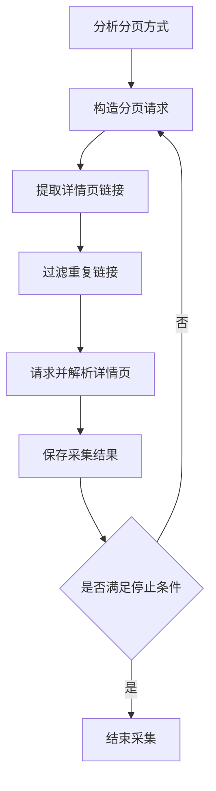
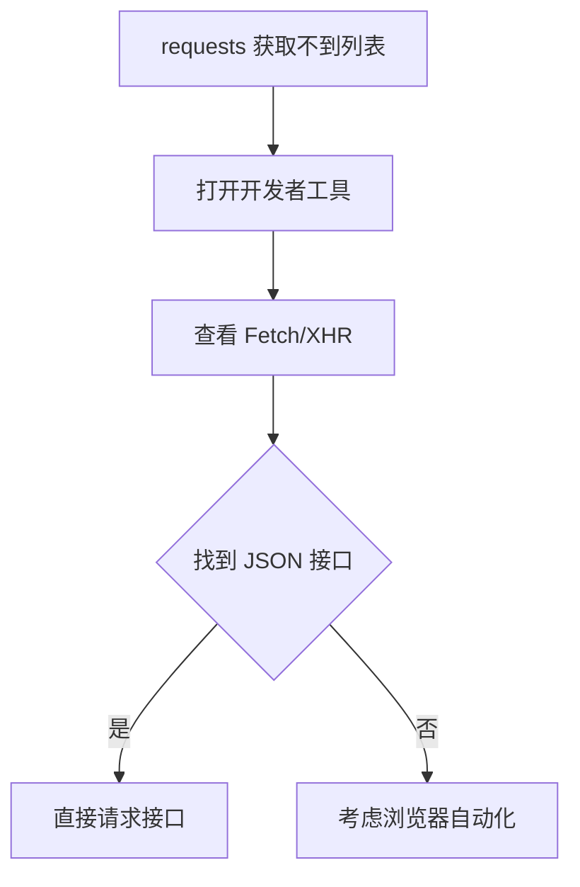

# 2.3 分页与动态数据采集

### （一）本节目标

网站数据通常分布在多个列表页中，部分页面还通过 JavaScript 动态加载内容。爬虫需要识别分页规则或数据接口，批量获取详情页地址，再调用 2.2 中的详情页解析函数提取正文和附件。

基本流程如下：



本节重点完成普通分页和 JSON 接口采集。对于必须执行 JavaScript 才能获取数据的页面，可将浏览器自动化作为扩展任务。

------

### （二）识别分页方式

常见分页方式包括：

| 分页方式         | 示例                           |
| ---------------- | ------------------------------ |
| 页码位于路径中   | `/list/2.htm`                  |
| 页码作为查询参数 | `/list?page=2`                 |
| 使用起始位置参数 | `/list?start=20&size=10`       |
| 下一页链接       | 页面中包含“下一页”按钮         |
| JSON 接口加载    | `/api/news?page=2&pageSize=20` |
| 滚动加载         | 页面滚动后继续请求数据         |

可以通过以下方法判断分页规则：

- 观察浏览器地址栏中的页码变化；
- 查看分页区域中的链接；
- 检查网页源代码；
- 使用浏览器开发者工具查看 `Fetch/XHR` 请求；
- 对比不同页面的请求参数和响应内容。

开始编码前，应记录分页地址、页码参数、每页数量和停止条件。

------

### （三）按页码采集

当分页地址具有固定规律时，可以循环构造列表页地址。

```python
def build_page_url(page: int) -> str:
    if page == 1:
        return "https://example.edu.cn/news/index.htm"

    return f"https://example.edu.cn/news/{page}.htm"
```

生成多个列表页地址：

```python
for page in range(1, 6):
    print(build_page_url(page))
```

如果页码使用查询参数，可以通过 `params` 传递：

```python
import requests

params = {
    "page": 2,
    "pageSize": 20
}

response = requests.get(
    "https://example.edu.cn/news/list",
    params=params,
    headers=HEADERS,
    timeout=10
)

response.raise_for_status()
```

页码范围可以手动配置，也可以从分页区域提取。

------

### （四）提取总页数

如果列表页中包含明确的页码，可以解析最大页码。

假设分页结构如下：

```html
<div class="pagination">
    <a href="1.htm">1</a>
    <a href="2.htm">2</a>
    <a href="10.htm">10</a>
</div>
```

解析函数如下：

```python
from bs4 import BeautifulSoup


def parse_total_pages(html: str) -> int:
    soup = BeautifulSoup(html, "lxml")
    page_numbers = []

    for node in soup.select(".pagination a"):
        text = node.get_text(strip=True)

        if text.isdigit():
            page_numbers.append(int(text))

    return max(page_numbers, default=1)
```

不同网站的分页结构不同，CSS 选择器应根据实际页面调整。

------

### （五）提取详情页链接

列表页只负责提取详情页入口，正文和附件继续使用 2.2 中的详情页解析函数处理。

```python
from urllib.parse import urljoin

from bs4 import BeautifulSoup


def parse_list_page(
    html: str,
    page_url: str
) -> list[dict]:
    soup = BeautifulSoup(html, "lxml")
    items = []

    for node in soup.select(".news-list li"):
        link_node = node.select_one("a[href]")
        time_node = node.select_one(".date")

        if link_node is None:
            continue

        items.append(
            {
                "title": link_node.get_text(" ", strip=True),
                "publish_time": (
                    time_node.get_text(strip=True)
                    if time_node
                    else ""
                ),
                "detail_url": urljoin(
                    page_url,
                    link_node.get("href", "")
                )
            }
        )

    return items
```

输出示例：

```json
[
  {
    "title": "研究生培养通知",
    "publish_time": "2026-06-20",
    "detail_url": "https://example.edu.cn/info/1001/1234.htm"
  }
]
```

------

### （六）链接去重与详情页采集

同一详情页可能出现在多个栏目或分页中。可以使用集合保存已经访问的地址。

```python
def crawl_pages(
    start_page: int,
    end_page: int
) -> list[dict]:
    results = []
    visited_urls = set()

    for page in range(start_page, end_page + 1):
        page_url = build_page_url(page)
        list_html = fetch_html(page_url)
        items = parse_list_page(list_html, page_url)

        for item in items:
            detail_url = item["detail_url"]

            if detail_url in visited_urls:
                continue

            visited_urls.add(detail_url)

            detail_html = fetch_html(detail_url)

            document_id = f"doc_{len(results) + 1:04d}"

            detail_data = parse_detail_page(
                url=detail_url,
                html=detail_html,
                document_id=document_id
            )

            results.append(detail_data)

    return results
```

`visited_urls` 只用于避免重复请求。正式的数据去重规则将在 2.4 中进一步完善。

------

### （七）跟随“下一页”链接

部分网站没有固定页码规律，只提供“下一页”按钮。

```python
from urllib.parse import urljoin

from bs4 import BeautifulSoup


def get_next_page(
    page_url: str,
    html: str
) -> str | None:
    soup = BeautifulSoup(html, "lxml")
    next_node = soup.select_one("a.next[href]")

    if next_node is None:
        return None

    return urljoin(
        page_url,
        next_node.get("href", "")
    )
```

循环采集时应设置最大页数，防止错误链接造成无限循环。

```python
page_url = "https://example.edu.cn/news/index.htm"
max_pages = 20
page_count = 0

while page_url and page_count < max_pages:
    html = fetch_html(page_url)
    items = parse_list_page(html, page_url)

    print("当前页面：", page_url)
    print("记录数量：", len(items))

    page_url = get_next_page(page_url, html)
    page_count += 1
```

------

### （八）识别动态数据接口

如果浏览器中能够看到列表数据，但使用 `requests` 获取的 HTML 中没有对应内容，页面可能通过 JavaScript 动态加载。

可以按照以下步骤分析：

1. 打开浏览器开发者工具；
2. 进入“网络”面板；
3. 刷新页面；
4. 筛选 `Fetch/XHR` 请求；
5. 查找返回新闻或通知数据的请求；
6. 记录请求地址、方法、参数和响应字段。



动态页面应优先查找其数据接口。直接请求 JSON 接口通常比浏览器自动化更简单、稳定。

------

### （九）请求 JSON 接口

假设页面通过以下接口加载数据：

```text
GET https://example.edu.cn/api/news?page=1&pageSize=20
```

请求函数如下：

```python
import requests


def fetch_api_page(
    page: int,
    page_size: int = 20
) -> dict:
    api_url = "https://example.edu.cn/api/news"

    params = {
        "page": page,
        "pageSize": page_size
    }

    response = requests.get(
        api_url,
        params=params,
        headers=HEADERS,
        timeout=10
    )

    response.raise_for_status()
    return response.json()
```

解析返回结果：

```python
data = fetch_api_page(page=1)

for item in data.get("records", []):
    print(item.get("title"))
    print(item.get("url"))
```

接口字段需要转换为项目统一格式。

```python
from urllib.parse import urljoin


def parse_api_records(
    data: dict,
    base_url: str
) -> list[dict]:
    items = []

    for item in data.get("records", []):
        items.append(
            {
                "title": item.get("title", ""),
                "publish_time": item.get("publishTime", ""),
                "detail_url": urljoin(
                    base_url,
                    item.get("url", "")
                )
            }
        )

    return items
```

------

### （十）处理 POST 接口

部分接口通过 POST 请求接收分页条件。

```python
def fetch_post_page(page: int) -> dict:
    api_url = "https://example.edu.cn/api/search"

    payload = {
        "page": page,
        "size": 20,
        "category": "notice"
    }

    response = requests.post(
        api_url,
        json=payload,
        headers=HEADERS,
        timeout=10
    )

    response.raise_for_status()
    return response.json()
```

如果接口使用表单数据，应将：

```python
json=payload
```

改为：

```python
data=payload
```

调用接口前，应确认：

- 请求地址；
- GET 或 POST 方法；
- 页码和每页数量参数；
- 请求体格式；
- 必要请求头；
- 返回数据结构。

需要登录、令牌或复杂验证的接口，不建议作为基础课程项目的数据源。

------

### （十一）浏览器自动化

当页面必须执行 JavaScript，且无法直接找到数据接口时，可以使用 Playwright 或 Selenium。

Playwright 示例：

```python
from playwright.sync_api import sync_playwright


def fetch_dynamic_html(url: str) -> str:
    with sync_playwright() as playwright:
        browser = playwright.chromium.launch(
            headless=True
        )

        page = browser.new_page()
        page.goto(
            url,
            wait_until="networkidle",
            timeout=30000
        )

        html = page.content()
        browser.close()

        return html
```

浏览器自动化资源消耗较大，调试难度也更高，因此只作为选做内容。基础项目优先选择普通 HTML 页面或可直接访问的 JSON 接口。

------

### （十二）请求频率与停止条件

批量采集时，应设置请求间隔。

```python
import random
import time

time.sleep(
    random.uniform(1.0, 2.0)
)
```

可以使用 `Session` 复用连接：

```python
import requests

session = requests.Session()
session.headers.update(HEADERS)

response = session.get(
    "https://example.edu.cn/news/list.htm",
    timeout=10
)
```

分页采集应设置明确的停止条件：

- 达到最大页数；
- 当前页没有数据；
- 没有下一页链接；
- 当前页与上一页内容重复；
- 数据时间早于设定范围；
- 接口返回 `hasNext=false`；
- 连续多个页面请求失败。

示例：

```python
if not items:
    print("当前页无数据，停止采集")
    break
```

------

### （十三）保存采集进度

批量采集可能因网络或程序异常中断。可以保存当前页码和已采集数量。

```python
import json
from pathlib import Path


def save_progress(
    current_page: int,
    collected_count: int
) -> None:
    progress = {
        "current_page": current_page,
        "collected_count": collected_count
    }

    path = Path("data/raw/crawl_progress.json")
    path.parent.mkdir(parents=True, exist_ok=True)

    with path.open("w", encoding="utf-8") as file:
        json.dump(
            progress,
            file,
            ensure_ascii=False,
            indent=2
        )
```

进度文件示例：

```json
{
  "current_page": 5,
  "collected_count": 83
}
```

重新运行时，可以读取该文件，从未完成的页码继续采集。

------

### （十四）采集结果保存

详情页解析结果继续使用 2.2 中的统一文档格式，并保存为 JSONL。

```json
{
  "document_id": "doc_0001",
  "title": "研究生培养通知",
  "source_url": "https://example.edu.cn/info/1001/1234.htm",
  "category": "培养管理",
  "publish_time": "2026-06-20",
  "content": "通知正文内容",
  "attachments": [],
  "created_at": "2026-06-26T10:00:00",
  "metadata": {
    "source_name": "示例网站",
    "list_page": 1
  }
}
```

建议在 `metadata` 中记录列表页页码或接口来源，便于后续检查数据来源和采集过程。

------

### （十五）结果检查

完成分页或动态采集后，应检查：

| 检查项目   | 检查要求                 |
| ---------- | ------------------------ |
| 分页规则   | 能够连续访问多个列表页   |
| 详情页链接 | 地址完整且可以访问       |
| 重复链接   | 同一地址不重复请求       |
| 停止条件   | 程序能够正常结束         |
| 动态接口   | 请求参数与响应字段正确   |
| 请求频率   | 设置合理的访问间隔       |
| 采集进度   | 中断后可以继续运行       |
| 输出格式   | 与 2.2 的 JSONL 格式一致 |
| 数据数量   | 与列表页实际记录基本一致 |

------

### （十六）本节任务

完成本节后，应形成以下成果：

- 识别目标网站的分页方式；
- 构造并请求多个列表页；
- 提取和补全详情页地址；
- 使用集合过滤重复链接；
- 调用 2.2 的详情页解析函数；
- 设置最大页数、请求间隔和停止条件；
- 分析至少一个动态页面或 JSON 接口；
- 使用 GET 或 POST 请求获取接口数据；
- 保存采集进度；
- 将详情页结果保存为 JSONL；
- 记录分页采集数量和测试结果。

浏览器自动化为选做内容，不作为基础要求。

本节输出的网页数据、详情页地址和附件信息，将用于 2.4 的数据去重与异常处理。