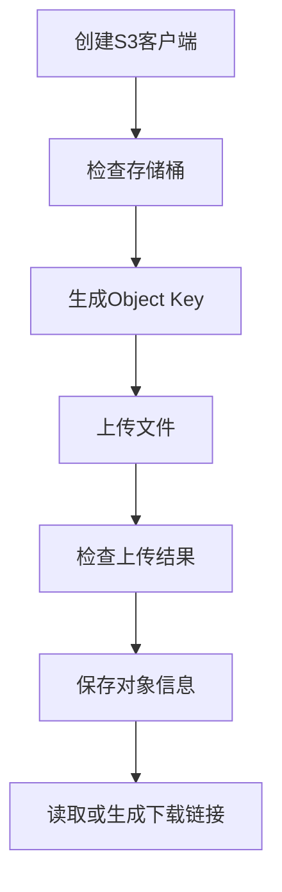
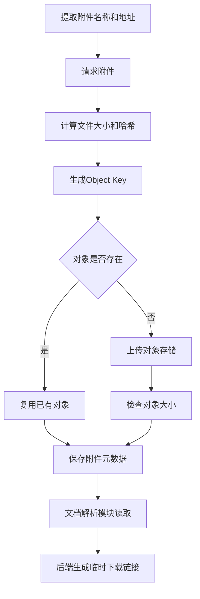

# 3.2 S3兼容对象存储

### （一）本节目标

S3兼容对象存储用于保存网页HTML、PDF、Word、Excel、图片、JSONL和Parquet等文件。

本项目可以使用MinIO，也可以连接其他支持S3接口的存储服务。程序通过统一接口完成：

- 创建和检查存储桶；
- 上传网页与附件；
- 读取和下载文件；
- 生成临时下载链接；
- 保存文件路径和元数据。



------

### （二）基本概念

S3对象存储包含三个主要概念。

| 概念       | 说明                     |
| ---------- | ------------------------ |
| Bucket     | 存储桶，用于保存一组对象 |
| Object     | 实际保存的文件或数据     |
| Object Key | 对象在存储桶中的唯一标识 |

例如：

```text
Bucket：bigdata-qa
Object Key：raw/attachments/pdf/2026/06/a8f32c.pdf
```

对象存储中的目录是逻辑目录。`Object Key`中的斜杠主要用于分类和展示，并不表示传统文件系统中的真实文件夹。

------

### （三）存储目录设计

项目统一使用一个存储桶，并按照数据类型和处理阶段组织文件。

```text
bigdata-qa/
├── raw/
│   ├── html/
│   └── attachments/
│       ├── pdf/
│       ├── word/
│       ├── excel/
│       └── other/
├── datasets/
│   ├── raw/
│   └── cleaned/
├── parsed/
├── indexes/
├── exports/
└── logs/
```

对象路径示例：

```text
raw/html/doc_0001.html
raw/attachments/pdf/2026/06/{file_hash}.pdf
datasets/raw/pages.jsonl
datasets/cleaned/pages.parquet
parsed/doc_0001.json
indexes/faiss.index
```

对象路径应保持稳定。附件可以使用文件哈希命名，原始文件名保存在关系数据库中。

------

### （四）连接配置

安装对象存储客户端：

```bash
pip install boto3 python-dotenv
```

在`.env`中保存连接信息：

```env
S3_ENDPOINT=http://localhost:9000
S3_ACCESS_KEY=your_access_key
S3_SECRET_KEY=your_secret_key
S3_BUCKET=bigdata-qa
S3_REGION=us-east-1
```

访问密钥不得直接写入代码，也不得上传到公共代码仓库。

------

### （五）创建S3客户端

```python
import os

import boto3
from dotenv import load_dotenv

load_dotenv()


def create_s3_client():
    return boto3.client(
        "s3",
        endpoint_url=os.getenv("S3_ENDPOINT"),
        aws_access_key_id=os.getenv("S3_ACCESS_KEY"),
        aws_secret_access_key=os.getenv("S3_SECRET_KEY"),
        region_name=os.getenv("S3_REGION", "us-east-1"),
    )


s3_client = create_s3_client()
bucket_name = os.getenv("S3_BUCKET", "bigdata-qa")
```

检查连接：

```python
response = s3_client.list_buckets()

for bucket in response.get("Buckets", []):
    print(bucket["Name"])
```

如果能够正常输出存储桶名称，说明客户端连接成功。

------

### （六）检查存储桶

上传文件前，应确认项目存储桶存在。

```python
from botocore.exceptions import ClientError


def ensure_bucket(
    client,
    bucket: str,
) -> None:
    try:
        client.head_bucket(Bucket=bucket)
        print("存储桶已存在：", bucket)

    except ClientError:
        client.create_bucket(Bucket=bucket)
        print("已创建存储桶：", bucket)
```

调用：

```python
ensure_bucket(
    client=s3_client,
    bucket=bucket_name,
)
```

实际项目中，存储桶也可以由教师或服务器管理员提前创建。

------

### （七）生成对象路径

对象路径应能够表示文件类型，同时避免文件重名。

```python
from datetime import datetime
from pathlib import Path


def build_attachment_key(
    file_name: str,
    file_hash: str,
) -> str:
    suffix = Path(file_name).suffix.lower()

    file_type = {
        ".pdf": "pdf",
        ".doc": "word",
        ".docx": "word",
        ".xls": "excel",
        ".xlsx": "excel",
    }.get(suffix, "other")

    now = datetime.now()

    return (
        f"raw/attachments/{file_type}/"
        f"{now:%Y/%m}/{file_hash}{suffix}"
    )
```

例如：

```text
raw/attachments/word/2026/06/a8f32c.docx
```

数据库中保存`object_key`，不保存本地临时路径。

------

### （八）上传本地文件

使用`upload_file()`上传本地文件。

```python
def upload_local_file(
    client,
    bucket: str,
    local_path: str,
    object_key: str,
    content_type: str,
) -> None:
    client.upload_file(
        Filename=local_path,
        Bucket=bucket,
        Key=object_key,
        ExtraArgs={
            "ContentType": content_type,
        },
    )
```

调用示例：

```python
upload_local_file(
    client=s3_client,
    bucket=bucket_name,
    local_path="data/sample.pdf",
    object_key="raw/attachments/pdf/sample.pdf",
    content_type="application/pdf",
)
```

`ContentType`用于说明文件类型，便于浏览器正确预览或下载。

------

### （九）直接上传字节数据

爬虫下载网页和附件后，可以直接将内存中的字节数据上传到对象存储，不必先保存为本地文件。

```python
from io import BytesIO


def upload_bytes(
    client,
    bucket: str,
    object_key: str,
    data: bytes,
    content_type: str,
) -> None:
    client.upload_fileobj(
        Fileobj=BytesIO(data),
        Bucket=bucket,
        Key=object_key,
        ExtraArgs={
            "ContentType": content_type,
        },
    )
```

上传附件：

```python
import requests

response = requests.get(
    attachment_url,
    timeout=20,
)
response.raise_for_status()

upload_bytes(
    client=s3_client,
    bucket=bucket_name,
    object_key=object_key,
    data=response.content,
    content_type=response.headers.get(
        "Content-Type",
        "application/octet-stream",
    ),
)
```

上传成功后，再将`bucket_name`和`object_key`写入数据库。

------

### （十）保存网页HTML

保存原始HTML可以在解析规则发生变化时重新处理网页，而不必再次请求目标网站。

```python
def upload_html(
    client,
    bucket: str,
    document_id: str,
    html: str,
) -> str:
    object_key = f"raw/html/{document_id}.html"

    upload_bytes(
        client=client,
        bucket=bucket,
        object_key=object_key,
        data=html.encode("utf-8"),
        content_type="text/html; charset=utf-8",
    )

    return object_key
```

调用示例：

```python
html_object_key = upload_html(
    client=s3_client,
    bucket=bucket_name,
    document_id="doc_0001",
    html=html,
)
```

网页记录中的`html_object_key`应保存该路径。

------

### （十一）检查和读取对象

上传前或上传后，可以检查对象是否存在。

```python
def object_exists(
    client,
    bucket: str,
    object_key: str,
) -> bool:
    try:
        client.head_object(
            Bucket=bucket,
            Key=object_key,
        )
        return True

    except ClientError:
        return False
```

读取对象内容：

```python
def read_object(
    client,
    bucket: str,
    object_key: str,
) -> bytes:
    response = client.get_object(
        Bucket=bucket,
        Key=object_key,
    )

    return response["Body"].read()
```

例如，文档解析模块可以直接读取PDF字节数据：

```python
file_bytes = read_object(
    client=s3_client,
    bucket=bucket_name,
    object_key="raw/attachments/pdf/sample.pdf",
)
```

------

### （十二）下载文件

需要将对象保存到本地时，可以使用：

```python
from pathlib import Path


def download_object(
    client,
    bucket: str,
    object_key: str,
    local_path: str,
) -> None:
    path = Path(local_path)
    path.parent.mkdir(
        parents=True,
        exist_ok=True,
    )

    client.download_file(
        Bucket=bucket,
        Key=object_key,
        Filename=str(path),
    )
```

调用示例：

```python
download_object(
    client=s3_client,
    bucket=bucket_name,
    object_key="raw/attachments/pdf/sample.pdf",
    local_path="data/downloads/sample.pdf",
)
```

------

### （十三）生成临时下载链接

对象存储桶可以设置为私有。用户需要下载附件时，由后端生成临时有效的预签名链接。

```python
def generate_download_url(
    client,
    bucket: str,
    object_key: str,
    expires_in: int = 600,
) -> str:
    return client.generate_presigned_url(
        ClientMethod="get_object",
        Params={
            "Bucket": bucket,
            "Key": object_key,
        },
        ExpiresIn=expires_in,
    )
```

调用示例：

```python
download_url = generate_download_url(
    client=s3_client,
    bucket=bucket_name,
    object_key="raw/attachments/pdf/sample.pdf",
    expires_in=600,
)
```

`600`表示链接在600秒内有效。

数据库不保存预签名链接。下载链接应在用户请求文件时实时生成。

------

### （十四）保存对象元数据

文件上传成功后，应将以下信息保存到关系数据库：

| 字段            | 说明         |
| --------------- | ------------ |
| `file_name`     | 原始文件名   |
| `file_type`     | 文件类型     |
| `file_size`     | 文件大小     |
| `file_hash`     | 文件哈希     |
| `content_type`  | MIME类型     |
| `bucket_name`   | 存储桶名称   |
| `object_key`    | 对象路径     |
| `source_url`    | 原始下载地址 |
| `upload_status` | 上传状态     |

示例：

```json
{
  "attachment_id": "att_0001",
  "document_id": "doc_0001",
  "file_name": "研究生答辩申请表.docx",
  "file_type": "docx",
  "file_size": 24576,
  "file_hash": "a8f32c...",
  "content_type": "application/vnd.openxmlformats-officedocument.wordprocessingml.document",
  "bucket_name": "bigdata-qa",
  "object_key": "raw/attachments/word/2026/06/a8f32c.docx",
  "source_url": "https://example.edu.cn/upload/form.docx",
  "upload_status": "uploaded"
}
```

数据库只保存文件定位信息，文件本体仍保存在对象存储中。

------

### （十五）文件完整性检查

上传前可以计算文件哈希：

```python
import hashlib


def calculate_sha256(data: bytes) -> str:
    return hashlib.sha256(data).hexdigest()
```

上传后可以检查文件大小：

```python
metadata = s3_client.head_object(
    Bucket=bucket_name,
    Key=object_key,
)

stored_size = metadata["ContentLength"]

if stored_size != len(file_bytes):
    raise ValueError("对象大小校验失败")
```

课程项目至少应检查：

- 文件内容不为空；
- 对象上传后能够查询到；
- 上传前后文件大小一致；
- 数据库中的`object_key`正确；
- 数据库状态与实际上传结果一致。

------

### （十六）异常处理

对象存储操作可能出现连接失败、认证失败、存储桶不存在和上传中断等异常。

```python
from botocore.exceptions import (
    BotoCoreError,
    ClientError,
)


def safe_upload(
    client,
    bucket: str,
    object_key: str,
    data: bytes,
    content_type: str,
) -> bool:
    try:
        upload_bytes(
            client=client,
            bucket=bucket,
            object_key=object_key,
            data=data,
            content_type=content_type,
        )
        return True

    except ClientError as exc:
        print("S3请求错误：", exc)

    except BotoCoreError as exc:
        print("S3客户端错误：", exc)

    return False
```

上传失败时：

- 记录对象路径和错误信息；
- 将数据库状态设置为`failed`；
- 不将附件标记为已上传；
- 后续可以重新执行失败任务。

------

### （十七）对象存储服务封装

为了避免爬虫、文档解析和后端重复编写连接代码，可以封装统一服务。

```python
class ObjectStorageService:

    def __init__(
        self,
        client,
        bucket_name: str,
    ):
        self.client = client
        self.bucket_name = bucket_name

    def upload(
        self,
        object_key: str,
        data: bytes,
        content_type: str,
    ) -> None:
        upload_bytes(
            client=self.client,
            bucket=self.bucket_name,
            object_key=object_key,
            data=data,
            content_type=content_type,
        )

    def read(
        self,
        object_key: str,
    ) -> bytes:
        return read_object(
            client=self.client,
            bucket=self.bucket_name,
            object_key=object_key,
        )

    def exists(
        self,
        object_key: str,
    ) -> bool:
        return object_exists(
            client=self.client,
            bucket=self.bucket_name,
            object_key=object_key,
        )

    def download_url(
        self,
        object_key: str,
        expires_in: int = 600,
    ) -> str:
        return generate_download_url(
            client=self.client,
            bucket=self.bucket_name,
            object_key=object_key,
            expires_in=expires_in,
        )
```

后续模块统一通过该服务访问对象存储。

------

### （十八）对象存储处理流程

以网页附件为例，完整流程如下：



同一附件被多个网页引用时，可以复用同一个对象，但应保留网页与附件之间的关联关系。

------

### （十九）本节任务

完成本节后，应形成以下成果：

- 配置S3兼容对象存储连接；
- 创建或检查项目存储桶；
- 建立统一的对象目录和命名规则；
- 上传网页HTML；
- 上传PDF、Word和Excel附件；
- 支持本地文件和字节数据上传；
- 检查对象是否存在；
- 读取和下载对象；
- 生成临时下载链接；
- 保存`bucket_name`、`object_key`和文件元数据；
- 检查对象大小和上传状态；
- 记录上传失败信息；
- 封装统一的对象存储服务；
- 完成至少一个网页及其附件的上传与下载测试。

完成本节后，系统应能够稳定保存网页、附件和数据文件，并为后续文档解析与附件下载提供统一的文件访问接口。