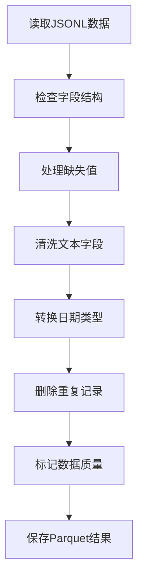

# 3.4 PySpark数据清洗与转换

### （一）本节目标

网络采集数据可能存在字段缺失、格式不统一、重复记录、正文空白和日期格式不一致等问题。

本节使用 PySpark DataFrame 对网页数据进行批量清洗，并将清洗结果保存为 Parquet，为后续 Spark SQL 统计和知识库构建提供规范数据。

基本流程如下：



------

### （二）创建Spark会话

课程项目采用本地模式运行 PySpark，不要求搭建 Spark 集群。

```python
from pyspark.sql import SparkSession

spark = (
    SparkSession.builder
    .appName("BigDataQACleaning")
    .master("local[*]")
    .getOrCreate()
)

spark.sparkContext.setLogLevel("WARN")

print("Spark版本：", spark.version)
```

`local[*]` 表示使用本机可用的 CPU 核心运行 Spark。

------

### （三）读取采集数据

爬虫程序输出的网页数据保存为 JSONL，可以直接使用 Spark 读取。

```python
pages_df = spark.read.json(
    "data/raw/pages.jsonl"
)
```

如果数据已经上传到 S3，也可以通过 `s3a://` 路径读取：

```python
pages_df = spark.read.json(
    "s3a://bigdata-qa/datasets/raw/pages.jsonl"
)
```

读取后先检查数据结构和样例：

```python
pages_df.printSchema()
pages_df.show(5, truncate=False)
```

预期字段包括：

```text
document_id
title
category
publish_time
content
source_url
content_hash
html_object_key
```

------

### （四）选择需要的字段

清洗前先保留后续处理需要的字段，避免无关数据增加处理难度。

```python
from pyspark.sql import functions as F

pages_df = pages_df.select(
    "document_id",
    "title",
    "category",
    "publish_time",
    "content",
    "source_url",
    "content_hash",
    "html_object_key"
)
```

如果原始数据缺少某些可选字段，可以在读取后补充默认值。

------

### （五）处理缺失值

`document_id`、标题和来源地址是必要字段。缺少这些字段的数据不能进入后续处理。

```python
pages_df = pages_df.filter(
    F.col("document_id").isNotNull()
    & F.col("title").isNotNull()
    & F.col("source_url").isNotNull()
)
```

普通字段可以填写默认值：

```python
pages_df = pages_df.fillna({
    "category": "未分类",
    "content": "",
    "html_object_key": ""
})
```

正文为空的数据不一定需要删除。例如，网页正文较少但包含附件时，仍可以用于附件查询。

------

### （六）清洗文本字段

网页文本中可能包含多余空格、换行符和残留 HTML 标签。

```python
pages_df = (
    pages_df
    .withColumn(
        "title",
        F.trim(
            F.regexp_replace(
                F.col("title"),
                r"\s+",
                " "
            )
        )
    )
    .withColumn(
        "content",
        F.trim(
            F.regexp_replace(
                F.coalesce(
                    F.col("content"),
                    F.lit("")
                ),
                r"\s+",
                " "
            )
        )
    )
)
```

清理残留 HTML 标签：

```python
pages_df = pages_df.withColumn(
    "content",
    F.regexp_replace(
        F.col("content"),
        r"<[^>]+>",
        ""
    )
)
```

完整 HTML 解析应在爬虫阶段完成，PySpark 主要用于清理残留标签和空白字符。

------

### （七）统一时间格式

网页发布时间通常以字符串保存，需要转换为时间类型。

```python
pages_df = pages_df.withColumn(
    "publish_time",
    F.coalesce(
        F.to_timestamp(
            F.col("publish_time"),
            "yyyy-MM-dd HH:mm:ss"
        ),
        F.to_timestamp(
            F.col("publish_time"),
            "yyyy-MM-dd"
        ),
        F.to_timestamp(
            F.col("publish_time"),
            "yyyy年MM月dd日"
        )
    )
)
```

无法转换的时间会变为 `null`，可以在数据质量检查中单独统计。

------

### （八）删除重复记录

优先使用 `document_id` 删除重复记录：

```python
pages_df = pages_df.dropDuplicates([
    "document_id"
])
```

如果需要识别不同地址下的相同内容，可以使用 `content_hash` 去重：

```python
pages_df = pages_df.dropDuplicates([
    "content_hash"
])
```

如果原始数据中没有 `content_hash`，可以在 Spark 中生成：

```python
pages_df = pages_df.withColumn(
    "content_hash",
    F.sha2(
        F.concat_ws(
            "|",
            F.coalesce(
                F.col("title"),
                F.lit("")
            ),
            F.coalesce(
                F.col("publish_time").cast("string"),
                F.lit("")
            ),
            F.coalesce(
                F.col("content"),
                F.lit("")
            )
        ),
        256
    )
)
```

课程项目可先根据 `document_id` 去重，再使用 `content_hash` 检查内容重复。

------

### （九）增加数据质量字段

可以计算正文长度，用于判断数据是否适合进入知识库。

```python
pages_df = pages_df.withColumn(
    "content_length",
    F.length(
        F.col("content")
    )
)
```

增加数据质量状态：

```python
pages_df = pages_df.withColumn(
    "data_status",
    F.when(
        F.trim(F.col("title")) == "",
        "missing_title"
    ).when(
        F.col("publish_time").isNull(),
        "invalid_time"
    ).when(
        F.col("content_length") == 0,
        "empty_content"
    ).when(
        F.col("content_length") < 20,
        "short_content"
    ).otherwise(
        "valid"
    )
)
```

状态说明：

| 状态            | 含义             |
| --------------- | ---------------- |
| `valid`         | 数据基本完整     |
| `missing_title` | 标题为空         |
| `invalid_time`  | 发布时间无法转换 |
| `empty_content` | 正文为空         |
| `short_content` | 正文过短         |

正文为空或过短的数据不直接删除，可以保留供人工检查或附件查询使用。

------

### （十）拆分有效与异常数据

根据 `data_status` 将数据分为有效数据和异常数据。

```python
valid_df = pages_df.filter(
    F.col("data_status") == "valid"
)

invalid_df = pages_df.filter(
    F.col("data_status") != "valid"
)
```

异常数据应保留 `document_id`、标题、来源地址和异常状态，便于后续检查。

```python
invalid_df.select(
    "document_id",
    "title",
    "source_url",
    "data_status"
).show(truncate=False)
```

------

### （十一）保存Parquet结果

清洗结果使用 Parquet 格式保存。

保存到本地目录：

```python
valid_df.write.mode("overwrite").parquet(
    "data/cleaned/pages"
)

invalid_df.write.mode("overwrite").parquet(
    "data/cleaned/invalid_pages"
)
```

也可以直接写入 S3：

```python
valid_df.write.mode("overwrite").parquet(
    "s3a://bigdata-qa/datasets/cleaned/pages"
)

invalid_df.write.mode("overwrite").parquet(
    "s3a://bigdata-qa/datasets/cleaned/invalid_pages"
)
```

Parquet 文件将作为 3.5 Spark SQL 查询和统计的输入。

------

### （十二）数据质量统计

清洗完成后，应统计清洗前后的数据数量。

```python
summary_df = pages_df.agg(
    F.count("*").alias("total_count"),
    F.sum(
        F.when(
            F.col("data_status") == "valid",
            1
        ).otherwise(0)
    ).alias("valid_count"),
    F.sum(
        F.when(
            F.col("data_status") != "valid",
            1
        ).otherwise(0)
    ).alias("invalid_count")
)

summary_df.show()
```

还可以统计不同异常类型的数量：

```python
pages_df.groupBy(
    "data_status"
).count().show()
```

建议记录以下指标：

| 指标         | 说明                     |
| ------------ | ------------------------ |
| 原始记录数   | 清洗前的网页数量         |
| 有效记录数   | 状态为 `valid` 的数量    |
| 异常记录数   | 存在缺失或格式问题的数量 |
| 重复记录数   | 去重前后减少的数量       |
| 空正文数量   | 正文为空的数量           |
| 日期异常数量 | 发布时间转换失败的数量   |

------

### （十三）完整清洗程序

```python
from pyspark.sql import SparkSession
from pyspark.sql import functions as F


spark = (
    SparkSession.builder
    .appName("BigDataQACleaning")
    .master("local[*]")
    .getOrCreate()
)

spark.sparkContext.setLogLevel("WARN")

pages_df = spark.read.json(
    "data/raw/pages.jsonl"
)

raw_count = pages_df.count()

cleaned_df = (
    pages_df
    .select(
        "document_id",
        "title",
        "category",
        "publish_time",
        "content",
        "source_url",
        "content_hash",
        "html_object_key"
    )
    .filter(
        F.col("document_id").isNotNull()
        & F.col("title").isNotNull()
        & F.col("source_url").isNotNull()
    )
    .fillna({
        "category": "未分类",
        "content": "",
        "html_object_key": ""
    })
    .withColumn(
        "title",
        F.trim(
            F.regexp_replace(
                F.col("title"),
                r"\s+",
                " "
            )
        )
    )
    .withColumn(
        "content",
        F.trim(
            F.regexp_replace(
                F.col("content"),
                r"\s+",
                " "
            )
        )
    )
    .withColumn(
        "content",
        F.regexp_replace(
            F.col("content"),
            r"<[^>]+>",
            ""
        )
    )
    .withColumn(
        "publish_time",
        F.coalesce(
            F.to_timestamp(
                F.col("publish_time"),
                "yyyy-MM-dd HH:mm:ss"
            ),
            F.to_timestamp(
                F.col("publish_time"),
                "yyyy-MM-dd"
            ),
            F.to_timestamp(
                F.col("publish_time"),
                "yyyy年MM月dd日"
            )
        )
    )
    .dropDuplicates([
        "document_id"
    ])
    .withColumn(
        "content_length",
        F.length(
            F.col("content")
        )
    )
    .withColumn(
        "data_status",
        F.when(
            F.trim(F.col("title")) == "",
            "missing_title"
        ).when(
            F.col("publish_time").isNull(),
            "invalid_time"
        ).when(
            F.col("content_length") == 0,
            "empty_content"
        ).when(
            F.col("content_length") < 20,
            "short_content"
        ).otherwise(
            "valid"
        )
    )
)

valid_df = cleaned_df.filter(
    F.col("data_status") == "valid"
)

invalid_df = cleaned_df.filter(
    F.col("data_status") != "valid"
)

valid_df.write.mode("overwrite").parquet(
    "data/cleaned/pages"
)

invalid_df.write.mode("overwrite").parquet(
    "data/cleaned/invalid_pages"
)

print("原始数据量：", raw_count)
print("有效数据量：", valid_df.count())
print("异常数据量：", invalid_df.count())

spark.stop()
```

------

### （十四）结果检查

完成清洗后，应检查：

- 标题和来源地址是否为空；
- 正文中的多余空格和 HTML 标签是否清除；
- 发布时间是否转换成功；
- `document_id` 是否唯一；
- 有效数据和异常数据是否正确分类；
- Parquet 文件是否能够重新读取；
- 清洗后的记录是否保留 `source_url` 和 `html_object_key`。

重新读取 Parquet 进行验证：

```python
result_df = spark.read.parquet(
    "data/cleaned/pages"
)

result_df.printSchema()
result_df.show(5, truncate=False)
```

------

### （十五）PySpark 输出的下游用途

PySpark 清洗后的 Parquet 数据是本项目的统一规范数据源，服务于两条下游管线：

| 下游模块            | 读取来源                  | 主要用途                     |
| ------------------- | ------------------------- | ---------------------------- |
| Spark SQL 统计(3.5) | `cleaned/pages.parquet`   | 数量、栏目、时间和附件统计   |
| 文档解析与知识库(4.1) | `cleaned/pages.parquet` | 获取已去重、标准化的文档列表 |

文档解析模块直接读取 PySpark 输出的规范数据，而非爬虫原始 JSONL。这保证进入 RAG 知识库的每一篇文档都已完成去重、字段标准化和质量标记。

------

### （十六）本节任务

完成本节后，应形成以下成果：

- 创建本地 Spark 会话；
- 读取网页 JSONL 数据；
- 检查字段结构和数据样例；
- 处理关键字段缺失；
- 清洗标题和正文；
- 统一发布时间格式；
- 删除重复网页记录；
- 计算正文长度；
- 标记有效和异常数据；
- 将清洗结果保存为 Parquet；
- 统计清洗前后的数据数量；
- 保存 PySpark 程序、Parquet 结果和运行截图。

完成本节后，应获得字段统一、来源完整、能够支持 Spark SQL 分析和知识库构建的网页数据。