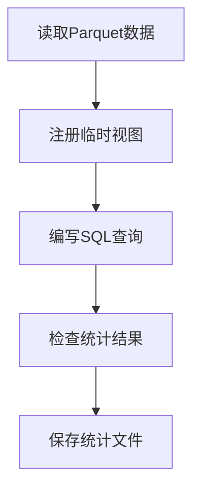

# 3.5 Spark SQL查询与统计

### （一）本节目标

Spark SQL 可以使用 SQL 语句查询 DataFrame，适合完成网页数量、栏目分布、发布时间、附件类型和数据质量等统计任务。

本节读取 3.4 生成的 Parquet 数据，注册临时视图，完成常用统计，并将结果保存为 Parquet 或 CSV。



------

### （二）读取清洗数据

创建 Spark 会话并读取上一节生成的数据：

```python
from pyspark.sql import SparkSession

spark = (
    SparkSession.builder
    .appName("BigDataQASQL")
    .master("local[*]")
    .getOrCreate()
)

spark.sparkContext.setLogLevel("WARN")

pages_df = spark.read.parquet(
    "data/cleaned/pages"
)

pages_df.printSchema()
pages_df.show(5, truncate=False)
```

如果附件数据需要统计分析，可以从爬虫输出的附件 JSONL 或 MySQL 数据库读取：

```python
attachments_df = spark.read.json(
    "data/raw/attachments.jsonl"
)
# 或从 MySQL 读取
attachments_df = spark.read.jdbc(
    url=jdbc_url,
    table="attachment",
    properties=connection_properties
)
```

数据存储在 S3 时，可以使用：

```python
pages_df = spark.read.parquet(
    "s3a://bigdata-qa/datasets/cleaned/pages"
)
```

------

### （三）注册临时视图

DataFrame 注册为临时视图后，可以使用 SQL 查询。

```python
pages_df.createOrReplaceTempView(
    "pages_cleaned"
)
```

存在附件数据时：

```python
attachments_df.createOrReplaceTempView(
    "attachments_view"
)
```

临时视图只在当前 Spark 会话中有效，不会创建真实数据库表。

------

### （四）网页基础统计

统计网页总数：

```python
spark.sql("""
    SELECT COUNT(*) AS page_count
    FROM pages_cleaned
""").show()
```

统计正文有效的网页数量：

```python
spark.sql("""
    SELECT COUNT(*) AS content_count
    FROM pages_cleaned
    WHERE content IS NOT NULL
      AND LENGTH(TRIM(content)) > 0
""").show()
```

统计正文平均长度：

```python
spark.sql("""
    SELECT
        ROUND(AVG(content_length), 2)
            AS avg_content_length
    FROM pages_cleaned
""").show()
```

------

### （五）栏目分布统计

统计每个栏目的网页数量：

```python
category_df = spark.sql("""
    SELECT
        COALESCE(category, '未分类') AS category,
        COUNT(*) AS page_count
    FROM pages_cleaned
    GROUP BY COALESCE(category, '未分类')
    ORDER BY page_count DESC
""")

category_df.show()
```

该结果可以用于分析不同栏目的数据规模，也可以作为系统统计页面的数据来源。

------

### （六）发布时间统计

按年份统计网页数量：

```python
spark.sql("""
    SELECT
        YEAR(publish_time) AS publish_year,
        COUNT(*) AS page_count
    FROM pages_cleaned
    WHERE publish_time IS NOT NULL
    GROUP BY YEAR(publish_time)
    ORDER BY publish_year
""").show()
```

按月份统计网页数量：

```python
monthly_df = spark.sql("""
    SELECT
        DATE_FORMAT(
            publish_time,
            'yyyy-MM'
        ) AS publish_month,
        COUNT(*) AS page_count
    FROM pages_cleaned
    WHERE publish_time IS NOT NULL
    GROUP BY DATE_FORMAT(
        publish_time,
        'yyyy-MM'
    )
    ORDER BY publish_month
""")

monthly_df.show()
```

时间统计可以用于回答"某月发布了多少条通知"等问题。

------

### （七）数据质量统计

统计不同数据状态的记录数量：

```python
quality_df = spark.sql("""
    SELECT
        data_status,
        COUNT(*) AS record_count
    FROM pages_cleaned
    GROUP BY data_status
    ORDER BY record_count DESC
""")

quality_df.show()
```

统计常见字段问题：

```python
spark.sql("""
    SELECT
        SUM(
            CASE
                WHEN title IS NULL
                  OR TRIM(title) = ''
                THEN 1 ELSE 0
            END
        ) AS missing_title_count,

        SUM(
            CASE
                WHEN content IS NULL
                  OR TRIM(content) = ''
                THEN 1 ELSE 0
            END
        ) AS empty_content_count,

        SUM(
            CASE
                WHEN publish_time IS NULL
                THEN 1 ELSE 0
            END
        ) AS invalid_time_count
    FROM pages_cleaned
""").show()
```

异常统计用于检查 3.4 的清洗结果是否符合预期。

------

### （八）附件类型统计

如果附件数据包含以下字段：

```text
attachment_id
document_id
file_name
file_type
file_size
object_key
status
```

可以统计不同附件类型的数量：

```python
file_type_df = spark.sql("""
    SELECT
        COALESCE(file_type, 'unknown') AS file_type,
        COUNT(*) AS file_count
    FROM attachments_view
    GROUP BY COALESCE(file_type, 'unknown')
    ORDER BY file_count DESC
""")

file_type_df.show()
```

统计附件总大小：

```python
spark.sql("""
    SELECT
        file_type,
        COUNT(*) AS file_count,
        ROUND(
            SUM(file_size) / 1024 / 1024,
            2
        ) AS total_size_mb
    FROM attachments_view
    WHERE file_size IS NOT NULL
    GROUP BY file_type
    ORDER BY file_count DESC
""").show()
```

------

### （九）网页与附件关联查询

当前项目使用 `document_id` 关联网页和附件，不需要单独的关联表。

查询每个网页的附件数量：

```python
spark.sql("""
    SELECT
        p.document_id,
        p.title,
        COUNT(a.attachment_id) AS attachment_count
    FROM pages_cleaned p
    LEFT JOIN attachments_view a
        ON p.document_id = a.document_id
    GROUP BY
        p.document_id,
        p.title
    ORDER BY attachment_count DESC
""").show(truncate=False)
```

查询网页及其附件明细：

```python
spark.sql("""
    SELECT
        p.title,
        p.source_url,
        a.file_name,
        a.file_type,
        a.object_key
    FROM pages_cleaned p
    JOIN attachments_view a
        ON p.document_id = a.document_id
    ORDER BY p.publish_time DESC
""").show(truncate=False)
```

该查询结果可以用于前端展示来源和附件列表。

------

### （十）关键词查询

可以使用 `LIKE` 对标题和正文进行基础关键词查询。

```python
spark.sql("""
    SELECT
        title,
        category,
        publish_time,
        source_url
    FROM pages_cleaned
    WHERE title LIKE '%奖学金%'
       OR content LIKE '%奖学金%'
    ORDER BY publish_time DESC
""").show(truncate=False)
```

Spark SQL 的关键词查询适合结构化筛选，不替代后续 RAG 的向量语义检索。

------

### （十一）查询最新网页

查询最新发布的 10 条网页：

```python
latest_df = spark.sql("""
    SELECT
        title,
        category,
        publish_time,
        source_url
    FROM pages_cleaned
    WHERE publish_time IS NOT NULL
    ORDER BY publish_time DESC
    LIMIT 10
""")

latest_df.show(truncate=False)
```

查询某个栏目的最新网页：

```python
spark.sql("""
    SELECT
        title,
        publish_time,
        source_url
    FROM pages_cleaned
    WHERE category = '培养管理'
    ORDER BY publish_time DESC
    LIMIT 5
""").show(truncate=False)
```

这些查询可以作为后续 Agent 数据查询工具的基础。

------

### （十二）时间范围统计

统计指定年份各栏目的网页数量：

```python
spark.sql("""
    SELECT
        category,
        COUNT(*) AS page_count
    FROM pages_cleaned
    WHERE YEAR(publish_time) = 2026
    GROUP BY category
    ORDER BY page_count DESC
""").show()
```

统计指定时间范围内的网页数量：

```python
spark.sql("""
    SELECT COUNT(*) AS page_count
    FROM pages_cleaned
    WHERE publish_time >= '2026-01-01'
      AND publish_time < '2026-07-01'
""").show()
```

------

### （十三）保存统计结果

可以将统计结果保存为 Parquet 或 CSV：

```python
category_df.write.mode("overwrite").parquet(
    "data/stats/category_stats"
)

monthly_df.write.mode("overwrite").csv(
    "data/stats/monthly_stats",
    header=True
)
```

------

### （十四）统计结果供Agent使用

本章的统计查询结果需要包装为 `{"success": true, "data": {...}}` 格式，供第5章 Agent 的 `statistics_query` 工具调用。

可以在后端实现一个轻量 `statistics_service`：

- 从 MySQL 或 Parquet 中读取预计算的统计结果；
- 根据 `stat_type`（total_count / category_count / time_range）返回对应数据；
- 不允许 Agent 直接执行 SQL，所有查询必须经过 service 层。

具体工具定义见 **5.2（六）统计查询工具**。

------

### （十五）结果检查

完成统计后，应检查：

- 统计数量是否与 3.4 的清洗结果一致；
- 栏目和时间分组是否完整；
- 附件类型是否覆盖了所有文件；
- 关键词查询是否返回预期结果；
- 时间范围查询是否正确。

------

### （十六）本节任务

完成本节后，应形成以下成果：

- 读取 3.4 生成的 Parquet 数据；
- 注册 Spark SQL 临时视图；
- 统计网页总数和有效网页数量；
- 统计栏目分布；
- 统计按年和按月的发布时间分布；
- 统计数据质量；
- 统计附件类型和大小；
- 完成网页与附件关联查询；
- 完成关键词和时间范围查询；
- 保存 Spark SQL 程序和统计结果。
