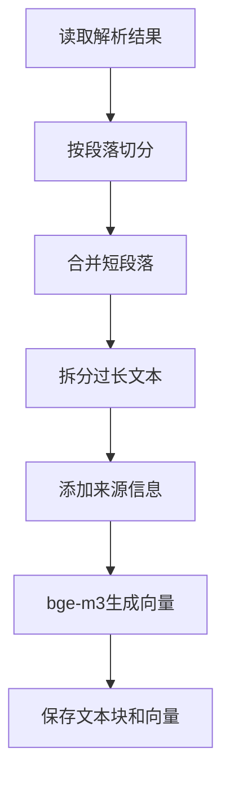

# 4.2 文本分块与向量化

### （一）本节目标

文档解析后得到的文本通常较长，不能直接作为知识库的检索单元。系统需要将长文本划分为多个长度适中的文本块，再使用向量模型将文本转换为数值向量。

本节主要完成：

- 将网页和附件文本划分为文本块；
- 控制文本块长度；
- 保留文本块的来源信息；
- 使用 `BAAI/bge-m3` 生成文本向量；
- 保存文本块和向量结果。

基本流程如下：



------

### （二）文本分块的作用

文本块过长时，可能同时包含多个主题，影响检索准确性；文本块过短时，又容易缺少回答问题所需的上下文。

分块时应满足以下基本要求：

- 每个文本块表达相对完整的内容；
- 尽量保留段落、条款和列表结构；
- 文本块长度不能超过向量模型的输入限制；
- 每个文本块能够追溯到原始网页或附件；
- 相邻文本块可以保留少量重复内容。

课程项目可以采用统一的基础参数：

```python
MAX_LENGTH = 500
OVERLAP_LENGTH = 50
```

这里使用字符数控制长度，便于大二学生理解和实现。使用 Token 精确控制可作为扩展内容。

------

### （三）文本块数据结构

每个文本块不仅要保存正文，还要保存原始来源。

```json
{
  "chunk_id": "doc_0001_chunk_0001",
  "document_id": "doc_0001",
  "attachment_id": "att_0001",
  "chunk_index": 0,
  "chunk_text": "学位论文答辩申请人应提交相关申请材料。",
  "source_url": "https://example.edu.cn/info/1234.htm",
  "file_name": "研究生培养管理办法.pdf",
  "object_key": "raw/attachments/pdf/rule.pdf",
  "page_number": 5,
  "sheet_name": null
}
```

核心字段如下：

| 字段            | 说明                 |
| --------------- | -------------------- |
| `chunk_id`      | 文本块唯一编号       |
| `document_id`   | 所属网页或文档编号   |
| `attachment_id` | 附件编号，可为空     |
| `chunk_index`   | 文本块在文档中的顺序 |
| `chunk_text`    | 文本块内容           |
| `source_url`    | 原始网页地址         |
| `file_name`     | 原始文件名           |
| `object_key`    | S3对象路径           |
| `page_number`   | PDF页码              |
| `sheet_name`    | Excel工作表名称      |

来源字段必须和文本块一起保存，避免检索后无法定位原始文档。

------

### （四）按段落切分文本

普通网页、Word 和 PDF 文本可以先按照空行切分为段落。

```python
import re


def split_paragraphs(text: str) -> list[str]:
    paragraphs = re.split(
        r"\n\s*\n",
        text
    )

    return [
        paragraph.strip()
        for paragraph in paragraphs
        if paragraph.strip()
    ]
```

如果 4.1 的解析结果已经按照页面、段落或工作表保存，则应优先使用原有结构，不必重新切分。

------

### （五）合并短段落

单独的短段落可能缺少完整语义，可以按照原有顺序合并。

```python
def merge_paragraphs(
    paragraphs: list[str],
    max_length: int = 500
) -> list[str]:
    chunks = []
    current_text = ""

    for paragraph in paragraphs:
        candidate = (
            current_text + "\n" + paragraph
            if current_text
            else paragraph
        )

        if (
            current_text
            and len(candidate) > max_length
        ):
            chunks.append(current_text)
            current_text = paragraph
        else:
            current_text = candidate

    if current_text:
        chunks.append(current_text)

    return chunks
```

该方法可以减少过短文本块，同时保留段落之间的顺序。

------

### （六）拆分过长文本

如果单个段落超过最大长度，可以按照句号、问号、感叹号和分号继续切分。

```python
def split_sentences(text: str) -> list[str]:
    parts = re.split(
        r"(?<=[。！？；])",
        text
    )

    return [
        part.strip()
        for part in parts
        if part.strip()
    ]
```

将长段落拆分为多个文本块：

```python
def split_long_text(
    text: str,
    max_length: int = 500
) -> list[str]:
    sentences = split_sentences(text)

    chunks = []
    current_text = ""

    for sentence in sentences:
        candidate = current_text + sentence

        if (
            current_text
            and len(candidate) > max_length
        ):
            chunks.append(current_text)
            current_text = sentence
        else:
            current_text = candidate

    if current_text:
        chunks.append(current_text)

    return chunks
```

课程项目不要求实现复杂的中文分词和语义切分，按段落和句子处理即可。

------

### （七）设置文本重叠

相邻文本块之间可以保留少量重叠内容，避免一句话刚好被切断。

```python
def add_overlap(
    chunks: list[str],
    overlap_length: int = 50
) -> list[str]:
    if not chunks:
        return []

    result = [chunks[0]]

    for index in range(1, len(chunks)):
        previous_tail = chunks[index - 1][
            -overlap_length:
        ]

        result.append(
            previous_tail + chunks[index]
        )

    return result
```

重叠长度不宜过大，否则会生成大量重复内容。课程项目可以设置为 30～50 个字符。

------

### （八）生成文本块

根据文档解析结果生成统一文本块。

```python
def build_chunks(
    parsed_document: dict,
    max_length: int = 500,
    overlap_length: int = 50
) -> list[dict]:
    chunk_records = []
    chunk_index = 0

    for unit in parsed_document["units"]:
        text = unit.get("text", "").strip()

        if not text:
            continue

        paragraphs = split_paragraphs(text)
        merged_chunks = merge_paragraphs(
            paragraphs,
            max_length
        )

        final_chunks = []

        for chunk in merged_chunks:
            if len(chunk) > max_length:
                final_chunks.extend(
                    split_long_text(
                        chunk,
                        max_length
                    )
                )
            else:
                final_chunks.append(chunk)

        final_chunks = add_overlap(
            final_chunks,
            overlap_length
        )

        for chunk_text in final_chunks:
            chunk_id = (
                f"{parsed_document['document_id']}"
                f"_chunk_{chunk_index:04d}"
            )

            chunk_records.append({
                "chunk_id": chunk_id,
                "document_id": parsed_document[
                    "document_id"
                ],
                "attachment_id": parsed_document.get(
                    "attachment_id"
                ),
                "chunk_index": chunk_index,
                "chunk_text": chunk_text,
                "source_url": parsed_document.get(
                    "source_url"
                ),
                "file_name": parsed_document.get(
                    "file_name"
                ),
                "object_key": parsed_document.get(
                    "object_key"
                ),
                "page_number": unit.get(
                    "page_number"
                ),
                "sheet_name": unit.get(
                    "sheet_name"
                )
            })

            chunk_index += 1

    return chunk_records
```

该方法适用于网页、PDF、Word 和 Excel 的基础文本分块。

------

### （九）表格文本处理

Word 和 Excel 表格在 4.1 中已经转换为使用竖线分隔的文本。

例如：

```text
学院 | 硕士名额 | 博士名额
计算机学院 | 10 | 3
机械学院 | 8 | 2
```

表格分块时应注意：

- 不单独删除表头；
- 行数较少时作为一个文本块；
- 表格较长时可以按照若干行切分；
- 每个文本块应重复保留表头；
- 保存工作表名称。

基础课程项目可以直接将一个工作表作为一个文本单元，再按照最大字符长度进行切分。

------

### （十）保存文本块

文本块可以保存为 JSONL，每行对应一个文本块。

```python
import json
from pathlib import Path


def save_chunks(
    chunks: list[dict],
    output_path: str
) -> None:
    path = Path(output_path)
    path.parent.mkdir(
        parents=True,
        exist_ok=True
    )

    with path.open(
        "w",
        encoding="utf-8"
    ) as file:
        for chunk in chunks:
            file.write(
                json.dumps(
                    chunk,
                    ensure_ascii=False
                )
                + "\n"
            )
```

保存示例：

```python
save_chunks(
    chunks,
    "data/chunks/chunks.jsonl"
)
```

也可以上传到 S3：

```text
datasets/chunks/chunks.jsonl
```

------

### （十一）加载向量模型

本项目使用 `BAAI/bge-m3` 生成中文和中英文混合文本向量。

安装依赖：

```bash
pip install sentence-transformers
```

加载模型：

```python
from sentence_transformers import (
    SentenceTransformer
)

model = SentenceTransformer(
    "BAAI/bge-m3"
)
```

模型首次运行时需要下载文件。实验室网络受限时，可以提前下载模型并使用本地路径加载。

------

### （十二）批量生成文本向量

提取所有文本块内容：

```python
texts = [
    chunk["chunk_text"]
    for chunk in chunks
]
```

批量生成向量：

```python
embeddings = model.encode(
    texts,
    batch_size=16,
    normalize_embeddings=True,
    show_progress_bar=True
)
```

参数说明：

| 参数                   | 说明                 |
| ---------------------- | -------------------- |
| `texts`                | 需要编码的文本列表   |
| `batch_size`           | 每批处理的文本数量   |
| `normalize_embeddings` | 是否对向量进行归一化 |
| `show_progress_bar`    | 是否显示处理进度     |

课程项目可以从 `batch_size=16` 开始。内存或显存不足时，可以改为 8 或 4。

------

### （十三）CPU与GPU运行

`sentence-transformers` 会根据运行环境选择计算设备。

强制使用 CPU：

```python
model = SentenceTransformer(
    "BAAI/bge-m3",
    device="cpu"
)
```

使用 GPU：

```python
model = SentenceTransformer(
    "BAAI/bge-m3",
    device="cuda"
)
```

大二课程设计不要求必须使用 GPU。数据规模较小时，CPU 也可以完成向量生成，只是运行时间较长。

------

### （十四）查询文本向量化

用户问题必须使用同一个模型和相同的归一化参数生成向量。

```python
question = "申请学位论文答辩需要哪些材料？"

query_vector = model.encode(
    [question],
    normalize_embeddings=True
)[0]
```

知识库文本和用户问题如果使用不同模型，向量维度和语义空间可能不一致，无法正常检索。

------

### （十五）保存向量结果

文本向量可以保存为 NumPy 文件，文本块元数据继续保存为 JSONL。

```python
import numpy as np

np.save(
    "data/vectors/embeddings.npy",
    embeddings
)
```

推荐目录：

```text
data/
├── chunks/
│   └── chunks.jsonl
└── vectors/
    └── embeddings.npy
```

其中：

- `chunks.jsonl` 保存文本和来源信息；
- `embeddings.npy` 保存对应向量；
- 两个文件中的记录顺序必须一致。

下一节构建 FAISS 索引时，将同时读取这两个文件。

------

### （十六）向量结果检查

完成向量化后，应检查文本块数量和向量数量是否一致。

```python
import numpy as np

embedding_array = np.asarray(
    embeddings
)

print("文本块数量：", len(chunks))
print("向量数量：", len(embedding_array))
print("向量维度：", embedding_array.shape[1])

assert len(chunks) == len(embedding_array)
assert not np.isnan(embedding_array).any()
```

重点检查：

- 是否存在空文本块；
- 文本块是否过长；
- 文本块数量是否合理；
- 来源字段是否完整；
- 向量数量是否等于文本块数量；
- 所有向量维度是否一致；
- 向量中是否存在空值。

------

### （十七）完整处理示例

```python
import json
import numpy as np
from sentence_transformers import (
    SentenceTransformer
)


with open(
    "data/parsed/att_0001.json",
    "r",
    encoding="utf-8"
) as file:
    parsed_document = json.load(file)

chunks = build_chunks(
    parsed_document=parsed_document,
    max_length=500,
    overlap_length=50
)

save_chunks(
    chunks,
    "data/chunks/chunks.jsonl"
)

model = SentenceTransformer(
    "BAAI/bge-m3",
    device="cpu"
)

texts = [
    chunk["chunk_text"]
    for chunk in chunks
]

embeddings = model.encode(
    texts,
    batch_size=16,
    normalize_embeddings=True,
    show_progress_bar=True
)

np.save(
    "data/vectors/embeddings.npy",
    embeddings
)

print("文本块数量：", len(chunks))
print("向量形状：", embeddings.shape)
```

------

### （十八）结果检查

完成文本分块和向量化后，应检查：

| 检查项目   | 检查要求                     |
| ---------- | ---------------------------- |
| 文本块内容 | 无空文本块                   |
| 文本块长度 | 大部分不超过设定长度         |
| 文本结构   | 段落、条款和表格基本完整     |
| 来源信息   | 保留网页、附件、页码或工作表 |
| 文本块编号 | 编号唯一且顺序正确           |
| 向量数量   | 与文本块数量一致             |
| 向量维度   | 所有向量维度相同             |
| 输出文件   | JSONL和NumPy文件能够重新读取 |

可以随机抽取 5～10 个文本块进行人工检查。

------

### （十九）本节任务

完成本节后，应形成以下成果：

- 读取 4.1 生成的文档解析结果；
- 按段落切分文本；
- 合并过短段落；
- 拆分过长文本；
- 为相邻文本块设置少量重叠；
- 保留网页地址、附件名称、页码和工作表；
- 为文本块生成唯一编号；
- 将文本块保存为 JSONL；
- 加载 `BAAI/bge-m3` 模型；
- 批量生成并归一化文本向量；
- 将向量保存为 NumPy 文件；
- 检查文本块数量、来源信息和向量维度。

完成本节后，应得到长度适中、来源可追溯的文本块和对应向量，为 4.3 FAISS 索引构建提供输入。

------

### （二十）拓展：LangChain 文本拆分与向量化

掌握了原生的文本拆分和向量化流程后，可以了解 LangChain 提供的统一封装方式。LangChain 将 4.2 中多个手写函数整合为类配置，代码量大幅减少。

#### 1. 文本拆分：RecursiveCharacterTextSplitter

`RecursiveCharacterTextSplitter` 一套配置即可替代 4.2 中 (四)~(七) 的 `split_paragraphs`、`merge_paragraphs`、`split_long_text`、`add_overlap` 四个手动步骤：

```python
from langchain_text_splitters import RecursiveCharacterTextSplitter

splitter = RecursiveCharacterTextSplitter(
    # 按优先级从高到低依次尝试切分：空行 → 换行 → 句号 → 感叹号 → 问号 → 分号 → 空格 → 逐字符
    separators=["\n\n", "\n", "。", "！", "？", "；", " ", ""],
    chunk_size=500,              # 对应课程的 max_length
    chunk_overlap=50,            # 对应课程的 overlap_length
    length_function=len,         # 以字符数计算
    is_separator_regex=False,
)

# 直接拆分文本
chunks = splitter.split_text(text)

# 或从 4.1 解析结果中的 unit 文本逐条拆分
all_docs = []
for unit in parsed_document["units"]:
    docs = splitter.create_documents(
        texts=[unit["text"]],
        metadatas=[{
            "document_id": parsed_document["document_id"],
            "file_name": parsed_document["file_name"],
            "page_number": unit.get("page_number"),
            "sheet_name": unit.get("sheet_name"),
        }]
    )
    all_docs.extend(docs)
```

`create_documents` 返回 LangChain 的 `Document` 对象，自动携带 `page_content`（文本块）和 `metadata`（来源信息），无需像 4.2（八）中手动构造 chunk dict 和复制字段。

其内部递归逻辑如下：

```text
先按 "\n\n" 切 → 长度合适 → 保留
              → 长度过大 → 再按 "\n" 切 → 合适 → 保留
                                        → 过大 → 再按 "。" 切 → ...
```

这正是课程中"按段落切分 → 合并短段落 → 拆分过长文本"三步的自动化实现。

#### 2. 向量化：HuggingFaceBgeEmbeddings

LangChain 封装了 `BAAI/bge-m3`，与 `sentence-transformers` 用法一致但接口更统一：

```python
from langchain_community.embeddings import HuggingFaceBgeEmbeddings

model = HuggingFaceBgeEmbeddings(
    model_name="BAAI/bge-m3",
    model_kwargs={"device": "cpu"},
    encode_kwargs={
        "normalize_embeddings": True,
        "batch_size": 16,
        "show_progress_bar": True,
    },
)

# 批量编码 Document 对象
embeddings = model.embed_documents(
    [doc.page_content for doc in all_docs]
)

# 单条查询编码
query_vector = model.embed_query("申请学位论文答辩需要哪些材料？")
```


> **建议**：课程基础项目使用本节原生方式，以便理解拆分、合并、重叠的完整逻辑。学有余力时，可尝试用 `RecursiveCharacterTextSplitter` 替代 (四)~(八) 的手写函数，配合 `HuggingFaceBgeEmbeddings` 替代 `SentenceTransformer`，整个 4.2 的代码量可从约 120 行缩减到约 30 行。