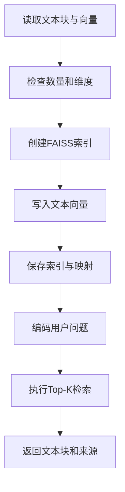

# 4.3 向量数据库与索引构建

### （一）本节目标

4.2 已经生成文本块文件和对应的文本向量。本节使用 FAISS 建立本地向量索引，实现用户问题与知识库文本块之间的相似度检索。

课程重点不是训练向量模型，而是完成：

- 读取文本块和向量；
- 创建 FAISS 索引；
- 保存索引和文本块映射；
- 使用同一模型编码用户问题；
- 执行 Top-K 相似度检索；
- 返回文本内容和来源信息。

基本流程如下：



------

### （二）FAISS的作用

FAISS 是一个向量相似度检索工具，可以根据用户问题向量，从大量知识向量中快速找出最相似的文本块。

本项目采用本地 FAISS，不需要单独安装和部署向量数据库服务，适合课程设计使用。

安装依赖：

```bash
pip install faiss-cpu numpy sentence-transformers
```

有 GPU 环境时可以使用 FAISS GPU 版本，但本课程不作要求。

------

### （三）输入文件

本节使用 4.2 生成的两个文件：

```text
data/
├── chunks/
│   └── chunks.jsonl
└── vectors/
    └── embeddings.npy
```

其中：

- `chunks.jsonl` 保存文本块和来源信息；
- `embeddings.npy` 保存文本块对应的向量；
- 两个文件中的记录顺序必须完全一致。

文本块示例：

```json
{
  "chunk_id": "doc_0001_chunk_0000",
  "document_id": "doc_0001",
  "attachment_id": "att_0001",
  "chunk_index": 0,
  "chunk_text": "申请学位论文答辩需要提交答辩申请表和学位论文。",
  "source_url": "https://example.edu.cn/info/1234.htm",
  "file_name": "研究生培养管理办法.pdf",
  "object_key": "raw/attachments/pdf/rule.pdf",
  "page_number": 5,
  "sheet_name": null
}
```

------

### （四）读取文本块和向量

读取 JSONL 文本块：

```python
import json


def load_chunks(file_path: str) -> list[dict]:
    chunks = []

    with open(
        file_path,
        "r",
        encoding="utf-8"
    ) as file:
        for line in file:
            if line.strip():
                chunks.append(
                    json.loads(line)
                )

    return chunks
```

读取向量：

```python
import numpy as np

chunks = load_chunks(
    "data/chunks/chunks.jsonl"
)

embeddings = np.load(
    "data/vectors/embeddings.npy"
)
```

检查数据：

```python
print("文本块数量：", len(chunks))
print("向量形状：", embeddings.shape)

if len(chunks) != len(embeddings):
    raise ValueError(
        "文本块数量与向量数量不一致"
    )
```

------

### （五）创建FAISS索引

4.2 中生成的向量已经进行了归一化，因此可以使用内积计算相似度。归一化向量的内积可以作为余弦相似度使用。

```python
import faiss
import numpy as np

embedding_matrix = np.asarray(
    embeddings,
    dtype="float32"
)

dimension = embedding_matrix.shape[1]

index = faiss.IndexFlatIP(
    dimension
)

index.add(
    embedding_matrix
)

print("向量维度：", dimension)
print("索引数量：", index.ntotal)
```

`IndexFlatIP` 的特点是：

- 使用方法简单；
- 检索结果精确；
- 不需要额外训练索引；
- 适合课程项目中的中小规模数据。

本课程不要求使用 IVF、HNSW 等复杂索引。

------

### （六）保存FAISS索引

构建完成后，可以将索引保存到本地。

```python
from pathlib import Path

index_path = Path(
    "data/indexes/faiss.index"
)

index_path.parent.mkdir(
    parents=True,
    exist_ok=True
)

faiss.write_index(
    index,
    str(index_path)
)
```

推荐目录：

```text
data/
├── chunks/
│   └── chunks.jsonl
├── vectors/
│   └── embeddings.npy
└── indexes/
    └── faiss.index
```

文本块文件本身就是索引编号与来源信息的映射文件。

例如，FAISS 返回编号 `5`，程序就读取：

```python
chunks[5]
```

得到对应文本块和来源信息。

------

### （七）保存索引配置

为了保证知识库构建和查询阶段使用相同模型，可以保存简单配置文件。

```python
index_config = {
    "embedding_model": "BAAI/bge-m3",
    "dimension": int(
        embedding_matrix.shape[1]
    ),
    "metric": "inner_product",
    "normalized": True,
    "vector_count": int(index.ntotal)
}
```

保存配置：

```python
with open(
    "data/indexes/index_config.json",
    "w",
    encoding="utf-8"
) as file:
    json.dump(
        index_config,
        file,
        ensure_ascii=False,
        indent=2
    )
```

配置文件主要记录：

| 字段              | 说明               |
| ----------------- | ------------------ |
| `embedding_model` | 使用的向量模型     |
| `dimension`       | 向量维度           |
| `metric`          | 相似度计算方式     |
| `normalized`      | 是否进行向量归一化 |
| `vector_count`    | 索引中的向量数量   |

更换向量模型后，应重新生成全部向量和 FAISS 索引。

------

### （八）加载已有索引

系统重新启动时，不需要重新构建索引，可以直接读取已有文件。

```python
index = faiss.read_index(
    "data/indexes/faiss.index"
)

chunks = load_chunks(
    "data/chunks/chunks.jsonl"
)

print("加载索引数量：", index.ntotal)
```

加载后应检查：

```python
if index.ntotal != len(chunks):
    raise ValueError(
        "FAISS索引数量与文本块数量不一致"
    )
```

------

### （九）编码用户问题

用户问题必须使用与知识库相同的向量模型。

```python
from sentence_transformers import (
    SentenceTransformer
)

model = SentenceTransformer(
    "BAAI/bge-m3",
    device="cpu"
)
```

编码问题：

```python
question = "申请学位论文答辩需要哪些材料？"

query_vector = model.encode(
    [question],
    normalize_embeddings=True
)
```

转换为 FAISS 需要的格式：

```python
query_vector = np.asarray(
    query_vector,
    dtype="float32"
)
```

知识文本和用户问题必须满足：

- 使用同一个模型；
- 使用相同的文本处理方式；
- 使用相同的归一化设置；
- 向量维度相同。

------

### （十）执行Top-K检索

Top-K 表示返回相似度最高的前 K 个文本块。

```python
top_k = 5

scores, indices = index.search(
    query_vector,
    top_k
)
```

其中：

- `scores` 保存相似度分数；
- `indices` 保存文本块编号。

输出结果：

```python
for rank, chunk_index in enumerate(
    indices[0],
    start=1
):
    if chunk_index < 0:
        continue

    chunk = chunks[chunk_index]
    score = float(
        scores[0][rank - 1]
    )

    print("排名：", rank)
    print("相似度：", score)
    print("内容：", chunk["chunk_text"])
    print("来源：", chunk.get("file_name"))
    print("页码：", chunk.get("page_number"))
    print("-" * 50)
```

课程项目可以先设置：

```python
top_k = 5
```

后续根据检索效果调整为 3、5 或 10。

------

### （十一）封装检索函数

可以将问题编码和 FAISS 查询封装为统一函数。

```python
def search_chunks(
    question: str,
    model,
    index,
    chunks: list[dict],
    top_k: int = 5
) -> list[dict]:
    query_vector = model.encode(
        [question],
        normalize_embeddings=True
    )

    query_vector = np.asarray(
        query_vector,
        dtype="float32"
    )

    scores, indices = index.search(
        query_vector,
        top_k
    )

    results = []

    for score, chunk_index in zip(
        scores[0],
        indices[0]
    ):
        if chunk_index < 0:
            continue

        chunk = chunks[chunk_index]

        results.append({
            "score": float(score),
            "chunk_id": chunk["chunk_id"],
            "chunk_text": chunk["chunk_text"],
            "document_id": chunk[
                "document_id"
            ],
            "attachment_id": chunk.get(
                "attachment_id"
            ),
            "file_name": chunk.get(
                "file_name"
            ),
            "source_url": chunk.get(
                "source_url"
            ),
            "object_key": chunk.get(
                "object_key"
            ),
            "page_number": chunk.get(
                "page_number"
            ),
            "sheet_name": chunk.get(
                "sheet_name"
            )
        })

    return results
```

调用示例：

```python
results = search_chunks(
    question="申请答辩需要提交哪些材料？",
    model=model,
    index=index,
    chunks=chunks,
    top_k=5
)

for item in results:
    print(item)
```

------

### （十二）检索结果格式

检索结果应同时返回文本和来源。

```json
[
  {
    "score": 0.82,
    "chunk_id": "doc_0001_chunk_0003",
    "chunk_text": "申请人应提交学位论文、答辩申请表和审核意见表。",
    "document_id": "doc_0001",
    "attachment_id": "att_0001",
    "file_name": "研究生培养管理办法.pdf",
    "source_url": "https://example.edu.cn/info/1234.htm",
    "object_key": "raw/attachments/pdf/rule.pdf",
    "page_number": 8,
    "sheet_name": null
  }
]
```

这些字段将在后续 RAG 问答中用于：

- 构建大模型上下文；
- 展示引用来源；
- 显示 PDF 页码；
- 提供附件下载。

------

### （十三）完整索引构建程序

```python
import json
from pathlib import Path

import faiss
import numpy as np


def load_chunks(file_path: str) -> list[dict]:
    chunks = []

    with open(
        file_path,
        "r",
        encoding="utf-8"
    ) as file:
        for line in file:
            if line.strip():
                chunks.append(
                    json.loads(line)
                )

    return chunks


chunks = load_chunks(
    "data/chunks/chunks.jsonl"
)

embeddings = np.load(
    "data/vectors/embeddings.npy"
)

embedding_matrix = np.asarray(
    embeddings,
    dtype="float32"
)

if len(chunks) != len(embedding_matrix):
    raise ValueError(
        "文本块数量与向量数量不一致"
    )

dimension = embedding_matrix.shape[1]

index = faiss.IndexFlatIP(
    dimension
)

index.add(
    embedding_matrix
)

output_dir = Path("data/indexes")
output_dir.mkdir(
    parents=True,
    exist_ok=True
)

faiss.write_index(
    index,
    str(output_dir / "faiss.index")
)

config = {
    "embedding_model": "BAAI/bge-m3",
    "dimension": int(dimension),
    "metric": "inner_product",
    "normalized": True,
    "vector_count": int(index.ntotal)
}

with (
    output_dir / "index_config.json"
).open(
    "w",
    encoding="utf-8"
) as file:
    json.dump(
        config,
        file,
        ensure_ascii=False,
        indent=2
    )

print("FAISS索引构建完成")
print("向量数量：", index.ntotal)
print("向量维度：", dimension)
```

------

### （十四）索引与检索检查

完成索引后，应检查：

| 检查项目   | 检查要求               |
| ---------- | ---------------------- |
| 文本块数量 | 与向量数量一致         |
| 向量格式   | 为 `float32`           |
| 向量维度   | 知识向量与问题向量一致 |
| 索引数量   | `index.ntotal` 正确    |
| 模型名称   | 构建和查询阶段一致     |
| 归一化设置 | 构建和查询阶段一致     |
| 来源映射   | 检索编号能够找到文本块 |
| Top-K结果  | 能召回与问题相关的内容 |
| 索引文件   | 保存后能够重新加载     |

可以准备 5～10 个测试问题进行检索，例如：

```text
申请答辩需要哪些材料？
奖学金申请时间是什么时候？
培养方案在哪里下载？
某学院有多少个奖学金名额？
```

人工检查前 5 个结果是否与问题相关。

------

### （十五）常见问题

#### 1. 向量数量与文本块数量不一致

可能是生成向量时跳过了部分文本，或文本块文件被修改。应重新检查 4.2 的输出。

#### 2. 查询结果完全不相关

应检查：

- 文本块内容是否正确；
- 问题和文本是否使用同一模型；
- 是否都进行了向量归一化；
- 文本块是否过长或过短。

#### 3. FAISS报向量维度错误

说明查询向量和索引向量维度不同，通常是模型不一致导致的。

#### 4. CPU检索速度较慢

课程项目的数据规模通常较小，`IndexFlatIP` 可以正常使用。无需引入复杂索引结构。

------

### （十六）本节任务

完成本节后，应形成以下成果：

- 读取文本块和向量文件；
- 检查文本块数量和向量数量；
- 使用 `IndexFlatIP` 创建 FAISS 索引；
- 将文本向量加入索引；
- 保存和重新加载 FAISS 索引；
- 保存模型名称、向量维度和归一化配置；
- 使用 `BAAI/bge-m3` 编码用户问题；
- 完成 Top-K 相似度检索；
- 根据检索编号获取文本块和来源；
- 使用多个测试问题检查检索效果；
- 保存索引文件、配置文件和测试结果。

完成本节后，系统应能够根据用户问题从知识库中召回相关文本块，并返回对应的网页、附件、页码和对象路径。

------

### （十七）拓展：LangChain FAISS 向量存储

掌握了原生 FAISS 的索引构建、保存、加载和检索流程后，可以了解 LangChain 的 `FAISS` 向量存储类。它将 4.3 中约 190 行的手写代码整合为 3 个核心方法，大幅减少样板代码。

#### 1. 从 Document 列表一键构建索引

LangChain 的 `FAISS.from_documents` 替代了 4.3 中 (四)~(七) 的全部步骤（读取 JSONL → 加载 npy → 转 float32 → 创建 IndexFlatIP → add → write_index → 手写 config）：

```bash
pip install faiss-cpu langchain-community
```

```python
from langchain_community.vectorstores import FAISS
from langchain_community.embeddings import HuggingFaceBgeEmbeddings

# 加载向量模型
model = HuggingFaceBgeEmbeddings(
    model_name="BAAI/bge-m3",
    model_kwargs={"device": "cpu"},
    encode_kwargs={"normalize_embeddings": True, "batch_size": 16},
)

# 从 Document 列表直接构建 FAISS 索引（替代 (四)~(七)）
vectorstore = FAISS.from_documents(
    documents=all_docs,           # 来自 4.2 拆分的 Document 列表
    embedding=model,
)

# 保存到本地
vectorstore.save_local("data/faiss_index")
```

#### 2. 加载索引与检索

加载已有索引并执行检索，替代 4.3 中 (八)~(十一) 的全部步骤（`read_index` → `load_chunks` → `model.encode` → 转 float32 → `index.search` → 手动映射 chunk）：

```python
# 加载本地索引（替代 (八)）
vectorstore = FAISS.load_local(
    "data/faiss_index",
    embeddings=model,
    allow_dangerous_deserialization=True,  # 信任本地文件
)

# 检索（替代 (九)~(十一)）
results = vectorstore.similarity_search_with_score(
    "申请学位论文答辩需要哪些材料？",
    k=5,
)

for doc, score in results:
    print(f"[相似度: {score:.4f}] {doc.page_content[:80]}...")
    print(f"  来源: {doc.metadata.get('file_name')}, 第{doc.metadata.get('page_number')}页")
```

`similarity_search_with_score` 返回 `(Document, float)` 元组列表，`doc.metadata` 自动携带 4.2 中写入的全部来源字段，无需像 4.3（十一）中手动逐字段复制。

#### 3. 高级检索功能

LangChain FAISS 还提供原生方式未涉及的能力：

```python
# 相似度阈值过滤：只返回分数 >= 0.5 的结果
results = vectorstore.similarity_search_with_score(
    query, k=5, score_threshold=0.5
)

# MMR 多样性检索：先召回 fetch_k 个，再从中选 k 个差异性最大的
results = vectorstore.max_marginal_relevance_search(
    query, k=5, fetch_k=20
)

# 按 metadata 过滤检索
results = vectorstore.similarity_search(
    query, k=5,
    filter={"file_name": "研究生培养管理办法.pdf"}
)

# 增量添加新文档（无需重建整个索引）
vectorstore.add_documents(new_docs)
```

#### 4. 完整端到端流程

将 4.2 的拆分 + 4.3 的索引构建合并，整个流程仅需约 20 行：

```python
from langchain_text_splitters import RecursiveCharacterTextSplitter
from langchain_community.embeddings import HuggingFaceBgeEmbeddings
from langchain_community.vectorstores import FAISS

# 1. 拆分文本（4.2）
splitter = RecursiveCharacterTextSplitter(
    separators=["\n\n", "\n", "。", "！", "？", "；", " ", ""],
    chunk_size=500, chunk_overlap=50, length_function=len,
)
all_docs = splitter.create_documents(
    texts=[unit["text"] for unit in parsed_document["units"]],
    metadatas=[{
        "document_id": parsed_document["document_id"],
        "file_name": parsed_document["file_name"],
        "page_number": unit.get("page_number"),
        "sheet_name": unit.get("sheet_name"),
    } for unit in parsed_document["units"]],
)

# 2. 向量化 + 构建 FAISS 索引（4.3）
model = HuggingFaceBgeEmbeddings(
    model_name="BAAI/bge-m3",
    model_kwargs={"device": "cpu"},
    encode_kwargs={"normalize_embeddings": True, "batch_size": 16},
)
vectorstore = FAISS.from_documents(all_docs, model)
vectorstore.save_local("data/faiss_index")

# 3. 检索
results = vectorstore.similarity_search_with_score("用户问题", k=5)
```


> **建议**：课程基础项目使用本节原生方式，以便理解 FAISS 底层 API（`IndexFlatIP`、`index.add`、`index.search` 的返回结构、float32 格式要求）和索引与 chunk 的映射关系。学有余力时，可尝试 LangChain 一站式流程，将拆分、向量化、索引构建、检索合并为约 20 行代码。