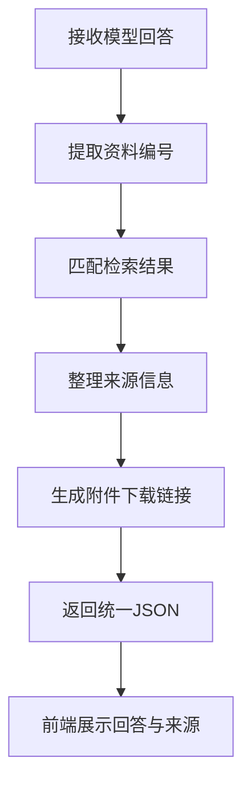

# 4.6 问答结果与来源展示

### （一）本节目标

大语言模型生成答案后，系统需要将回答正文、引用资料、网页地址和附件信息整理为统一格式，再返回给前端展示。

来源信息不能由模型自由生成，而应来自知识检索结果。模型主要负责生成回答正文和 `[资料1]` 等引用编号，后端负责绑定真实来源。

基本流程如下：



------

### （二）统一返回结构

后端可以返回以下数据：

```json
{
  "status": "success",
  "question": "申请学位论文答辩需要哪些材料？",
  "answer": "需要提交学位论文、答辩申请表和审核意见表。[资料1]",
  "sources": [
    {
      "source_no": 1,
      "document_id": "doc_0001",
      "file_name": "研究生学位管理办法.pdf",
      "source_url": "https://example.edu.cn/info/1234.htm",
      "page_number": 8,
      "sheet_name": null,
      "content_preview": "申请人应提交学位论文、答辩申请表和审核意见表。"
    }
  ],
  "attachments": [
    {
      "attachment_id": "att_0001",
      "file_name": "答辩申请表.docx",
      "file_type": "docx"
    }
  ],
  "session_id": "session_001"
}
```

主要字段如下：

| 字段         | 说明                 |
| ------------ | -------------------- |
| `status`     | 请求处理状态         |
| `question`   | 用户问题             |
| `answer`     | 模型生成的回答       |
| `sources`    | 回答使用的来源列表   |
| `attachments`| 可下载的附件列表     |
| `session_id` | 会话编号             |

来源与附件分开保存，附件下载链接由后端在用户点击时实时生成。

------

### （三）提取引用编号

模型在回答中使用 `[资料1]`、`[资料2]` 标注来源。后端可以使用正则表达式提取编号。

```python
import re


def extract_source_numbers(
    answer: str
) -> list[int]:
    numbers = re.findall(
        r"\[资料(\d+)\]",
        answer
    )

    return list(dict.fromkeys(
        int(number)
        for number in numbers
    ))
```

例如：

```python
answer = (
    "申请人需要提交学位论文和"
    "答辩申请表。[资料1]"
)

print(extract_source_numbers(answer))
```

输出：

```text
[1]
```

`dict.fromkeys()` 可以在保留顺序的同时删除重复编号。

------

### （四）建立资料编号映射

提示词中的资料顺序必须与检索结果顺序一致。

```python
def build_source_map(
    search_results: list[dict]
) -> dict[int, dict]:
    return {
        index: item
        for index, item in enumerate(
            search_results,
            start=1
        )
    }
```

例如，第一个检索结果对应 `[资料1]`，第二个对应 `[资料2]`。

不能根据模型生成的标题或网址重新查找来源，因为模型可能生成错误信息。

------

### （五）校验资料编号

模型可能引用不存在的资料编号，因此返回前需要进行检查。

```python
def validate_source_numbers(
    source_numbers: list[int],
    source_map: dict[int, dict]
) -> list[int]:
    return [
        number
        for number in source_numbers
        if number in source_map
    ]
```

例如，系统只提供了 3 条资料，但模型引用了 `[资料5]`，该编号应被视为无效。

------

### （六）构建来源列表

根据有效资料编号，从检索结果中生成来源信息。

```python
def build_sources(
    answer: str,
    search_results: list[dict]
) -> list[dict]:
    source_map = build_source_map(
        search_results
    )

    source_numbers = extract_source_numbers(
        answer
    )

    source_numbers = validate_source_numbers(
        source_numbers,
        source_map
    )

    sources = []

    for number in source_numbers:
        item = source_map[number]

        preview = item["chunk_text"].strip()

        if len(preview) > 150:
            preview = preview[:150] + "……"

        sources.append({
            "source_no": number,
            "document_id": item.get(
                "document_id"
            ),
            "file_name": item.get(
                "file_name"
            ),
            "source_url": item.get(
                "source_url"
            ),
            "page_number": item.get(
                "page_number"
            ),
            "sheet_name": item.get(
                "sheet_name"
            ),
            "content_preview": preview
        })

    return sources
```

如果模型没有标注任何资料编号，也可以将最终用于回答的检索结果作为“参考来源”返回。

------

### （七）附件下载链接

S3 中的附件一般不直接公开访问。后端根据 `attachment_id` 查询 `object_key`，再由 `generate_download_url` 工具生成临时下载链接。

```python
def generate_download_url(
    attachment_id: str,
    storage_service,
    expires_in: int = 600
) -> str | None:
    attachment = attachment_service.find_by_id(
        attachment_id
    )

    if attachment is None:
        return None

    return storage_service.generate_download_url(
        object_key=attachment.object_key,
        expires_in=expires_in
    )
```

下载链接不在返回结果中预先生成。前端需要下载时，调用 `/api/attachments/{attachment_id}/download` 接口获取临时链接。

其中 `expires_in=600` 表示链接有效期为 600 秒。临时链接不应保存到数据库或 FAISS 中，系统只需长期保存 `object_key`。

------

### （八）来源去重

同一个文档中的多个文本块可能同时被召回。来源展示时，可以根据文件名、网页地址和页码进行简单去重。

```python
def deduplicate_sources(
    sources: list[dict]
) -> list[dict]:
    result = []
    seen = set()

    for source in sources:
        key = (
            source.get("file_name"),
            source.get("source_url"),
            source.get("page_number")
        )

        if key in seen:
            continue

        seen.add(key)
        result.append(source)

    return result
```

同一个文件的不同页码包含不同内容时，可以分别保留。

------

### （九）完整结果构建

将答案、检索结果和附件链接整理为统一结果。

```python
def build_answer_result(
    question: str,
    answer: str,
    search_results: list[dict],
    session_id: str | None = None
) -> dict:
    sources = build_sources(
        answer,
        search_results
    )

    sources = deduplicate_sources(
        sources
    )

    # 从检索结果中提取关联附件
    attachments = extract_attachments(
        search_results
    )

    return {
        "status": "success",
        "question": question,
        "answer": answer,
        "sources": sources,
        "attachments": attachments,
        "session_id": session_id
    }
```

其中 `extract_attachments` 从检索结果中收集关联的附件信息（该函数在 4.5 和 4.6 中通用）：

```python
def extract_attachments(
    search_results: list[dict]
) -> list[dict]:
    attachments = []
    seen = set()

    for item in search_results:
        attachment_id = item.get("attachment_id")

        if not attachment_id or attachment_id in seen:
            continue

        seen.add(attachment_id)
        attachments.append({
            "attachment_id": attachment_id,
            "file_name": item.get("file_name", ""),
            "file_type": item.get("file_type")
        })

    return attachments
```

如果文本块中暂时没有 `file_type`，后端应在整理附件列表时通过 `attachment_id` 查询附件表补充。统一问答接口中的 `attachments` 应保持 `attachment_id`、`file_name` 和 `file_type` 三个字段。

调用示例：

```python
result = build_answer_result(
    question=question,
    answer=answer,
    search_results=search_results,
    session_id="session_001"
)
```

------

### （十）无知识结果

没有检索到有效知识时，应明确返回无知识状态。

```python
result = {
    "status": "no_knowledge",
    "question": question,
    "answer": (
        "未在当前知识库中检索到"
        "与该问题直接相关的内容。"
    ),
    "sources": [],
    "attachments": [],
    "session_id": session_id
}
```

前端应显示“未找到知识依据”，不能生成虚假的来源卡片。

------

### （十一）部分失败处理

如果模型回答成功，但附件下载链接生成失败，可以保留回答和网页来源。

```json
{
  "status": "partial_success",
  "question": "申请答辩需要哪些材料？",
  "answer": "需要提交相关申请材料。[资料1]",
  "sources": [
    {
      "source_no": 1,
      "document_id": "doc_0001",
      "file_name": "学位管理办法.pdf",
      "source_url": "https://example.edu.cn/info/1234.htm",
      "page_number": 8,
      "content_preview": "申请人应提交……"
    }
  ],
  "attachments": [],
  "session_id": "session_001",
  "message": "附件下载链接暂时无法生成"
}
```

单个附件处理失败不应导致整个问答请求失败。

------

### （十二）前端回答展示

回答正文可以使用 Markdown 格式展示，例如：

```markdown
申请学位论文答辩需要提交以下材料：

1. 学位论文；
2. 答辩申请表；
3. 审核意见表。[资料1]
```

本项目选择已有 Markdown 渲染功能的 Vue 聊天界面，只需将后端返回的 `answer` 交给原有 Markdown 组件显示。

前端应对 Markdown 中的 HTML 和脚本内容进行安全过滤，不能直接执行模型输出的 JavaScript。

------

### （十三）来源卡片展示

每条来源可以显示为简单卡片：

```text
[资料1] 研究生学位管理办法.pdf
位置：第8页

命中内容：
申请人应提交学位论文、答辩申请表和审核意见表……

查看原网页    下载附件
```

来源卡片可以包含：

- 资料编号；
- 网页或附件名称；
- PDF 页码；
- Excel 工作表名称；
- 命中文本摘要；
- 原始网页链接；
- 附件下载按钮。

相关度分数主要用于测试和调试，面向普通用户时可以不显示。

------

### （十四）网页与附件分别展示

网页地址和附件下载地址具有不同作用，不应相互替代。

仅有网页时：

```text
标题：关于开展研究生答辩工作的通知
操作：查看原网页
```

包含附件时：

```text
标题：研究生学位管理办法
附件：研究生学位管理办法.pdf
位置：第8页
操作：查看原网页｜下载附件
```

其中：

- `source_url` 用于查看原网页；
- `download_url` 用于下载附件。

------

### （十五）FastAPI返回示例

后端接口可以直接返回统一结果。

```python
from fastapi import FastAPI
from pydantic import BaseModel

app = FastAPI()


class QuestionRequest(BaseModel):
    question: str
    session_id: str | None = None


@app.post("/api/qa")
def ask_question(
    request: QuestionRequest
):
    result = qa_service.answer(
        question=request.question,
        session_id=request.session_id
    )

    return result
```

接口层只负责接收请求和返回结果。知识检索、模型调用和来源整理应放在服务层中完成。

------

### （十六）前端处理示例

前端收到结果后，可以分别读取回答和来源。

```javascript
const response = await api.post(
  "/api/qa",
  {
    question: userQuestion,
    session_id: sessionId
  }
)

const answer = response.data.answer
const sources = response.data.sources
```

页面可以先显示 `answer`，再循环展示 `sources`。

```javascript
sources.forEach((source) => {
  console.log(source.file_name)
  console.log(source.source_url)
  console.log(source.download_url)
})
```

已有 Vue 聊天项目通常已经支持消息列表和 Markdown 渲染，因此课程项目主要增加来源卡片和下载按钮即可。

------

### （十七）结果一致性检查

返回结果前，应检查：

| 检查项目   | 检查要求                  |
| ---------- | ------------------------- |
| 资料编号   | 回答中的编号真实存在      |
| 来源顺序   | `source_no`与资料编号一致 |
| 网页地址   | 来自检索元数据或数据库    |
| 附件路径   | 使用真实`object_key`      |
| 下载链接   | 由后端实时生成            |
| 页码信息   | 与命中文本块一致          |
| 重复来源   | 相同来源不重复展示        |
| 无知识回答 | 不生成虚假来源            |

如果模型生成了不存在的网址，应忽略该网址，只使用后端保存的真实地址。

------

### （十八）安全要求

结果展示时应注意：

- 不向前端返回 S3 访问密钥；
- 不返回服务器本地文件路径；
- 不返回系统提示词；
- 不显示完整错误堆栈；
- 不执行模型输出中的脚本；
- 私有附件使用临时链接；
- 下载接口应检查 `object_key` 是否有效。

前端可以显示错误提示，但不应暴露后端内部配置。

------

### （十九）运行示例

用户问题：

```text
请说明申请学位论文答辩需要哪些材料，并提供相关文件。
```

系统回答：

```text
申请学位论文答辩通常需要提交以下材料：

1. 学位论文；
2. 答辩申请表；
3. 审核意见表。[资料1]
```

来源区域：

```text
[资料1] 研究生学位管理办法.pdf
第8页
查看原网页｜下载附件
```

用户既可以查看回答依据，也可以打开原网页或下载相关文件。

------

### （二十）本节任务

完成本节后，应形成以下成果：

- 定义统一的问答返回结构；
- 从回答中提取资料编号；
- 校验资料编号是否有效；
- 将资料编号绑定到真实检索结果；
- 整理网页、附件和页码信息；
- 根据 `object_key` 生成临时下载链接；
- 对重复来源进行去重；
- 处理无知识和部分失败结果；
- 使用 Markdown 展示回答正文；
- 在前端展示来源卡片；
- 分别提供原网页和附件下载入口；
- 检查引用、来源和下载信息的一致性；
- 保存接口测试结果和页面截图。

完成本节后，系统应能够向用户展示结构清晰的回答、真实可追溯的来源，以及可访问的网页和附件下载入口。
