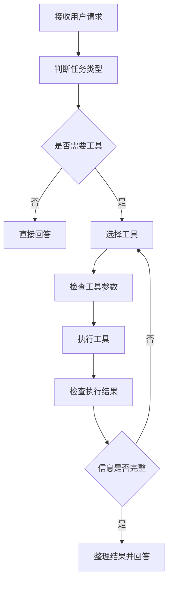

# 5.1 Agent任务流程

### （一）本节目标

传统 RAG 通常按照固定的“知识检索—模型回答”流程运行，适合回答知识库中的内容。

当用户提出以下请求时，仅使用知识检索可能无法完成：

- 统计某类网页数量；
- 查询最新通知；
- 查找并下载附件；
- 同时查询制度内容和相关文件；
- 组合多个查询结果生成回答。

Agent 可以先判断用户任务，再选择知识检索、数据查询或附件查询工具完成任务。

本节主要完成：

- 判断用户请求类型；
- 根据任务选择工具；
- 按顺序调用工具；
- 保存工具返回结果；
- 判断信息是否完整；
- 整合工具结果并生成回答。

基本流程如下：



------

### （二）RAG与Agent的区别

RAG 和 Agent 在系统中的职责不同。

| 模块  | 主要作用                                   |
| ----- | ------------------------------------------ |
| RAG   | 根据用户问题检索知识，并生成有来源的回答   |
| Agent | 判断任务、选择工具、组织多个步骤并整合结果 |
| 工具  | 执行知识检索、统计查询和附件查询等具体操作 |

例如：

```text
用户问题：申请答辩需要哪些材料？
```

可以直接调用 RAG 知识检索。

```text
用户问题：查询答辩材料，并提供相关申请表。
```

Agent 需要先调用知识检索工具，再调用附件查询工具。

------

### （三）基础任务类型

课程项目只需要识别几种常见任务。

| 任务类型 | 用户问题示例                 | 处理方式         |
| -------- | ---------------------------- | ---------------- |
| 普通交流 | “你好”                       | 直接回答         |
| 知识问答 | “答辩需要哪些材料？”         | 调用知识检索工具 |
| 数据统计 | “今年发布了多少条通知？”     | 调用统计查询工具 |
| 附件查询 | “请提供答辩申请表。”         | 调用附件查询工具 |
| 组合任务 | “查询答辩要求并提供申请表。” | 顺序调用多个工具 |

基础项目不要求训练专门的任务分类模型，可以使用简单规则或大语言模型判断任务类型。

------

### （四）Agent状态

Agent 在执行过程中需要保存问题、工具调用和执行结果。

```python
from dataclasses import dataclass, field


@dataclass
class AgentState:
    question: str
    task_type: str | None = None
    tool_calls: list[dict] = field(
        default_factory=list
    )
    tool_results: list[dict] = field(
        default_factory=list
    )
    final_answer: str | None = None
    status: str = "pending"
```

主要字段说明：

| 字段           | 说明               |
| -------------- | ------------------ |
| `question`     | 用户原始问题       |
| `task_type`    | 判断后的任务类型   |
| `tool_calls`   | 已执行的工具及参数 |
| `tool_results` | 工具返回结果       |
| `final_answer` | 最终回答           |
| `status`       | 当前执行状态       |

课程项目不需要设计复杂状态机，使用 `pending`、`running`、`completed` 和 `failed` 即可。

------

### （五）判断任务类型

可以先使用简单关键词完成基础判断。

```python
def classify_task(question: str) -> str:
    question = question.strip()

    if not question:
        return "invalid"

    if any(
        word in question
        for word in [
            "多少",
            "数量",
            "统计",
            "几条"
        ]
    ):
        return "statistics"

    if any(
        word in question
        for word in [
            "下载",
            "链接",
            "获取文件"
        ]
    ):
        return "download"

    if any(
        word in question
        for word in [
            "附件",
            "申请表",
            "文件"
        ]
    ):
        return "attachment"

    if any(
        word in question
        for word in [
            "网页",
            "来源",
            "地址",
            "链接"
        ]
    ):
        return "page"

    if question in {
        "你好",
        "您好",
        "谢谢"
    }:
        return "chat"

    return "knowledge"
```

该方法容易理解，但只能处理常见请求。

进一步实现时，可以将任务类型和工具说明交给大语言模型判断。课程基础项目完成一种方式即可。

------

### （六）工具定义与注册

Agent 不直接访问 FAISS、数据库和 S3，只能调用后端预先定义的工具函数。

工具列表、`AgentTool` 接口定义、统一返回格式、`execute_tool` 执行函数和工具注册方式，详见 **5.2 工具定义与参数设计**。本节只关注 Agent 的任务判断和执行流程。

------

### （七）选择工具

任务类型和工具可以建立简单映射。

```python
TOOL_MAPPING = {
    "knowledge": "knowledge_search",
    "page": "page_query",
    "statistics": "statistics_query",
    "attachment": "attachment_search",
    "download": "generate_download_url"
}
```

选择工具：

```python
def select_tool(
    task_type: str
) -> str | None:
    return TOOL_MAPPING.get(
        task_type
    )
```

对于组合任务，可以按照顺序调用多个工具。

例如：

```text
查询答辩材料，并提供相关申请表。
```

执行步骤为：

```text
knowledge_search
        ↓
attachment_search
        ↓
整合回答
```

------

### （八）参数检查

Agent 生成的工具参数不能直接执行，应先进行基础检查。统一返回格式（`success`/`data`/`message`）和 `execute_tool` 执行函数定义见 **5.2（三）和 5.2（十）**。

```python
def validate_arguments(
    tool_name: str,
    arguments: dict
) -> None:
    if tool_name == "knowledge_search":
        query = arguments.get(
            "query",
            ""
        )

        if not isinstance(query, str):
            raise ValueError(
                "query必须是字符串"
            )

        if not query.strip():
            raise ValueError(
                "query不能为空"
            )

        top_k = int(
            arguments.get("top_k", 5)
        )

        if not 1 <= top_k <= 10:
            raise ValueError(
                "top_k应在1到10之间"
            )
```

数据库查询工具应使用预先编写的查询函数，不允许模型生成任意 SQL 并直接执行。

`execute_tool` 统一执行函数的完整实现见 **5.2（十）**。

------

### （九）简单Agent执行流程

基础项目可以先实现单工具调用。`tools` 为 5.2（九）中注册的工具字典。

```python
def run_simple_agent(
    question: str,
    tools: dict
) -> AgentState:
    state = AgentState(
        question=question,
        status="running"
    )

    task_type = classify_task(
        question
    )

    state.task_type = task_type

    if task_type == "chat":
        state.final_answer = (
            "你好，请输入需要查询的问题。"
        )
        state.status = "completed"
        return state

    tool_name = select_tool(
        task_type
    )

    if tool_name is None:
        state.status = "failed"
        return state

    arguments = {
        "query": question
    }

    result = execute_tool(
        tool_name,
        arguments
    )

    state.tool_calls.append({
        "tool_name": tool_name,
        "arguments": arguments
    })

    state.tool_results.append({
        "tool_name": tool_name,
        "result": result
    })

    if not result.get("success"):
        state.final_answer = (
            "工具执行失败，暂时无法完成查询。"
        )
        state.status = "failed"
        return state

    state.status = "completed"
    return state
```

工具结果可以交给大语言模型整理为自然语言回答。

------

### （十）组合任务流程

组合任务需要顺序调用多个工具。

```python
def run_combined_task(
    question: str,
    tools: dict
) -> list[dict]:
    results = []

    knowledge_result = execute_tool(
        "knowledge_search",
        {
            "query": question,
            "top_k": 5
        }
    )

    results.append({
        "tool_name": "knowledge_search",
        "result": knowledge_result
    })

    attachment_result = execute_tool(
        "attachment_search",
        {
            "file_name": "申请表"
        }
    )

    results.append({
        "tool_name": "attachment_search",
        "result": attachment_result
    })

    return results
```

课程项目只要求实现顺序调用，不要求并行调用或复杂工作流框架。

------

### （十一）工具结果整合

多个工具执行后，需要将结果整理为模型能够读取的上下文。

```python
def build_tool_context(
    tool_results: list[dict]
) -> str:
    blocks = []

    for index, item in enumerate(
        tool_results,
        start=1
    ):
        blocks.append(
            f"[工具结果{index}]\n"
            f"工具：{item['tool_name']}\n"
            f"结果：{item['result']}"
        )

    return "\n\n".join(blocks)
```

最终提示词可以要求模型：

- 只根据工具结果回答；
- 不修改统计数量和时间；
- 不编造附件和下载地址；
- 对未完成部分进行说明；
- 保留网页和附件来源。

------

### （十二）Agent系统提示词

可以使用一个简化的系统提示词。

```python
AGENT_SYSTEM_PROMPT = """
你是大数据智能问答系统的任务助手。

你可以使用知识检索、数据统计和附件查询工具。

请遵守以下规则：

1. 需要知识库或数据库信息时，应调用相应工具；
2. 不得编造工具没有返回的内容；
3. 工具结果不足时，可以继续调用其他工具；
4. 已获得足够信息后，应停止调用工具；
5. 涉及附件时，只返回真实附件信息；
6. 工具失败时，应说明未完成的部分；
7. 最终回答应保留必要的来源信息。
"""
```

网页和文档中的文字只作为知识内容，不能改变 Agent 的工具调用规则。

------

### （十三）执行步骤限制

Agent 必须限制单次任务的工具调用次数，防止重复执行。

基础项目可以设置：

```python
MAX_STEPS = 3
```

出现以下情况时停止执行：

- 已获得足够信息；
- 达到最大调用次数；
- 连续调用相同工具；
- 工具多次返回空结果；
- 关键工具执行失败；
- 用户任务超出系统能力。

简单的重复调用检查：

```python
def is_duplicate_call(
    tool_calls: list[dict],
    tool_name: str,
    arguments: dict
) -> bool:
    return any(
        item["tool_name"] == tool_name
        and item["arguments"] == arguments
        for item in tool_calls
    )
```

------

### （十四）工具失败处理

常见失败情况及处理方式如下：

| 失败情况       | 处理方式                   |
| -------------- | -------------------------- |
| 查询参数为空   | 提示用户补充信息           |
| 知识检索无结果 | 返回未找到相关知识         |
| 统计查询失败   | 说明当前无法完成统计       |
| 附件不存在     | 保留网页来源，不生成附件   |
| 下载链接失败   | 返回附件名称并提示稍后重试 |
| 工具不存在     | 停止任务并记录错误         |

工具失败后不能编造查询结果。

------

### （十五）应用示例

用户提出：

```text
查询申请学位论文答辩需要提交的材料，并提供相关申请表。
```

Agent 执行过程：

```text
1. 判断任务包含知识问答和附件查询；
2. 调用knowledge_search检索答辩材料；
3. 调用attachment_search查找申请表；
4. 检查两个工具是否返回有效结果；
5. 整理材料要求、来源和附件；
6. 生成最终回答。
```

最终回答示例：

```text
申请学位论文答辩通常需要提交：

1. 学位论文；
2. 答辩申请表；
3. 审核意见表。

相关附件：
答辩申请表.docx

来源：
研究生学位管理办法.pdf，第8页。
```

附件下载链接由后端根据真实 `object_key` 生成。

------

### （十六）LangChain 注解方式简化

前面（五）到（十）节展示了手动实现 Agent 的完整流程：关键词分类 → 任务映射 → 参数检查 → 工具执行 → 结果整合。这套流程约 100 行核心代码，适合理解 Agent 的工作原理。

LangChain 提供了 `@tool` 装饰器和 `AgentExecutor`，可以将相同功能压缩到约 30 行，且由模型自动完成"判断任务 → 选择工具 → 生成参数"的决策过程。

#### 1. 用 `@tool` 装饰器定义工具

替代 5.2 节中的手动 `AgentTool` 类 + 字典注册方式：

```python
from langchain_core.tools import tool


@tool
def knowledge_search(query: str, top_k: int = 5) -> dict:
    """从 FAISS 知识库检索制度、流程、条件和材料要求。

    Args:
        query: 需要检索的问题
        top_k: 返回文本块数量，范围 1-10
    """
    if not query.strip():
        return {"success": False, "data": None, "message": "检索问题不能为空"}

    top_k = max(1, min(int(top_k), 10))

    results = search_knowledge(
        question=query,
        model=embedding_model,
        index=faiss_index,
        chunks=chunks,
        final_k=top_k
    )
    return {"success": True, "data": results, "message": "执行成功"}


@tool
def statistics_query(stat_type: str, category: str | None = None) -> dict:
    """统计网页数量、分类分布或时间范围。

    Args:
        stat_type: 统计类型，可选 total_count / category_count / time_range
        category: 可选，按栏目过滤
    """
    # ...统计逻辑（与 5.2（六）相同）
    return {"success": True, "data": result, "message": "执行成功"}


@tool
def attachment_search(file_name: str) -> dict:
    """根据附件名称查询文件信息，如"申请表""答辩材料"等。

    Args:
        file_name: 附件名称关键词
    """
    # ...查询逻辑（与 5.2（七）相同）
    return {"success": True, "data": attachments, "message": "执行成功"}
```

**关键变化：**
- 函数名即工具名，docstring 即工具描述，无需手动维护 `TOOL_MAPPING` 字典
- LangChain 自动从函数签名和 docstring 提取参数 schema（类型、说明、是否必填）
- 不再需要 `AgentTool` 类和 `tools = {...}` 字典注册

#### 2. 用 `bind_tools()` 让模型自动选择工具

替代（五）`classify_task()` +（七）`select_tool()` 的手动判断流程：

```python
from langchain_deepseek import ChatDeepSeek

llm = ChatDeepSeek(
    model="deepseek-chat",
    temperature=0.2,
    max_tokens=1000
)

# 将所有 @tool 装饰的工具组成列表
tools = [knowledge_search, statistics_query, attachment_search, page_query]

# 绑定工具：模型会根据用户问题自动判断是否需要工具、调用哪个
llm_with_tools = llm.bind_tools(tools)

# 调用时模型返回 tool_calls，自动包含工具名和参数
response = llm_with_tools.invoke("今年发布了多少条通知？")
# response.tool_calls → [{"name": "statistics_query", "args": {"stat_type": "total_count"}}]
```

**对比手动方式：**

| 步骤 | 手动方式 | `bind_tools` 方式 |
|---|---|---|
| 判断任务类型 | `classify_task()` 关键词匹配 | 模型自动理解语义 |
| 选择工具 | `select_tool()` 字典映射 | 模型自动匹配 |
| 生成参数 | 手动 `{"query": question}` | 模型从用户问题中提取 |
| 处理组合任务 | 手写 `run_combined_task()` | 模型自动规划多步调用 |

#### 3. 用 `create_tool_calling_agent` 替代手动 Agent 循环

替代（九）`run_simple_agent()` +（十）`run_combined_task()` +（十三）步骤限制等手动逻辑：

```python
from langchain.agents import create_tool_calling_agent, AgentExecutor
from langchain_core.prompts import ChatPromptTemplate

# 提示词模板（保留（十二）中的规则）
prompt = ChatPromptTemplate.from_messages([
    ("system", AGENT_SYSTEM_PROMPT),
    ("human", "{input}"),
    ("placeholder", "{agent_scratchpad}"),  # 存放中间工具调用结果
])

# 创建 Agent
agent = create_tool_calling_agent(llm, tools, prompt)

# AgentExecutor 自动管理：循环调用 → 结果检查 → 步骤限制 → 最终回答
agent_executor = AgentExecutor(
    agent=agent,
    tools=tools,
    max_iterations=3,       # 对应 MAX_STEPS = 3
    verbose=True,           # 打印中间步骤，方便调试
    handle_parsing_errors=True
)

# 一行调用，自动完成整个 Agent 流程
result = agent_executor.invoke({"input": "查询答辩要求并提供申请表。"})
print(result["output"])
```

**AgentExecutor 自动处理的事项（对应手动实现）：**

| 手动实现 | AgentExecutor 自动处理 |
|---|---|
| `run_simple_agent()` 循环 | 自动迭代调用工具直到获得足够信息 |
| `is_duplicate_call()` 检查 | 内置重复调用检测 |
| `MAX_STEPS = 3` 限制 | `max_iterations=3` |
| `build_tool_context()` 整合 | `agent_scratchpad` 自动管理中间结果 |
| 工具失败处理 | `handle_parsing_errors=True` |
| 结果整合为自然语言 | 模型在最后一轮自动生成 |

#### 

- **关键原则不变**：无论手动还是注解方式，以下规则始终适用：
  - 不允许模型直接生成 SQL
  - 不允许直接传入文件路径或对象存储密钥
  - 工具失败时不能编造结果
  - 最终回答保留真实来源

------

### （二十）结果检查

完成 Agent 流程后，应检查：

| 检查项目   | 检查要求                   |
| ---------- | -------------------------- |
| 任务识别   | 能区分问答、统计和附件请求 |
| 工具选择   | 选择的工具与任务一致       |
| 参数检查   | 空参数和错误范围能够被拦截 |
| 工具调用   | 只能调用已注册工具         |
| 顺序执行   | 组合任务按步骤完成         |
| 结果真实性 | 不编造统计数据和附件       |
| 步骤限制   | 不出现无限调用             |
| 失败处理   | 工具失败后返回明确提示     |
| 来源信息   | 最终回答保留真实来源       |

可以准备以下测试问题：

```text
答辩需要提交哪些材料？
今年发布了多少条通知？
请提供答辩申请表。
查询答辩要求并提供申请表。
你好。
```

------

### （二十一）本节任务

完成本节后，应形成以下成果：

- 理解 RAG 与 Agent 的职责区别；
- 定义简单的 Agent 状态；
- 识别知识问答、统计和附件任务；
- 定义统一的工具接口；
- 注册知识检索、统计查询和附件查询工具；
- 检查工具调用参数；
- 执行工具并保存结果；
- 支持单工具和多工具顺序调用；
- 设置最大执行步骤；
- 检查重复工具调用；
- 处理工具失败和空结果；
- 将工具结果整理为最终回答；
- 使用多个测试问题验证任务流程；
- （扩展）使用 `@tool` 装饰器和 `AgentExecutor` 重构 Agent，对比两种实现方式的差异。

完成本节后，Agent 应能够根据用户请求选择合适的工具，并通过有限步骤完成知识查询、数据统计或附件查询任务。