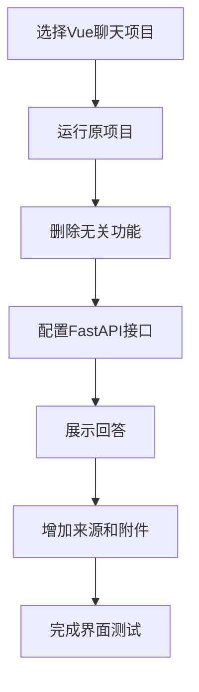
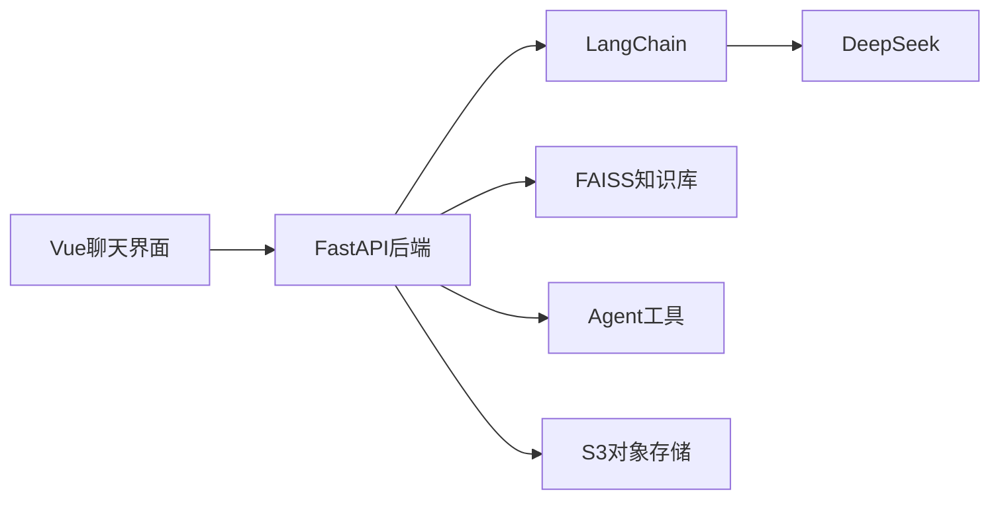
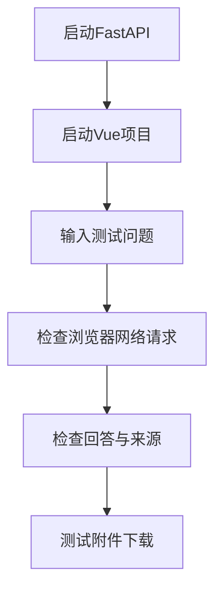

# 6.2 智能问答界面开发

### （一）本节目标

智能问答界面用于接收用户问题，并展示系统返回的回答、知识来源和附件信息。

本项目不要求从零开发聊天界面，而是选择一个结构简单的 Vue 3 聊天开源项目进行二次修改，保留其已有的消息列表、输入框和 Markdown 渲染功能。

前端主要完成：

- 输入并发送用户问题；
- 调用 FastAPI 问答接口；
- 展示 DeepSeek 生成的回答；
- 展示知识来源和页码；
- 提供附件下载入口；
- 显示加载状态和错误信息；
- 保存简单的会话消息。

基本开发流程如下：



------

### （二）前后端职责

前端不直接调用 DeepSeek、LangChain、FAISS、数据库或对象存储。

系统调用关系如下：



各部分职责如下：

| 模块       | 主要职责                   |
| ---------- | -------------------------- |
| Vue前端    | 提交问题、展示回答和来源   |
| FastAPI    | 接收请求并返回统一结果     |
| LangChain  | 组织提示词、模型和工具调用 |
| DeepSeek   | 生成自然语言回答           |
| FAISS      | 检索相关知识文本           |
| Agent工具  | 查询网页、附件和下载信息   |
| S3对象存储 | 保存并提供附件文件         |

这种设计可以避免在浏览器中暴露模型密钥和对象存储配置。

------

### （三）界面主要功能

本项目界面保留以下核心功能：

| 功能         | 说明                     |
| ------------ | ------------------------ |
| 问题输入     | 输入并发送用户问题       |
| 消息展示     | 区分用户消息和助手回答   |
| Markdown展示 | 显示列表、表格和加粗内容 |
| 来源展示     | 显示文件名、网页和页码   |
| 附件下载     | 根据附件编号请求下载链接 |
| 加载提示     | 请求处理时显示等待状态   |
| 错误提示     | 请求失败时显示提示信息   |
| 简单会话     | 保存当前页面中的历史消息 |

复杂的用户登录、多模型切换、插件市场和在线充值等功能不属于本课程项目范围。

------

### （四）选择开源项目

建议选择满足以下条件的 Vue 聊天项目：

- 使用 Vue 3；
- 能够使用 npm 直接运行；
- 已包含聊天消息布局；
- 已支持 Markdown 渲染；
- 目录结构较简单；
- 没有复杂的服务器依赖；
- 容易修改接口地址。

可以优先选择简单的 Vue 3 聊天模板或 `chatgpt-web` 类项目。

不建议选择：

- React 或 Next.js 项目；
- 依赖复杂账号系统的项目；
- 同时集成多个模型平台的项目；
- 包含 LangGraph 或多 Agent 前端的项目；
- 长期无法正常安装依赖的旧项目。

选择的重点不是界面功能越多越好，而是能够快速运行和修改。

------

### （五）运行开源项目

进入前端项目目录后安装依赖：

```bash
npm install
```

启动开发服务器：

```bash
npm run dev
```

一般可以通过以下地址访问：

```text
http://localhost:5173
```

确认原项目能够正常显示聊天页面后，再开始修改。

------

### （六）简化原有功能

开源项目中可能包含许多与课程设计无关的功能，可以删除或隐藏：

- 多模型切换；
- 温度等模型参数设置；
- API Key输入；
- 在线充值；
- 插件管理；
- 多语言切换；
- 复杂用户权限；
- 云端会话同步；
- 图片生成；
- 语音输入。

建议保留：

- 聊天消息列表；
- 问题输入框；
- 发送按钮；
- Markdown 渲染；
- 简单会话列表；
- 页面基础样式。

前端不能要求用户填写 DeepSeek API Key。模型密钥统一保存在 FastAPI 后端。

------

### （七）配置后端地址

在前端项目根目录创建 `.env`：

```env
VITE_API_BASE_URL=http://127.0.0.1:8000/api
```

创建 Axios 请求对象：

```javascript
import axios from "axios"

const api = axios.create({
  baseURL: import.meta.env.VITE_API_BASE_URL,
  timeout: 120000
})

export default api
```

其中，`timeout` 设置为 120 秒，是因为知识检索和 DeepSeek 回答可能需要一定时间。

------

### （八）封装问答接口

创建问答请求函数：

```javascript
import api from "./request"

export function askQuestion(data) {
  return api.post("/qa", data)
}
```

前端提交的数据格式为：

```json
{
  "question": "申请答辩需要提交哪些材料？",
  "session_id": "session_001",
  "use_agent": true
}
```

参数说明：

| 参数         | 说明                      |
| ------------ | ------------------------- |
| `question`   | 用户输入的问题            |
| `session_id` | 当前会话编号              |
| `use_agent`  | 是否允许后端使用Agent工具 |

即使设置了 `use_agent=true`，是否真正调用工具仍由后端任务判断决定。

------

### （九）定义消息数据结构

前端可以使用统一的消息结构：

```javascript
const message = {
  role: "assistant",
  content: "",
  sources: [],
  attachments: [],
  error: false
}
```

字段说明：

| 字段          | 说明                |
| ------------- | ------------------- |
| `role`        | `user`或`assistant` |
| `content`     | 消息正文            |
| `sources`     | 知识来源列表        |
| `attachments` | 附件列表            |
| `error`       | 是否为错误消息      |

用户消息通常只需要保存 `role` 和 `content`。

------

### （十）发送用户问题

发送问题时，先将用户消息加入消息列表，再调用后端接口。

```javascript
import { ref } from "vue"
import { askQuestion } from "./api"

const messages = ref([])
const loading = ref(false)
const sessionId = ref("session_001")

async function sendQuestion(text) {
  const question = text.trim()

  if (!question || loading.value) {
    return
  }

  messages.value.push({
    role: "user",
    content: question
  })

  loading.value = true

  try {
    const response = await askQuestion({
      question,
      session_id: sessionId.value,
      use_agent: true
    })

    const result = response.data

    messages.value.push({
      role: "assistant",
      content: result.answer,
      sources: result.sources || [],
      attachments: result.attachments || [],
      error: false
    })
  } catch (error) {
    messages.value.push({
      role: "assistant",
      content: "请求失败，请稍后重试。",
      sources: [],
      attachments: [],
      error: true
    })
  } finally {
    loading.value = false
  }
}
```

前端不需要了解后端本次请求使用了 RAG 还是 Agent，只需处理统一返回结构。

------

### （十一）展示Markdown回答

开源聊天项目通常已经包含 Markdown 组件，可以继续使用原有组件展示 `message.content`。

示例：

```vue
<MarkdownRenderer
  :content="message.content"
/>
```

回答可以展示：

- 普通段落；
- 有序列表；
- 无序列表；
- 表格；
- 加粗内容；
- 代码块；
- `[资料1]` 等引用编号。

不需要重新编写 Markdown 解析器。

模型输出可能包含 HTML，因此应使用项目已有的安全过滤功能，避免执行脚本。

------

### （十二）展示知识来源

在助手回答下方增加来源区域：

```vue
<div
  v-if="message.sources?.length"
  class="source-list"
>
  <div
    v-for="source in message.sources"
    :key="source.source_no"
    class="source-item"
  >
    <div class="source-title">
      [资料{{ source.source_no }}]
      {{ source.file_name || "未知来源" }}
    </div>

    <div v-if="source.page_number">
      第{{ source.page_number }}页
    </div>

    <div v-if="source.sheet_name">
      工作表：{{ source.sheet_name }}
    </div>

    <a
      v-if="source.source_url"
      :href="source.source_url"
      target="_blank"
      rel="noopener noreferrer"
    >
      查看原网页
    </a>
  </div>
</div>
```

来源编号必须与回答中的 `[资料1]`、`[资料2]` 保持一致。

来源区域不应根据模型文本自行解析网页地址，而应使用后端返回的真实 `source_url`。

------

### （十三）展示命中文本摘要

为了帮助用户判断来源是否相关，可以显示知识块摘要：

```vue
<p
  v-if="source.content_preview"
  class="source-preview"
>
  {{ source.content_preview }}
</p>
```

每条来源只显示较短的摘要即可，避免页面内容过长。

相关度分数主要用于调试，普通界面可以不显示。

------

### （十四）附件下载接口

前端不能直接使用 S3 的 `object_key`，应根据附件编号向 FastAPI 请求临时下载链接。

接口函数：

```javascript
export function getDownloadUrl(
  attachmentId
) {
  return api.get(
    `/attachments/${attachmentId}/download`
  )
}
```

下载处理：

```javascript
async function downloadAttachment(
  attachment
) {
  try {
    const response = await getDownloadUrl(
      attachment.attachment_id
    )

    const downloadUrl =
      response.data.download_url

    window.open(
      downloadUrl,
      "_blank",
      "noopener,noreferrer"
    )
  } catch (error) {
    alert("附件下载失败，请稍后重试。")
  }
}
```

下载链接由后端实时生成，前端不长期保存。

------

### （十五）附件按钮展示

在助手消息下方显示附件列表：

```vue
<div
  v-if="message.attachments?.length"
  class="attachment-list"
>
  <button
    v-for="item in message.attachments"
    :key="item.attachment_id"
    type="button"
    @click="downloadAttachment(item)"
  >
    下载 {{ item.file_name }}
  </button>
</div>
```

如果来源中已经包含附件编号，也可以在来源卡片中增加下载按钮：

```vue
<button
  v-if="source.attachment_id"
  type="button"
  @click="downloadAttachment(source)"
>
  下载附件
</button>
```

------

### （十六）加载状态

发送问题后，应显示加载状态，并阻止重复提交。

```vue
<button
  :disabled="loading"
  @click="sendQuestion(inputText)"
>
  {{ loading ? "正在回答..." : "发送" }}
</button>
```

也可以在消息列表末尾显示：

```vue
<div v-if="loading">
  正在检索知识并生成回答……
</div>
```

由于后端需要完成 FAISS 检索、LangChain 调用和 DeepSeek 生成，响应时间可能比普通接口稍长。

基础项目使用普通非流式响应即可，不要求实现 SSE 或 WebSocket。

------

### （十七）错误提示

常见错误包括：

- 后端服务未启动；
- DeepSeek 接口不可用；
- 请求处理超时；
- 知识库未加载；
- 附件不存在；
- 下载链接生成失败。

可以统一显示简短提示：

```javascript
function getErrorMessage(error) {
  if (error.code === "ECONNABORTED") {
    return "请求超时，请稍后重试。"
  }

  if (error.response?.status === 404) {
    return "请求的资源不存在。"
  }

  return "请求失败，请检查后端服务。"
}
```

不需要向用户展示完整的服务器异常信息。

------

### （十八）简单会话功能

本科项目可以只在前端内存中保存当前会话：

```javascript
const messages = ref([])
```

新建会话时清空消息：

```javascript
function createNewSession() {
  sessionId.value = `session_${Date.now()}`
  messages.value = []
}
```

若后端实现了会话记录接口，再增加历史消息加载功能。基础项目不要求实现复杂的用户登录和云端同步。

------

### （十九）系统名称与页面调整

开源项目运行后，应替换原有品牌信息，例如：

```text
原名称：ChatGPT Web
修改后：大数据智能问答系统
```

页面可以包括：

- 顶部系统名称；
- 左侧简单会话列表；
- 中间聊天消息区域；
- 底部问题输入框；
- 回答下方来源卡片；
- 附件下载按钮。

不要求设计复杂动画或管理后台，重点是功能完整和展示清晰。

------

### （二十）使用AI辅助修改

可以使用 AI 辅助理解和修改开源项目代码，例如：

```text
请分析当前Vue聊天组件的消息数据结构，
在assistant消息下方增加知识来源列表和附件下载按钮。
保留原有Markdown渲染、消息发送和页面样式。
```

也可以提供浏览器控制台错误：

```text
点击发送后出现Cannot read properties of undefined，
请检查response.data和消息字段的使用是否一致。
```

AI 生成代码后，必须在本地运行，并检查：

- 组件路径是否正确；
- 变量名称是否与项目一致；
- 后端字段是否匹配；
- npm 依赖是否已安装；
- 页面是否能够正常编译。

------

### （二十一）接口联调

联调前应先确认 FastAPI 已经启动：

```text
http://127.0.0.1:8000/health
```

再确认前端环境变量：

```env
VITE_API_BASE_URL=http://127.0.0.1:8000/api
```

联调流程如下：



浏览器开发者工具中应重点检查：

- 请求地址是否正确；
- HTTP 状态码是否为 200；
- 请求 JSON 是否正确；
- 返回字段是否完整；
- 控制台是否有 JavaScript 错误。

------

### （二十二）界面测试

可以使用以下问题进行测试：

```text
申请论文答辩需要提交哪些材料？
请提供相关申请表。
今年发布了多少条奖学金通知？
该规定来自哪个文件？
知识库中不存在的制度是什么？
```

测试内容如下：

| 测试项目     | 预期结果               |
| ------------ | ---------------------- |
| 用户问题发送 | 消息能够加入聊天区域   |
| 普通知识问答 | 正常显示DeepSeek回答   |
| Markdown展示 | 列表和表格正常显示     |
| 来源编号     | 与回答中的资料编号一致 |
| 网页来源     | 点击后能够打开原网页   |
| 附件查询     | 能显示附件名称         |
| 附件下载     | 能获得临时下载链接     |
| 加载状态     | 请求期间禁止重复发送   |
| 错误提示     | 后端异常时显示友好信息 |
| 无知识问题   | 明确提示未找到知识依据 |
| 新建会话     | 能清空当前消息         |

------

### （二十三）本节任务

完成本节后，应形成以下成果：

- 选择并运行一个 Vue 3 聊天开源项目；
- 删除多模型、插件和复杂用户管理等无关功能；
- 修改系统名称和基础页面样式；
- 配置 FastAPI 后端地址；
- 实现问答接口调用；
- 使用原项目 Markdown 组件展示回答；
- 在回答下方展示知识来源；
- 显示文件名、网页地址和 PDF 页码；
- 根据附件编号请求临时下载链接；
- 增加附件下载按钮；
- 增加加载状态和错误提示；
- 实现简单的新建会话功能；
- 完成 RAG、Agent、来源和附件功能测试；
- 保存运行页面和测试结果截图。

完成本节后，系统应能够通过 Vue 聊天界面提交用户问题，并展示 DeepSeek 生成的回答、真实知识来源和附件下载入口。