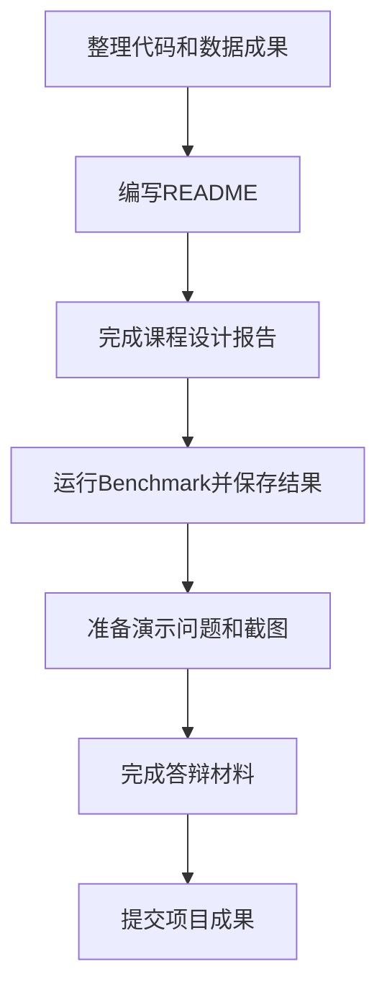

# 7.2 课程设计报告与答辩

### （一）本节目标

完成 Benchmark 测试后，项目还需要形成可提交、可复现、可展示的最终成果。课程设计报告和答辩不是重新罗列代码，而是说明系统如何从数据采集、处理、检索、问答到测试验收形成完整工程。

本节主要完成：

- 整理项目最终提交材料；
- 编写 README 运行说明；
- 编写课程设计报告；
- 准备系统演示内容；
- 准备答辩说明和分工材料；
- 检查最终成果是否与前文章节对应。



------

### （二）最终提交材料

项目提交时应保证教师能够看到系统的完整结构、关键代码、运行方式和测试结果。

建议提交以下内容：

| 类别 | 提交内容 |
| ---- | -------- |
| 代码 | 爬虫、数据处理、文档解析、知识库、RAG、Agent、FastAPI、Vue、Benchmark 脚本 |
| 配置 | `requirements.txt`、`.env.example`、数据库建表脚本、前端环境说明 |
| 数据 | 采集样例、PySpark 清洗结果、Spark SQL 统计结果、解析文本、文本块样例 |
| 索引 | FAISS 索引构建脚本、索引配置、文本块映射文件 |
| 测试 | Benchmark 输入说明、结果 JSONL、接口测试截图或日志 |
| 文档 | README、课程设计报告、任务分工表、答辩 PPT |

较大的原始文件、模型文件和 FAISS 索引可以提交构建脚本和存储位置说明，不必全部放入代码仓库。

不得提交：

- `.env` 文件；
- 数据库真实密码；
- S3 访问密钥；
- DeepSeek API Key；
- 未授权公开的数据；
- 本地绝对路径形式的临时文件。

------

### （三）README运行说明

README 用于说明项目如何运行。内容应简洁、可操作，避免写成课程设计报告。

README 建议包含：

#### 1. 项目简介

说明项目名称、应用主题、数据来源和主要功能。

```text
本项目实现一个面向公开网页和附件资料的大数据智能问答系统，支持知识问答、来源追溯、附件查询下载和统计类问题。
```

#### 2. 技术路线

用简短列表说明系统组件：

```text
Python + PySpark + Spark SQL + MySQL + S3/MinIO
BAAI/bge-m3 + FAISS + LangChain + DeepSeek
FastAPI + Vue
```

#### 3. 目录结构

列出项目主要目录，并说明作用。

```text
crawler/             网页与附件采集
data_processing/     PySpark清洗与Spark SQL统计
document_parser/     文档解析
knowledge_base/      文本分块、向量化和FAISS索引
agent/               Agent工具调用
backend/             FastAPI后端
frontend/            Vue前端
tests/               Benchmark和接口测试
```

#### 4. 环境准备

说明 Python、Java、Node.js、MySQL、MinIO 等基础环境要求，并给出依赖安装命令。

```bash
pip install -r requirements.txt
```

前端依赖安装：

```bash
cd frontend
npm install
```

#### 5. 配置说明

说明 `.env.example` 中各配置项含义。README 中只能展示配置项名称，不能写真实密钥。

```env
DATABASE_URL=
S3_ENDPOINT=
S3_BUCKET=
DEEPSEEK_API_KEY=
DEEPSEEK_MODEL=
FAISS_INDEX_PATH=
CHUNK_FILE_PATH=
```

#### 6. 运行步骤

按实际执行顺序说明：

1. 初始化数据库表；
2. 启动 MySQL 和 S3 对象存储；
3. 运行爬虫采集数据；
4. 运行 PySpark 清洗程序；
5. 运行 Spark SQL 统计程序；
6. 运行文档解析和文本分块程序；
7. 生成向量并构建 FAISS 索引；
8. 启动 FastAPI 后端；
9. 启动 Vue 前端；
10. 运行 Benchmark 测试。

#### 7. 接口说明

至少说明问答接口和附件下载接口。

```text
POST /api/qa
GET /api/attachments/{attachment_id}/download
GET /health
```

问答请求：

```json
{
  "session_id": "session_001",
  "question": "申请论文答辩需要提交哪些材料？",
  "use_agent": true
}
```

问答响应：

```json
{
  "status": "success",
  "question": "用户问题",
  "answer": "系统回答",
  "sources": [],
  "attachments": [],
  "session_id": "session_001"
}
```

#### 8. Benchmark说明

说明测试文件位置、运行命令和结果文件位置。

```bash
python tests/run_benchmark.py
```

输出：

```text
outputs/benchmark_result.jsonl
```

------

### （四）课程设计报告结构

课程设计报告应真实反映系统设计、实现、测试和问题分析。报告不要求逐行粘贴全部代码，应重点说明关键流程、接口、数据结构和运行结果。

建议结构如下：

#### 1. 项目背景与目标

说明项目主题、数据来源、目标用户和系统要解决的问题。

应回答：

- 为什么选择该数据源；
- 系统支持哪些类型的问题；
- 项目最终要实现哪些功能。

#### 2. 系统总体设计

说明系统整体流程和模块分工。

建议包含：

- 离线数据构建流程；
- 在线问答流程；
- RAG 与 Agent 的职责划分；
- 前后端职责划分。

不要在总体设计中展开全部实现代码，具体实现放到后续章节。

#### 3. 数据采集与存储

说明：

- 数据源地址和合法性；
- 采集字段；
- 网页和附件采集方法；
- MySQL 表结构；
- S3 对象目录；
- `document_id` 和 `attachment_id` 的关联方式。

可展示少量 JSON 样例、数据库截图或对象存储截图。

#### 4. PySpark清洗与Spark SQL统计

说明：

- PySpark 输入和输出；
- 去重、空值处理、时间转换、字段标准化；
- Spark SQL 统计内容；
- 统计结果保存位置；
- 在线 Agent 如何读取已有统计结果。

应明确 Spark SQL 用于离线统计，不在用户问答时实时启动 Spark 作业。

#### 5. 文档解析与知识库构建

说明：

- PDF、Word、Excel 和网页正文的解析方式；
- 文本清洗规则；
- 文本分块参数；
- `chunk_id` 与来源字段；
- `BAAI/bge-m3` 向量化；
- FAISS `IndexFlatIP` 索引构建；
- 向量编号与文本块映射关系。

#### 6. RAG问答与Agent工具

说明：

- RAG 的检索、过滤、上下文构建和回答生成流程；
- 无知识答案处理；
- Agent 的任务判断和顺序工具调用；
- 五个工具的名称、参数和返回格式；
- 工具失败时如何处理。

五个工具应统一为：

```text
knowledge_search
statistics_query
page_query
attachment_search
generate_download_url
```

#### 7. 前后端系统实现

说明：

- FastAPI 提供的接口；
- 请求和返回 JSON；
- Vue 如何提交问题；
- Vue 如何展示 Markdown 回答、来源和附件；
- 前端如何通过 `attachment_id` 请求下载链接。

前端不得直接访问 MySQL、FAISS、S3 或 DeepSeek。

#### 8. Benchmark测试与结果分析

说明：

- Benchmark 文件格式；
- 执行脚本；
- 测试覆盖的问题类型；
- 结果文件格式；
- 典型成功案例；
- 典型失败案例和原因分析。

失败案例分析应关注检索、来源、附件、统计和接口问题，不要只写“模型效果不好”。

#### 9. 总结与改进方向

说明项目完成情况、存在问题和后续可改进内容。

可作为改进方向的内容包括：

- OCR 解析扫描 PDF；
- 检索重排序；
- 流式输出；
- 更好的前端交互；
- 定时更新数据；
- 更完善的日志和错误提示。

这些内容只作为扩展，不应写成基础项目已完成的功能。

------

### （五）报告写作要求

报告应符合工程项目说明的基本规范。

写作要求：

- 图表和截图应与实际系统一致；
- 字段名称应与代码一致；
- 接口示例应与 FastAPI 实际返回一致；
- Benchmark 结果应来自程序运行，不应手工编造；
- 关键代码可以节选，不要整段堆砌；
- 每个模块都应说明输入、处理和输出；
- 遇到失败或不足时应说明原因和处理方法。

报告中不应出现：

- Hadoop、HDFS、Hive 等未使用组件；
- Milvus、Chroma 等未采用的向量数据库；
- LangGraph 或多 Agent 系统；
- 大模型训练或微调；
- 企业级权限系统；
- 未在项目中实际完成的功能。

------

### （六）系统演示准备

现场演示应选择能够稳定运行的流程，不要临时展示未经测试的扩展功能。

建议演示顺序：

1. 展示项目目录和 README；
2. 展示数据源和采集结果；
3. 展示 MySQL 中的网页和附件记录；
4. 展示 S3 中保存的网页 HTML 和附件；
5. 展示 PySpark 清洗结果；
6. 展示 Spark SQL 统计结果；
7. 展示文本块和 FAISS 索引文件；
8. 启动 FastAPI 后端；
9. 启动 Vue 前端；
10. 演示知识问答；
11. 演示来源展示；
12. 演示附件查询和下载；
13. 演示统计类问题；
14. 演示无知识问题；
15. 展示 Benchmark 结果文件。

每个演示点都应说明：

```text
输入是什么
处理了什么
输出在哪里
如何验证结果正确
```

------

### （七）推荐答辩问题

答辩时，教师可能围绕系统流程、字段关联和测试结果提问。学生应能解释自己负责模块的输入、处理和输出。

常见问题包括：

| 问题 | 回答要点 |
| ---- | -------- |
| 为什么使用 S3 和 MySQL 两种存储？ | S3 保存文件本体，MySQL 保存结构化元数据和关联字段 |
| PySpark 处理了哪些数据？ | 网页记录和结构化元数据，不负责 PDF/Word 正文解析 |
| Spark SQL 是否用于在线问答？ | 不实时启动 Spark，只读取离线统计结果 |
| `document_id` 有什么作用？ | 关联网页、附件、清洗结果、文本块和来源 |
| `chunk_id` 如何与 FAISS 对应？ | FAISS 返回向量编号，再映射到文本块记录 |
| RAG 和 Agent 有什么区别？ | RAG 负责知识检索和回答，Agent 负责判断任务并调用工具 |
| 前端能否直接访问 S3？ | 不能，前端只能通过 FastAPI 使用 `attachment_id` 获取临时链接 |
| Benchmark 提交什么？ | 只提交最终答案、完整来源网址和附件文件名 |

------

### （八）任务分工说明

小组项目应在报告或附录中列出任务分工表。

| 成员 | 负责模块 | 主要工作 | 阶段成果 |
| ---- | -------- | -------- | -------- |
| 成员A | 数据采集 | 网页解析、附件下载、异常处理 | 爬虫代码、采集 JSONL |
| 成员B | 数据处理 | MySQL/S3、PySpark、Spark SQL | 数据库表、Parquet、统计结果 |
| 成员C | 知识库 | 文档解析、分块、向量化、FAISS | 文本块、向量、索引 |
| 成员D | 问答后端 | RAG、Agent、FastAPI | 问答接口、工具接口 |
| 成员E | 前端与测试 | Vue 界面、Benchmark、报告 | 页面截图、测试结果、文档 |

实际成员数量不同，可以合并或拆分任务。每名成员都应能够解释本人模块如何与上下游连接。

------

### （九）最终成果检查表

提交前应逐项检查。

| 检查项 | 通过标准 | 结果 |
| ------ | -------- | ---- |
| 数据源说明 | 有公开来源和采集范围 | 通过/未通过 |
| 网页采集 | 能生成网页 JSONL 或数据库记录 | 通过/未通过 |
| 附件采集 | 附件有 `attachment_id` 和 `object_key` | 通过/未通过 |
| MySQL | 网页和附件可通过 `document_id` 关联 | 通过/未通过 |
| S3 | 原始 HTML 和附件可读取 | 通过/未通过 |
| PySpark | 生成清洗 Parquet | 通过/未通过 |
| Spark SQL | 生成离线统计结果 | 通过/未通过 |
| 文档解析 | PDF、Word、Excel 至少有样例通过 | 通过/未通过 |
| 文本块 | 保留 `chunk_id`、`document_id` 和来源字段 | 通过/未通过 |
| FAISS | 索引数量与文本块数量一致 | 通过/未通过 |
| RAG | 能返回回答和来源 | 通过/未通过 |
| Agent | 能调用统计或附件工具 | 通过/未通过 |
| FastAPI | `/api/qa` 和下载接口可用 | 通过/未通过 |
| Vue | 能展示回答、来源和附件 | 通过/未通过 |
| Benchmark | 结果数量与测试数量一致 | 通过/未通过 |
| README | 能说明运行步骤 | 通过/未通过 |
| 报告 | 覆盖设计、实现、测试和总结 | 通过/未通过 |

------

### （十）本节任务

完成本节后，应形成以下成果：

- 整理最终项目源代码；
- 检查 `.env.example` 和依赖文件；
- 编写 README 运行说明；
- 完成课程设计报告；
- 保存 Benchmark 结果 JSONL；
- 保存系统运行截图或日志；
- 准备系统演示问题；
- 准备答辩 PPT；
- 填写任务分工表；
- 使用最终成果检查表完成自查。

完成本节后，项目应具备提交、复现、测试和现场演示条件。

