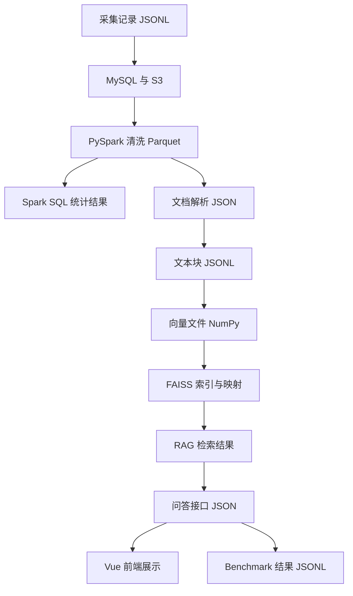

# 8.1 各阶段数据格式与字段规范

### （一）概述

本文档汇总系统各阶段的数据格式、字段定义和保存位置，用于开发过程中的模块衔接检查和最终成果验证。

数据在系统中经历的步骤：



本文档是前文章节的汇总，不引入新字段体系。若实现与本文档不一致，以第 2 至第 7 章已定义内容为准。

### （二）对齐章节

| 内容 | 对应章节 |
| ---- | -------- |
| 网页和附件采集字段 | 2.1、2.2、2.4 |
| S3 与 MySQL 字段 | 3.1、3.2、3.3 |
| PySpark 清洗字段 | 3.4 |
| Spark SQL 统计结果 | 3.5 |
| 文档解析结果 | 4.1 |
| 文本块和向量索引 | 4.2、4.3 |
| RAG 检索和来源展示 | 4.4、4.6 |
| Agent 工具返回格式 | 5.2 |
| FastAPI 问答接口 | 6.1 |
| Vue 前端消息与下载 | 6.2 |
| Benchmark 输入输出 | 7.1 |

------

### （三）统一编号字段

全文必须统一使用以下关键编号。

| 字段 | 作用 | 生成阶段 | 主要使用位置 |
| ---- | ---- | -------- | ------------ |
| `document_id` | 标识网页或文档来源 | 数据采集 | 网页、附件、清洗结果、解析结果、文本块、来源展示 |
| `attachment_id` | 标识附件文件 | 附件采集或入库 | 附件表、文档解析、附件查询、下载接口 |
| `chunk_id` | 标识文本块 | 文本分块 | 文本块、向量映射、FAISS 检索结果、回答来源 |
| `session_id` | 标识用户会话 | 前端或后端生成 | 问答请求、问答记录、Benchmark 独立会话 |

使用规则：

- 同一条网页记录的 `document_id` 在后续流程中不得重新生成；
- 附件必须通过 `document_id` 追溯到所属网页；
- FAISS 返回的向量编号必须能够映射到 `chunk_id`；
- Benchmark 每条问题应使用独立 `session_id`。

------

### （四）网页采集数据

网页采集结果保存为 JSONL，每行一条网页记录。

保存位置：

```text
data/raw/pages.jsonl
```

字段定义：

| 字段 | 类型 | 是否必填 | 说明 |
| ---- | ---- | -------- | ---- |
| `document_id` | string | 是 | 网页唯一编号 |
| `title` | string | 是 | 网页标题 |
| `source_url` | string | 是 | 原始网页完整网址 |
| `category` | string | 否 | 栏目或分类 |
| `publish_time` | string | 否 | 发布时间 |
| `content` | string | 否 | 网页正文 |
| `attachments` | array | 是 | 当前网页中的附件列表 |
| `created_at` | string | 否 | 采集时间 |
| `metadata` | object | 否 | 数据源名称、列表页等扩展信息 |

示例：

```json
{
  "document_id": "doc_0001",
  "title": "研究生论文答辩工作通知",
  "source_url": "https://example.edu.cn/info/1234.htm",
  "category": "学位管理",
  "publish_time": "2026-06-20",
  "content": "现开展研究生论文答辩相关工作……",
  "attachments": [
    {
      "attachment_id": "att_0001",
      "document_id": "doc_0001",
      "file_name": "论文答辩申请表.docx",
      "file_type": "docx",
      "download_url": "https://example.edu.cn/upload/form.docx",
      "object_key": null
    }
  ],
  "created_at": "2026-06-26T10:00:00",
  "metadata": {
    "source_name": "示例研究生院"
  }
}
```

约束：

- `document_id` 不重复、不为空
- `source_url` 为完整网址
- `attachments` 无附件时为空数组 `[]`
- 附件中 `document_id` 与网页记录一致
- 不写入本地文件路径

------

### （五）附件元数据

附件元数据可以嵌入网页采集结果，也可以单独保存为 JSONL 或写入 MySQL。

保存位置：

```text
data/raw/attachments.jsonl
```

字段定义：

| 字段 | 类型 | 是否必填 | 说明 |
| ---- | ---- | -------- | ---- |
| `attachment_id` | string | 是 | 附件唯一编号 |
| `document_id` | string | 是 | 所属网页编号 |
| `file_name` | string | 是 | 原始文件名 |
| `file_type` | string | 是 | pdf、docx、xlsx 等 |
| `source_url` | string | 是 | 原始下载地址 |
| `file_size` | number | 否 | 文件大小 |
| `file_hash` | string | 否 | 文件哈希 |
| `bucket_name` | string | 否 | S3 存储桶 |
| `object_key` | string | 上传后必填 | S3 对象路径 |
| `status` | string | 否 | pending、uploaded、parsed、failed 等 |

示例：

```json
{
  "attachment_id": "att_0001",
  "document_id": "doc_0001",
  "file_name": "论文答辩申请表.docx",
  "file_type": "docx",
  "source_url": "https://example.edu.cn/upload/form.docx",
  "file_size": 24576,
  "file_hash": "a8f32c...",
  "bucket_name": "bigdata-qa",
  "object_key": "raw/attachments/word/2026/06/a8f32c.docx",
  "status": "uploaded"
}
```

- 附件必须能通过 `document_id` 找到所属网页；
- 上传成功后必须写入真实 `object_key`；
- 前端和 Benchmark 不应直接使用 `object_key`；
- 临时下载链接不保存到附件元数据中。

------

### （六）关系数据库核心表

课程项目至少包含 `web_page` 和 `attachment` 两张核心表。

`web_page` 关键字段：

| 字段 | 说明 |
| ---- | ---- |
| `document_id` | 网页唯一编号 |
| `title` | 网页标题 |
| `category` | 栏目 |
| `publish_time` | 发布时间 |
| `content` | 网页正文 |
| `source_url` | 原始网页地址 |
| `content_hash` | 正文哈希 |
| `html_object_key` | 原始 HTML 的 S3 路径 |
| `status` | 处理状态 |

`attachment` 关键字段：

| 字段 | 说明 |
| ---- | ---- |
| `attachment_id` | 附件唯一编号 |
| `document_id` | 所属网页编号 |
| `file_name` | 文件名 |
| `file_type` | 文件类型 |
| `source_url` | 原始下载地址 |
| `file_size` | 文件大小 |
| `file_hash` | 文件哈希 |
| `object_key` | S3 对象路径 |
| `status` | 处理状态 |

约束：

- `attachment.document_id` 必须能关联到 `web_page.document_id`；
- `web_page.source_url` 用于来源展示和 Benchmark 来源提交；
- `attachment.object_key` 只由后端用于读取文件或生成临时下载链接。

------

### （七）S3对象路径

对象存储只保存文件本体和中间数据，不替代数据库元数据。

推荐路径：

```text
raw/html/doc_0001.html
raw/attachments/pdf/2026/06/{file_hash}.pdf
raw/attachments/word/2026/06/{file_hash}.docx
datasets/raw/pages.jsonl
datasets/cleaned/pages.parquet
parsed/attachments/att_0001.json
indexes/faiss.index
indexes/index_config.json
```

约束：

- 数据库中的 `object_key` 必须能在 S3 中读取到对象；
- 对象路径不返回给前端用户；
- 文件重名时优先使用编号或哈希避免覆盖；
- 临时下载链接由后端实时生成。

------

### （八）PySpark清洗结果

PySpark 主要清洗网页记录和结构化元数据，输出 Parquet。

保存位置：

```text
data/cleaned/pages
```

字段定义：

| 字段 | 类型 | 说明 |
| ---- | ---- | ---- |
| `document_id` | string | 网页编号 |
| `title` | string | 清洗后的标题 |
| `category` | string | 栏目 |
| `publish_time` | timestamp | 规范化时间 |
| `content` | string | 清洗后的网页正文 |
| `source_url` | string | 原始网页地址 |
| `content_hash` | string | 正文哈希 |
| `html_object_key` | string | 原始 HTML 路径 |
| `content_length` | number | 正文长度 |
| `data_status` | string | valid、empty_content、invalid_time 等 |

约束：

- 保留 `document_id` 和 `source_url`；
- 网页 HTML 路径使用 `html_object_key`；
- 附件文件路径不混入网页字段；
- PDF、Word、Excel 正文不由 PySpark 解析；
- 下游文档解析只处理 `data_status="valid"` 或人工确认可用的数据。

------

### （九）Spark SQL统计结果

Spark SQL 统计结果用于数据质量检查和 Agent 的 `statistics_query` 工具。

保存位置：

```text
data/stats/
```

统计结果可以保存为 Parquet、CSV 或写入 MySQL。

栏目统计示例：

```json
{
  "stat_type": "category_count",
  "items": [
    {
      "category": "通知公告",
      "page_count": 25
    },
    {
      "category": "培养管理",
      "page_count": 18
    }
  ],
  "updated_at": "2026-06-26T12:00:00"
}
```

时间范围统计示例：

```json
{
  "stat_type": "time_range",
  "start_date": "2026-01-01",
  "end_date": "2026-07-01",
  "page_count": 36,
  "updated_at": "2026-06-26T12:00:00"
}
```

约束：

- Spark SQL 只用于离线查询和统计；
- 在线 Agent 不实时启动 Spark 作业；
- `statistics_query` 读取已有统计结果；
- 统计结果应记录更新时间。

------

### （十）文档解析结果

文档解析结果统一保存为 JSON 或 JSONL，供文本分块使用。

保存位置：

```text
data/parsed/documents.jsonl
parsed/attachments/att_0001.json
```

字段定义：

| 字段 | 类型 | 说明 |
| ---- | ---- | ---- |
| `document_id` | string | 所属网页或文档编号 |
| `attachment_id` | string/null | 附件编号，网页正文可为空 |
| `document_type` | string | html、pdf、word、excel、text |
| `file_name` | string | 文件名或网页标题 |
| `source_url` | string | 原始网页地址 |
| `object_key` | string/null | 附件或 HTML 的对象路径 |
| `units` | array | 文本单元列表 |

文本单元字段：

| 字段 | 类型 | 说明 |
| ---- | ---- | ---- |
| `unit_index` | number | 单元序号 |
| `unit_type` | string | body、page、paragraph、sheet、table |
| `text` | string | 解析出的文本 |
| `page_number` | number/null | PDF 页码 |
| `sheet_name` | string/null | Excel 工作表名称 |
| `text_status` | string | valid、empty、too_short、failed |

示例：

```json
{
  "document_id": "doc_0001",
  "attachment_id": "att_0001",
  "document_type": "pdf",
  "file_name": "研究生培养方案.pdf",
  "source_url": "https://example.edu.cn/info/1234.htm",
  "object_key": "raw/attachments/pdf/plan.pdf",
  "units": [
    {
      "unit_index": 0,
      "unit_type": "page",
      "text": "第一章 总则……",
      "page_number": 1,
      "sheet_name": null,
      "text_status": "valid"
    }
  ]
}
```

约束：

- 每个文本单元保留来源字段；
- PDF 页码和 Excel 工作表名称不丢失；
- 空文本和过短文本应标记，不直接进入向量知识库；
- 附件解析结果必须能通过 `attachment_id` 回到附件表。

------

### （十一）文本块数据

文本块是 RAG 检索的基本单位，建议保存为 JSONL。

保存位置：

```text
data/chunks/chunks.jsonl
```

字段定义：

| 字段 | 类型 | 说明 |
| ---- | ---- | ---- |
| `chunk_id` | string | 文本块唯一编号 |
| `document_id` | string | 来源文档编号 |
| `attachment_id` | string/null | 附件编号 |
| `chunk_index` | number | 文本块顺序 |
| `chunk_text` | string | 文本块正文 |
| `source_url` | string | 原始网页地址 |
| `file_name` | string | 文件名或网页标题 |
| `object_key` | string/null | 对象路径 |
| `page_number` | number/null | PDF 页码 |
| `sheet_name` | string/null | Excel 工作表 |

示例：

```json
{
  "chunk_id": "doc_0001_chunk_0001",
  "document_id": "doc_0001",
  "attachment_id": "att_0001",
  "chunk_index": 1,
  "chunk_text": "申请学位论文答辩应提交答辩申请表和学位论文。",
  "source_url": "https://example.edu.cn/info/1234.htm",
  "file_name": "研究生学位管理办法.pdf",
  "object_key": "raw/attachments/pdf/rule.pdf",
  "page_number": 8,
  "sheet_name": null
}
```

约束：

- `chunk_id` 不重复；
- `chunk_text` 不为空；
- 文本块数量与向量数量一致；
- 来源字段完整，能够支持回答来源展示；
- `file_type` 不要求保存在文本块中，问答接口需要展示附件类型时，可通过 `attachment_id` 查询附件表补充；
- 不把临时下载链接写入文本块。

------

### （十二）向量与FAISS索引

文本向量和 FAISS 索引用于本地知识检索。

保存位置：

```text
data/vectors/embeddings.npy
data/indexes/faiss.index
data/indexes/index_config.json
```

索引配置示例：

```json
{
  "embedding_model": "BAAI/bge-m3",
  "dimension": 1024,
  "metric": "inner_product",
  "normalized": true,
  "index_type": "IndexFlatIP",
  "vector_count": 1200
}
```

约束：

- 文本和问题都使用 `BAAI/bge-m3`；
- 文本向量和问题向量都使用相同归一化方式；
- FAISS 统一使用 `IndexFlatIP`；
- `vector_count` 与文本块数量一致；
- 更换向量模型后必须重新生成向量和索引。

------

### （十三）RAG检索结果

RAG 检索结果由 FAISS 向量编号映射回文本块。

字段定义：

| 字段 | 类型 | 说明 |
| ---- | ---- | ---- |
| `rank` | number | 排名 |
| `score` | number | 相似度得分 |
| `chunk_id` | string | 文本块编号 |
| `chunk_text` | string | 命中文本 |
| `document_id` | string | 文档编号 |
| `attachment_id` | string/null | 附件编号 |
| `file_name` | string | 来源文件名 |
| `source_url` | string | 原始网页 |
| `page_number` | number/null | 页码 |
| `sheet_name` | string/null | 工作表 |

示例：

```json
{
  "rank": 1,
  "score": 0.82,
  "chunk_id": "doc_0001_chunk_0003",
  "chunk_text": "申请人应提交学位论文、答辩申请表和审核意见表。",
  "document_id": "doc_0001",
  "attachment_id": "att_0001",
  "file_name": "研究生学位管理办法.pdf",
  "source_url": "https://example.edu.cn/info/1234.htm",
  "page_number": 8,
  "sheet_name": null
}
```

约束：

- 检索结果不能丢失 `chunk_id`；
- 来源网址来自真实元数据；
- 页码和工作表来自文档解析结果；
- RAG 检索结果不直接生成附件下载链接；
- 如需在最终问答接口中展示 `file_type`，由后端根据 `attachment_id` 查询附件表补充；
- 模型不得自行编造来源网址。

------

### （十四）Agent工具返回格式

所有 Agent 工具统一返回以下结构。

```json
{
  "success": true,
  "data": {},
  "message": "执行成功"
}
```

失败时：

```json
{
  "success": false,
  "data": null,
  "message": "失败原因"
}
```

工具名称与核心参数：

| 工具 | 参数 | 返回数据 |
| ---- | ---- | -------- |
| `knowledge_search` | `query`、`top_k` | 文本块和来源 |
| `statistics_query` | `stat_type`、`category`、`start_date`、`end_date` | 离线统计结果 |
| `page_query` | `document_id` 或 `keyword` | 网页标题、时间、来源网址 |
| `attachment_search` | `document_id` 或 `file_name` | 附件编号、文件名、类型 |
| `generate_download_url` | `attachment_id` | 临时下载链接 |

`statistics_query` 返回示例：

```json
{
  "success": true,
  "data": {
    "stat_type": "category_count",
    "result": [
      {
        "category": "通知公告",
        "count": 25
      },
      {
        "category": "培养管理",
        "count": 18
      }
    ]
  },
  "message": "执行成功"
}
```

`attachment_search` 返回示例：

```json
{
  "success": true,
  "data": [
    {
      "attachment_id": "att_0001",
      "document_id": "doc_0001",
      "file_name": "论文答辩申请表.docx",
      "file_type": "docx"
    }
  ],
  "message": "执行成功"
}
```

约束：

- Agent 只能调用已注册工具；
- Agent 不直接执行 SQL；
- Agent 不直接接收 `object_key`；
- 下载链接必须先通过 `attachment_id` 查询附件，再由后端生成。

------

### （十五）问答接口数据

问答接口由 Vue 前端调用 FastAPI 后端。

请求格式：

```json
{
  "session_id": "session_001",
  "question": "申请论文答辩需要提交哪些材料？",
  "use_agent": true
}
```

字段定义：

| 字段 | 类型 | 说明 |
| ---- | ---- | ---- |
| `session_id` | string | 会话编号 |
| `question` | string | 用户问题 |
| `use_agent` | boolean | 是否允许后端自动使用 Agent 工具 |

返回格式：

```json
{
  "status": "success",
  "question": "申请论文答辩需要提交哪些材料？",
  "answer": "申请论文答辩需要提交答辩申请表、论文评阅材料和相关审核文件。[资料1]",
  "sources": [
    {
      "source_no": 1,
      "document_id": "doc_0001",
      "file_name": "研究生论文答辩管理规定.pdf",
      "source_url": "https://example.edu.cn/info/1234.htm",
      "page_number": 3,
      "sheet_name": null,
      "content_preview": "申请人应提交答辩申请表、论文评阅材料……"
    }
  ],
  "attachments": [
    {
      "attachment_id": "att_0001",
      "file_name": "论文答辩申请表.docx",
      "file_type": "docx"
    }
  ],
  "session_id": "session_001"
}
```

约束：

- `answer` 始终为字符串；
- `sources` 始终为数组；
- `attachments` 始终为数组；
- 问答接口顶层不使用 `result`、`response`、`references` 等替代字段；
- `use_agent=true` 表示允许自动判断，不表示强制每次调用工具。

------

### （十六）附件下载接口数据

附件下载由前端根据 `attachment_id` 单独请求。

请求：

```text
GET /api/attachments/{attachment_id}/download
```

返回：

```json
{
  "success": true,
  "file_name": "论文答辩申请表.docx",
  "download_url": "https://s3.example.com/temporary-url",
  "expires_in": 600
}
```

约束：

- 前端只能传入 `attachment_id`；
- 后端不接受前端传入的 `object_key`；
- 临时链接不写入数据库；
- Benchmark 不提交临时下载链接。

------

### （十七）前端消息数据

Vue 前端可以将后端返回结果转换为消息对象。

```json
{
  "role": "assistant",
  "content": "申请论文答辩需要提交相关材料。[资料1]",
  "sources": [],
  "attachments": [],
  "error": false
}
```

字段定义：

| 字段 | 类型 | 说明 |
| ---- | ---- | ---- |
| `role` | string | user 或 assistant |
| `content` | string | 消息正文 |
| `sources` | array | 来源列表 |
| `attachments` | array | 附件列表 |
| `error` | boolean | 是否为错误消息 |

约束：

- 前端只读取后端统一返回字段；
- 前端不解析模型生成的网址作为来源；
- 前端不保存 API Key；
- 前端不直接访问 MySQL、FAISS 或 S3。

------

### （十八）Benchmark数据

教师提供的 Benchmark 文件只包含编号和问题。

输入格式：

```json
{"id":"test_001","question":"申请论文答辩需要提交哪些材料？"}
```

学生提交结果：

```json
{
  "id": "test_001",
  "question": "申请论文答辩需要提交哪些材料？",
  "answer": "申请论文答辩需要提交答辩申请表、论文评阅材料和相关审核文件。",
  "sources": ["https://example.edu.cn/info/1234.htm"],
  "attachments": ["论文答辩申请表.docx"]
}
```

约束：

- `id` 和 `question` 必须保持原样；
- 每条测试使用独立 `session_id`；
- 每个测试编号都必须生成结果；
- `sources` 只包含完整网址；
- `attachments` 只包含文件名；
- 不提交 Agent 工具调用过程；
- 失败时提交空答案和空数组。

------

### （十九）阶段数据检查表

| 阶段 | 输出数据 | 必须保留字段 | 检查重点 |
| ---- | -------- | ------------ | -------- |
| 网页采集 | `pages.jsonl` | `document_id`、`source_url`、`attachments` | 编号唯一、网址完整 |
| 附件采集 | `attachments.jsonl` 或 MySQL | `attachment_id`、`document_id`、`object_key` | 附件可追溯到网页 |
| PySpark清洗 | Parquet | `document_id`、`source_url`、`html_object_key` | 来源字段不丢失 |
| Spark SQL统计 | Parquet/CSV/MySQL | `stat_type`、统计结果、`updated_at` | 离线生成 |
| 文档解析 | JSON/JSONL | `document_id`、`attachment_id`、`units` | 页码和工作表保留 |
| 文本分块 | `chunks.jsonl` | `chunk_id`、`chunk_text`、来源字段 | 文本块可追溯 |
| 向量化 | `embeddings.npy` | 向量顺序 | 数量与文本块一致 |
| FAISS索引 | `faiss.index` | 向量编号映射 | 索引数量一致 |
| RAG检索 | list[dict] | `chunk_id`、`score`、来源字段 | 来源真实 |
| Agent工具 | dict | `success`、`data`、`message` | 返回格式统一 |
| 问答接口 | JSON | `answer`、`sources`、`attachments` | 前后端字段一致 |
| Benchmark | JSONL | `id`、`question`、`answer`、`sources`、`attachments` | 符合提交格式 |

------

### （二十）注意事项

| 错误 | 后果 | 修正方法 |
| ---- | ---- | -------- |
| 清洗后丢失 `source_url` | 回答无法展示来源 | PySpark 选择字段时保留来源 |
| 附件缺少 `document_id` | 附件无法追溯网页 | 附件入库时写入所属网页编号 |
| 文本块缺少 `chunk_id` | FAISS 结果无法映射 | 分块时生成稳定编号 |
| 向量数量与文本块数量不同 | 检索结果错位 | 重新生成向量和索引 |
| 前端读取顶层 `response` 字段 | 接口解析失败 | 统一读取 `answer` |
| Benchmark 提交附件链接 | 附件命中失败 | 只提交附件文件名 |
| Agent 直接使用 `object_key` | 安全风险 | 只允许传入 `attachment_id` |
| 在文本块中强制要求 `file_type` | 与 4.2 文本块结构不一致 | 问答返回前通过附件表补充 |

------


