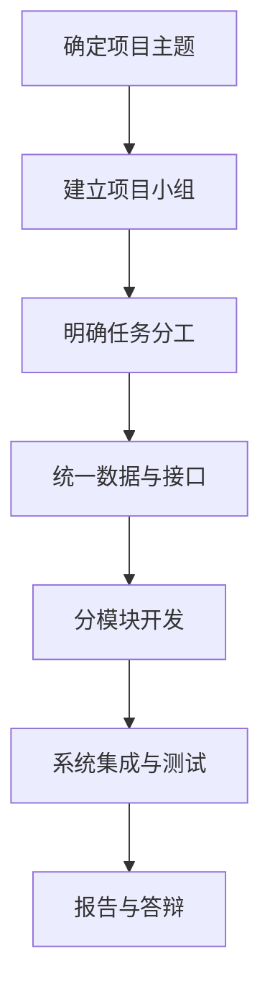
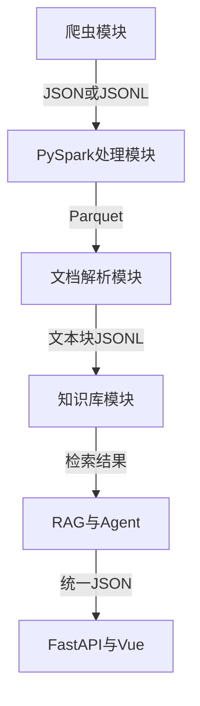
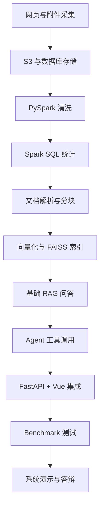

# 1.3 项目分工与成果要求

### （一）项目组织方式

本课程采用项目驱动方式。学生可以独立完成，也可以组成 **3～5 人项目小组**，共同开发大数据智能问答系统。

小组应确定一名组长，负责：

- 制定项目计划；
- 分配开发任务；
- 统一数据和接口规范；
- 检查项目进度；
- 组织系统集成、测试和成果提交。

每名成员既要完成本人负责的模块，也应了解系统总体流程，并参与测试、报告撰写和答辩。



------

### （二）项目任务分工

项目组可以根据成员人数和技术基础进行分工。

| 任务方向       | 主要工作                                                 |
| -------------- | -------------------------------------------------------- |
| 项目管理       | 制定计划、分配任务、统一规范、组织集成                   |
| 数据采集       | 分析网站、开发爬虫、采集网页和附件                       |
| 数据存储与处理 | 配置数据库和对象存储，完成 PySpark 清洗与 Spark SQL 统计 |
| 文档与知识库   | 解析文档，完成文本分块、向量化和 FAISS 索引              |
| RAG 与 Agent   | 实现知识检索、模型调用、工具定义和结果整合               |
| 前后端开发     | 开发 FastAPI 接口和 Vue 问答界面                         |
| 测试与文档     | 编写测试用例，整理报告和答辩材料                         |

实际分工不必与表格完全一致。一名成员可以承担多个任务，也可以由多名成员共同完成一个模块。

项目组应填写任务分工表。

| 成员   | 负责模块     | 主要任务             | 阶段成果             | 完成时间 |
| ------ | ------------ | -------------------- | -------------------- | -------- |
| 成员 A | 数据采集     | 网页解析与附件下载   | 采集程序、JSONL 数据 | 第 1 周  |
| 成员 B | 数据处理     | PySpark 清洗与统计   | Parquet、统计结果    | 第 2 周  |
| 成员 C | RAG 与 Agent | 检索、问答和工具调用 | RAG 与 Agent 模块    | 第 3 周  |

------

### （三）协作开发要求

小组成员开始开发前，应统一以下内容：

- 项目目录结构；
- 数据库表和字段名称；
- JSON、JSONL 和 Parquet 数据格式；
- `document_id` 和 `chunk_id` 编号规则；
- S3 存储桶和 `object_key` 路径；
- FastAPI 请求和响应格式；
- 配置文件和日志格式；
- Git 代码提交规范。

各模块之间应按照统一数据格式传递结果。例如：



项目代码应使用 Git 管理，不建议通过压缩包反复传递不同版本。

以下内容不得上传到公共代码仓库：

- 数据库密码；
- 对象存储密钥；
- 大语言模型接口密钥；
- `.env` 文件；
- 未授权公开的数据；
- 大型模型和临时文件。

------

### （四）阶段成果要求

项目应按照课程进度形成阶段性成果。每个阶段的成果都应能够运行或查看，不能只提交文字说明。

| 项目阶段       | 阶段成果                                |
| -------------- | --------------------------------------- |
| 项目准备       | 项目选题、数据源说明、任务分工表        |
| 环境配置       | 环境检查表、项目目录、Git 仓库          |
| 数据采集       | 爬虫程序、网页数据、附件和采集日志      |
| 数据存储与处理 | 数据库记录、S3 文件、Parquet 和统计结果 |
| 知识库构建     | 文档解析结果、文本块、FAISS 索引        |
| 智能问答       | RAG 回答、来源展示和附件下载            |
| Agent 开发     | 工具定义、工具接口和调用记录            |
| 系统集成       | FastAPI 后端、Vue 前端和完整运行程序    |
| 测试验收       | Benchmark 结果、课程设计报告和答辩材料  |

每完成一个阶段，都应保存：

- 输入数据；
- 输出结果；
- 关键代码；
- 运行截图或日志；
- 测试结果；
- 发现的问题及处理方法。

------

### （五）实施顺序建议

项目应按照由基础数据到智能应用的顺序推进，各阶段大致顺序如下：



每完成一个阶段，都应保存输入数据、输出结果和运行日志。前一阶段未通过检查时，不应直接进入下一阶段。

------

### （六）系统基本功能

课程项目应完成以下基本功能：

- 采集至少一个公开网站的网页数据；
- 识别并保存网页中的附件；
- 将结构化信息写入关系数据库；
- 将网页和附件保存到 S3 兼容对象存储；
- 使用 PySpark 完成数据清洗和转换；
- 使用 Spark SQL 完成数据查询和统计；
- 解析 HTML、PDF、Word、Excel 等文档；
- 完成文本分块、向量化和 FAISS 索引构建；
- 实现基于 RAG 的智能问答；
- 展示回答对应的网页来源和附件；
- 实现至少两类 Agent 工具调用；
- 通过 FastAPI 和 Vue 完成问答交互；
- 保存必要的会话和运行日志。

建议至少实现以下三类问题中的两类：

| 问题类型 | 示例                       | 处理方式         |
| -------- | -------------------------- | ---------------- |
| 知识问答 | 申请奖学金需要哪些材料？   | RAG 检索         |
| 数据统计 | 某时间段发布了多少条通知？ | `statistics_query` |
| 文件查询 | 请提供申请表下载入口       | `attachment_search` 与 `generate_download_url` |

完成基本功能后，可以选做动态网页采集、数据定时更新、多轮问答和问答反馈等功能。

------

### （七）数据与代码要求

项目数据应来源合法、内容公开，并记录数据来源和采集时间。

网页数据至少应包含：

```json
{
  "document_id": "doc_0001",
  "title": "示例文档标题",
  "source_url": "https://example.com/document/1",
  "publish_time": "2026-06-20T09:00:00",
  "content": "网页正文",
  "attachments": []
}
```

文本块数据至少应包含：

```json
{
  "chunk_id": "doc_0001_chunk_0001",
  "document_id": "doc_0001",
  "attachment_id": null,
  "chunk_index": 0,
  "chunk_text": "用于检索的文本块",
  "source_url": "https://example.com/document/1",
  "file_name": "示例文档.pdf",
  "object_key": "raw/attachments/pdf/example.pdf",
  "page_number": null,
  "sheet_name": null
}
```

项目源代码至少包括：

- 网络爬虫和附件下载代码；
- 数据库与对象存储操作代码；
- PySpark 和 Spark SQL 代码；
- 文档解析代码；
- 文本分块与向量化代码；
- FAISS 检索和模型调用代码；
- Agent 与工具调用代码；
- FastAPI 后端和 Vue 前端；
- 测试脚本、配置示例和依赖文件。

数据库地址、密码和接口密钥应通过环境变量或配置文件读取，不应直接写入代码。

------

### （八）成果提交要求

项目验收时应提交以下成果：

- 完整项目源代码；
- `requirements.txt`；
- `.env.example`；
- `README.md` 和运行说明；
- 数据源及采集结果说明；
- 数据库建表脚本；
- S3 对象存储目录说明；
- PySpark 清洗和 Spark SQL 统计结果；
- 文档解析与文本块数据；
- FAISS 索引和映射文件；
- RAG 与 Agent 模块；
- FastAPI 后端与 Vue 前端；
- Benchmark 测试记录；
- 项目任务分工表；
- 课程设计报告；
- 系统演示与答辩材料。

较大的原始数据、模型和向量索引可以提交存储位置及构建脚本，不必全部放入代码仓库。

------

### （八）报告与答辩要求

课程设计报告应真实反映项目开发过程，主要包括：

- 项目背景与需求；
- 系统总体设计；
- 数据来源与采集方法；
- 数据存储与 Spark 处理；
- 文档解析与知识库构建；
- RAG 问答和 Agent 工具调用；
- 前后端系统实现；
- Benchmark 测试结果；
- 存在的问题与改进方向；
- 小组成员分工。

报告中的流程图、界面截图、数据结果和测试结果应与实际系统一致。

系统演示应包括：

- 数据来源和采集结果；
- 数据库与对象存储内容；
- PySpark 清洗和 Spark SQL 统计结果；
- 文档解析与知识检索；
- RAG 智能问答；
- 来源展示和附件下载；
- Agent 工具调用；
- 前后端完整运行过程。

答辩时，每名成员应说明本人负责的任务，并能够解释本模块的输入、处理步骤、输出结果和测试方法。

------

### （九）成果评价原则

项目评价重点包括：

- 应用场景和数据来源是否明确；
- 系统主要流程是否完整；
- 网页和附件是否正确处理；
- PySpark 是否实际用于数据处理；
- 知识检索和问答结果是否有效；
- 回答是否能够展示来源；
- Agent 是否能够正确调用工具；
- 附件下载入口是否有效；
- 前后端是否完成集成；
- 数据、代码、报告和分工是否规范。

项目评价不以功能数量为唯一标准。**流程完整、运行稳定、数据清楚的项目，优于功能较多但无法正常集成的项目。**
