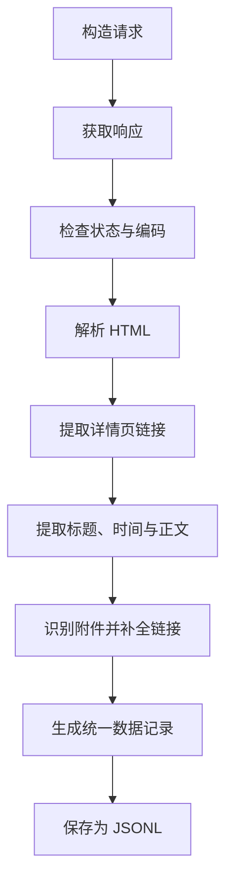

# 2.2 网页请求与内容解析

### （一）本节目标

网页请求与内容解析是数据采集的核心环节。程序首先向目标地址发送 HTTP 请求，获取网页源码，再根据 HTML 结构提取标题、发布时间、栏目、正文、附件和来源地址等信息。

本节主要完成单个列表页和详情页的解析。分页与动态数据采集将在 2.3 中介绍，数据去重和完整异常处理将在 2.4 中完成。



------

### （二）发送网页请求

本项目使用 `requests` 获取公开网页，使用 `BeautifulSoup` 解析 HTML。

安装依赖：

```bash
pip install requests beautifulsoup4 lxml
```

基本请求示例：

```python
import requests

url = "https://example.edu.cn/info/1001/1234.htm"

headers = {
    "User-Agent": (
        "Mozilla/5.0 (Windows NT 10.0; Win64; x64) "
        "AppleWebKit/537.36 Chrome/120.0 Safari/537.36"
    )
}

response = requests.get(
    url,
    headers=headers,
    timeout=10
)

response.raise_for_status()

print("状态码：", response.status_code)
```

常用请求参数如下：

| 参数      | 作用         |
| --------- | ------------ |
| `url`     | 目标网页地址 |
| `headers` | 请求头信息   |
| `timeout` | 最大等待时间 |
| `params`  | GET 请求参数 |

设置 `timeout` 可以避免网站长时间无响应时程序一直等待。课程项目还应控制请求频率，不在短时间内连续发送大量请求。

------

### （三）检查响应与网页编码

服务器响应主要包括状态码、响应头和响应正文。

常见状态码如下：

| 状态码   | 含义           |
| -------- | -------------- |
| 200      | 请求成功       |
| 301、302 | 页面重定向     |
| 403      | 拒绝访问       |
| 404      | 页面不存在     |
| 429      | 请求过于频繁   |
| 500      | 服务器内部错误 |

推荐使用 `raise_for_status()` 检查异常状态：

```python
try:
    response.raise_for_status()
except requests.RequestException as exc:
    print("网页请求失败：", exc)
```

中文网页编码不正确时可能出现乱码。可以使用：

```python
response.encoding = response.apparent_encoding
html = response.text
```

如果已经确认网站使用 UTF-8，也可以直接指定：

```python
response.encoding = "utf-8"
```

两种响应内容的用途不同：

- `response.text`：用于解析网页正文；
- `response.content`：用于下载 PDF、Word、Excel 等二进制文件。

------

### （四）解析 HTML 结构

使用 BeautifulSoup 创建解析对象：

```python
from bs4 import BeautifulSoup

soup = BeautifulSoup(html, "lxml")
```

常用方法包括：

| 方法           | 作用               |
| -------------- | ------------------ |
| `select_one()` | 返回第一个匹配节点 |
| `select()`     | 返回全部匹配节点   |
| `get_text()`   | 提取节点中的文本   |
| `get()`        | 获取节点属性       |

假设详情页包含以下结构：

```html
<h1 class="article-title">研究生奖学金申报通知</h1>

<div class="article-meta">
    <span class="publish-time">2026-06-20</span>
    <span class="category">奖助管理</span>
</div>

<div class="article-content">
    <p>现开展研究生奖学金申报工作。</p>
    <a href="/upload/application.docx">
        研究生奖学金申请表.docx
    </a>
</div>
```

可以提取主要节点：

```python
title_node = soup.select_one(".article-title")
time_node = soup.select_one(".publish-time")
category_node = soup.select_one(".category")
content_node = soup.select_one(".article-content")

title = title_node.get_text(strip=True) if title_node else ""
publish_time = time_node.get_text(strip=True) if time_node else ""
category = category_node.get_text(strip=True) if category_node else ""
```

实际选择器必须根据目标网站的 HTML 结构调整。

------

### （五）解析列表页

列表页通常包含标题、详情页链接和发布时间。

假设列表项结构如下：

```html
<ul class="news-list">
    <li>
        <a href="/info/1001/1234.htm">研究生奖学金申报通知</a>
        <span class="date">2026-06-20</span>
    </li>
</ul>
```

解析代码如下：

```python
from urllib.parse import urljoin

from bs4 import BeautifulSoup


def parse_list_page(
    html: str,
    page_url: str
) -> list[dict]:
    soup = BeautifulSoup(html, "lxml")
    records = []

    for item in soup.select("ul.news-list li"):
        link_node = item.select_one("a[href]")
        date_node = item.select_one(".date")

        if link_node is None:
            continue

        detail_url = urljoin(
            page_url,
            link_node.get("href", "")
        )

        records.append(
            {
                "title": link_node.get_text(strip=True),
                "detail_url": detail_url,
                "publish_time": (
                    date_node.get_text(strip=True)
                    if date_node
                    else ""
                )
            }
        )

    return records
```

`urljoin()` 用于将相对地址补全为完整地址。

```text
相对地址：/info/1001/1234.htm
完整地址：https://example.edu.cn/info/1001/1234.htm
```

列表页输出示例：

```json
[
  {
    "title": "研究生奖学金申报通知",
    "detail_url": "https://example.edu.cn/info/1001/1234.htm",
    "publish_time": "2026-06-20"
  }
]
```

------

### （六）提取正文内容

网页正文可能包含段落、标题、列表和表格。简单页面可以直接使用：

```python
content = (
    content_node.get_text("\n", strip=True)
    if content_node
    else ""
)
```

需要保留段落结构时，可以分别提取常见正文标签：

```python
paragraphs = []

if content_node:
    for node in content_node.select(
        "h2, h3, p, li"
    ):
        text = node.get_text(" ", strip=True)

        if text:
            paragraphs.append(text)

content = "\n".join(paragraphs)
```

正文中的表格可以逐行提取：

```python
tables = []

if content_node:
    for table in content_node.select("table"):
        rows = []

        for row_node in table.select("tr"):
            cells = [
                cell.get_text(" ", strip=True)
                for cell in row_node.select("th, td")
            ]

            if cells:
                rows.append(cells)

        if rows:
            tables.append(rows)
```

提取正文时，应尽量排除导航栏、页脚、相关推荐和版权信息，只保留当前文档的有效内容。

------

### （七）识别附件

附件通常位于正文中的 `<a>` 标签内。程序需要提取附件名称、文件类型和下载地址。

```python
from pathlib import PurePosixPath
from urllib.parse import urljoin, urlparse


SUPPORTED_EXTENSIONS = {
    ".pdf",
    ".doc",
    ".docx",
    ".xls",
    ".xlsx",
    ".txt",
    ".zip"
}


def parse_attachments(
    content_node,
    page_url: str,
    document_id: str
) -> list[dict]:
    attachments = []

    if content_node is None:
        return attachments

    for index, link_node in enumerate(
        content_node.select("a[href]"),
        start=1
    ):
        href = link_node.get("href")

        if not href:
            continue

        download_url = urljoin(page_url, href)
        path = urlparse(download_url).path
        suffix = PurePosixPath(path).suffix.lower()

        if suffix not in SUPPORTED_EXTENSIONS:
            continue

        file_name = link_node.get_text(" ", strip=True)

        if not file_name:
            file_name = PurePosixPath(path).name

        attachments.append(
            {
                "attachment_id": (
                    f"{document_id}_att_{index:04d}"
                ),
                "document_id": document_id,
                "file_name": file_name,
                "file_type": suffix.lstrip("."),
                "source_url": download_url,
                "object_key": None
            }
        )

    return attachments
```

附件尚未上传到 S3 时，`object_key` 设置为 `null`。完成附件存储后，再写入实际对象路径。

部分附件链接没有明显扩展名，此时可以结合链接文字或响应头中的 `Content-Type` 进一步判断。该情况可以作为扩展任务处理。

------

### （八）封装详情页解析函数

请求和解析功能应分别封装，便于后续分页采集和异常处理。

```python
from datetime import datetime
from typing import Any

import requests
from bs4 import BeautifulSoup


HEADERS = {
    "User-Agent": (
        "Mozilla/5.0 (Windows NT 10.0; Win64; x64) "
        "AppleWebKit/537.36 Chrome/120.0 Safari/537.36"
    )
}


def fetch_html(url: str) -> str:
    response = requests.get(
        url,
        headers=HEADERS,
        timeout=10
    )
    response.raise_for_status()
    response.encoding = response.apparent_encoding
    return response.text


def parse_detail_page(
    url: str,
    html: str,
    document_id: str
) -> dict[str, Any]:
    soup = BeautifulSoup(html, "lxml")

    title_node = soup.select_one(".article-title")
    time_node = soup.select_one(".publish-time")
    category_node = soup.select_one(".category")
    content_node = soup.select_one(".article-content")

    title = (
        title_node.get_text(strip=True)
        if title_node
        else ""
    )

    publish_time = (
        time_node.get_text(strip=True)
        if time_node
        else ""
    )

    category = (
        category_node.get_text(strip=True)
        if category_node
        else ""
    )

    content = (
        content_node.get_text("\n", strip=True)
        if content_node
        else ""
    )

    attachments = parse_attachments(
        content_node=content_node,
        page_url=url,
        document_id=document_id
    )

    return {
        "document_id": document_id,
        "title": title,
        "source_url": url,
        "category": category,
        "publish_time": publish_time,
        "content": content,
        "attachments": attachments,
        "created_at": datetime.now().isoformat(
            timespec="seconds"
        ),
        "metadata": {
            "source_name": "示例网站"
        }
    }
```

调用示例：

```python
url = "https://example.edu.cn/info/1001/1234.htm"

try:
    html = fetch_html(url)

    result = parse_detail_page(
        url=url,
        html=html,
        document_id="doc_0001"
    )

    print(result)

except requests.RequestException as exc:
    print("请求失败：", exc)
```

节点不存在时使用空字符串或空列表，避免因单个字段缺失导致整个页面无法解析。

------

### （九）统一输出格式

解析结果应与 2.1 中确定的数据格式保持一致。

```json
{
  "document_id": "doc_0001",
  "title": "研究生奖学金申报通知",
  "source_url": "https://example.edu.cn/info/1001/1234.htm",
  "category": "奖助管理",
  "publish_time": "2026-06-20",
  "content": "现开展研究生奖学金申报工作。",
  "attachments": [
    {
      "attachment_id": "doc_0001_att_0001",
      "document_id": "doc_0001",
      "file_name": "研究生奖学金申请表.docx",
      "file_type": "docx",
      "source_url": "https://example.edu.cn/upload/application.docx",
      "object_key": null
    }
  ],
  "created_at": "2026-06-26T10:00:00",
  "metadata": {
    "source_name": "示例网站"
  }
}
```

> **字段说明**：顶层 `source_url` 为网页地址；`attachments` 数组中的 `source_url` 为附件原始下载地址。附件入库后，该值写入 MySQL `attachment` 表的 `source_url` 列，采集阶段的 `object_key` 为 `null`，上传 S3 后再回填。临时下载链接（由 S3 签名生成）不写入采集结果。

批量采集结果建议保存为 JSONL，每行对应一条文档记录。

```python
import json
from pathlib import Path


def save_jsonl(
    records: list[dict],
    output_path: str
) -> None:
    path = Path(output_path)
    path.parent.mkdir(parents=True, exist_ok=True)

    with path.open("w", encoding="utf-8") as file:
        for record in records:
            file.write(
                json.dumps(
                    record,
                    ensure_ascii=False
                )
                + "\n"
            )
```

保存示例：

```python
save_jsonl(
    records=[result],
    output_path="data/raw/documents.jsonl"
)
```

------

### （十）解析规则测试

正式批量采集前，应选择多个不同页面测试解析规则。

重点检查：

- 标题是否完整；
- 发布时间格式是否正确；
- 正文是否为空；
- 正文是否包含导航、页脚等无关内容；
- 表格内容是否能够读取；
- 附件名称和类型是否正确；
- 相对链接是否正确补全；
- 无附件页面是否能够正常处理；
- 页面缺少某个字段时是否会报错。

如果不同栏目使用不同页面模板，应分别配置对应的 CSS 选择器。

| 测试页面 | 标题 | 正文   | 附件 | 结果 |
| -------- | ---- | ------ | ---- | ---- |
| 页面 1   | 正常 | 正常   | 2 个 | 通过 |
| 页面 2   | 正常 | 正常   | 无   | 通过 |
| 页面 3   | 正常 | 含表格 | 1 个 | 通过 |

------

### （十一）本节任务

完成本节后，应形成以下成果：

- 使用 `requests` 请求目标网页；
- 设置请求头和超时时间；
- 检查响应状态和网页编码；
- 使用 BeautifulSoup 解析 HTML；
- 提取列表页中的详情页链接；
- 提取标题、发布时间、栏目和正文；
- 提取并补全附件地址；
- 识别常见附件类型；
- 按统一格式生成文档记录；
- 将采集结果保存为 JSONL；
- 使用多个页面测试解析规则；
- 保存代码、测试数据和运行结果。

本节输出的 JSONL 数据将作为分页采集、附件下载、数据清洗和对象存储的输入。