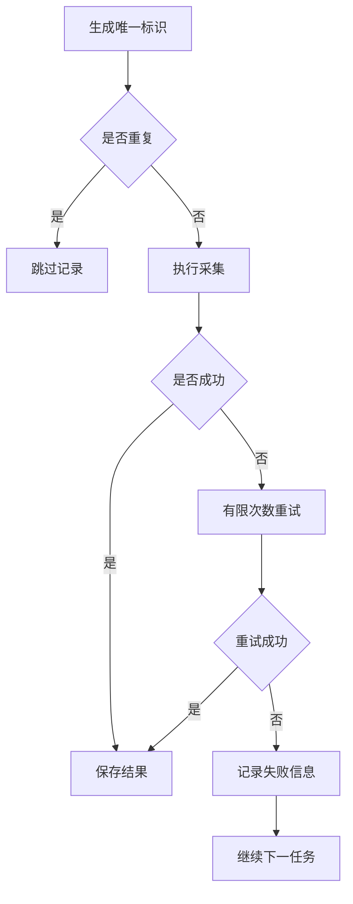

# 2.4 数据去重与异常处理

### （一）本节目标

批量采集时，同一网页可能被多个栏目重复引用，同一附件也可能存在多个下载地址。网络超时、页面不存在、结构变化和文件下载失败等问题，还可能导致采集任务中断。

因此，爬虫程序应完成以下处理：

- 识别重复网页和附件；
- 对临时网络错误进行有限重试；
- 记录失败地址和错误原因；
- 保证单个页面失败时，整个任务仍能继续；
- 支持任务中断后继续采集。



------

### （二）网页地址去重

最简单的网页去重方法是使用集合保存已经访问的 URL。

```python
visited_urls: set[str] = set()

if detail_url in visited_urls:
    print("跳过重复网页：", detail_url)
else:
    visited_urls.add(detail_url)
```

但同一个网页地址可能包含跟踪参数、锚点或多余斜杠，因此在比较前应先进行标准化。

```python
from urllib.parse import (
    parse_qsl,
    urlencode,
    urlsplit,
    urlunsplit,
)

IGNORED_PARAMS = {
    "utm_source",
    "utm_medium",
    "utm_campaign",
}


def normalize_url(url: str) -> str:
    parts = urlsplit(url)

    query_items = [
        (key, value)
        for key, value in parse_qsl(parts.query)
        if key not in IGNORED_PARAMS
    ]

    path = parts.path.rstrip("/") or "/"

    return urlunsplit(
        (
            parts.scheme.lower(),
            parts.netloc.lower(),
            path,
            urlencode(sorted(query_items)),
            "",
        )
    )
```

使用标准化地址去重：

```python
normalized_url = normalize_url(detail_url)

if normalized_url in visited_urls:
    print("跳过重复网页：", normalized_url)
else:
    visited_urls.add(normalized_url)
```

------

### （三）正文内容去重

不同 URL 也可能对应相同正文。此时可以根据标题、发布时间和正文生成内容指纹。

```python
import hashlib
import re


def normalize_text(text: str) -> str:
    return re.sub(r"\s+", "", text).strip()


def build_content_hash(
    title: str,
    publish_time: str,
    content: str,
) -> str:
    raw_text = "|".join(
        [
            normalize_text(title),
            publish_time.strip(),
            normalize_text(content),
        ]
    )

    return hashlib.sha256(
        raw_text.encode("utf-8")
    ).hexdigest()
```

生成网页记录时加入 `content_hash`：

```python
result["content_hash"] = build_content_hash(
    result["title"],
    result["publish_time"],
    result["content"],
)
```

去重时不应只比较标题，因为不同网页可能存在相同标题，但正文内容不同。

------

### （四）附件去重

附件可以先根据标准化下载地址去重。

```python
attachment_urls: set[str] = set()

normalized_url = normalize_url(download_url)

if normalized_url in attachment_urls:
    print("跳过重复附件：", normalized_url)
else:
    attachment_urls.add(normalized_url)
```

如果同一文件存在多个下载地址，可以在下载后计算文件哈希。

```python
import hashlib


def build_file_hash(file_bytes: bytes) -> str:
    return hashlib.sha256(file_bytes).hexdigest()
```

附件记录可以包含：

```json
{
  "attachment_id": "att_0001",
  "document_id": "doc_0001",
  "file_name": "申请表.docx",
  "source_url": "https://example.edu.cn/files/application.docx",
  "normalized_url": "https://example.edu.cn/files/application.docx",
  "file_size": 24576,
  "file_hash": "文件哈希值",
  "object_key": null
}
```

附件去重后，仍应保留附件与不同网页之间的关联关系。

------

### （五）常见异常类型

采集过程中常见的异常包括：

| 异常类型  | 示例                     | 处理方式           |
| --------- | ------------------------ | ------------------ |
| 网络异常  | 超时、连接失败           | 有限次数重试       |
| HTTP 异常 | 403、404、429、500       | 根据状态码处理     |
| 解析异常  | 标题或正文节点不存在     | 返回默认值并记录   |
| 文件异常  | 附件为空或下载中断       | 重新下载或记录失败 |
| 数据异常  | 字段缺失、时间格式错误   | 标记异常数据       |
| 存储异常  | JSONL 写入或 S3 上传失败 | 记录错误并重试     |

不同异常不能一直重复请求。程序应区分可重试和不可重试情况。

通常可以重试：

- 请求超时；
- 临时连接失败；
- HTTP 429；
- HTTP 500、502、503、504。

通常不应反复重试：

- HTTP 400；
- HTTP 401、403；
- HTTP 404；
- 页面结构长期不匹配；
- 文件类型不支持；
- 程序参数配置错误。

------

### （六）请求重试

可以为网页请求设置最大重试次数。

```python
import time

import requests


RETRY_STATUS = {
    429,
    500,
    502,
    503,
    504,
}


def fetch_with_retry(
    url: str,
    max_retries: int = 3,
) -> requests.Response:
    last_error: Exception | None = None

    for attempt in range(max_retries):
        try:
            response = requests.get(
                url,
                headers=HEADERS,
                timeout=10,
            )

            if response.status_code in RETRY_STATUS:
                raise requests.HTTPError(
                    f"可重试状态码：{response.status_code}"
                )

            response.raise_for_status()
            return response

        except requests.RequestException as exc:
            last_error = exc

            if attempt == max_retries - 1:
                break

            wait_seconds = 2 ** attempt
            print(
                f"请求失败，{wait_seconds} 秒后重试：{url}"
            )
            time.sleep(wait_seconds)

    raise RuntimeError(
        f"多次请求失败：{url}"
    ) from last_error
```

等待时间逐次增加，可以避免短时间内连续向网站发送请求。

------

### （七）安全提取字段

网页结构发生变化时，CSS 选择器可能无法找到节点。可以封装安全提取函数。

```python
def get_text_or_default(
    soup,
    selector: str,
    default: str = "",
) -> str:
    node = soup.select_one(selector)

    if node is None:
        return default

    return node.get_text(" ", strip=True)
```

使用示例：

```python
title = get_text_or_default(
    soup,
    ".article-title",
)

publish_time = get_text_or_default(
    soup,
    ".publish-time",
)
```

对于可选字段，可以返回空字符串。对于标题、正文等必要字段，如果为空，应将记录标记为解析失败，不直接进入知识库。

```python
if not title or not content:
    raise ValueError("标题或正文为空")
```

------

### （八）附件下载检查

附件下载完成后，应检查响应状态、文件大小和内容类型。

```python
def download_file(url: str) -> bytes:
    response = fetch_with_retry(url)
    file_bytes = response.content

    content_type = response.headers.get(
        "Content-Type",
        "",
    )

    if not file_bytes:
        raise ValueError("附件内容为空")

    if "text/html" in content_type.lower():
        raise ValueError(
            "下载结果为 HTML，可能不是有效附件"
        )

    return file_bytes
```

基础检查包括：

- 文件内容是否为空；
- 下载结果是否为网页错误页面；
- 文件大小是否合理；
- 文件哈希是否已经存在；
- 上传到对象存储后能否正常访问。

------

### （九）记录失败任务

单个页面采集失败时，不应终止整个任务。应记录失败地址、处理阶段和错误原因。

```python
from datetime import datetime


def build_error_record(
    url: str,
    stage: str,
    error: Exception,
    retry_count: int = 0,
) -> dict:
    return {
        "url": url,
        "stage": stage,
        "error_type": type(error).__name__,
        "error_message": str(error),
        "retry_count": retry_count,
        "created_at": datetime.now().isoformat(
            timespec="seconds"
        ),
    }
```

`stage` 可以使用：

| 阶段值                  | 含义         |
| ----------------------- | ------------ |
| `list_request`          | 列表页请求   |
| `detail_request`        | 详情页请求   |
| `page_parse`            | 网页解析     |
| `attachment_download`   | 附件下载     |
| `database_write`        | 数据库写入   |
| `object_storage_upload` | 对象存储上传 |

失败记录可以保存到：

```text
logs/crawl_errors.jsonl
```

------

### （十）分别保存成功与失败结果

批量采集时，建议逐条写入 JSONL，避免任务中断后丢失全部结果。

```python
import json
from pathlib import Path


def append_jsonl(
    file_path: str,
    data: dict,
) -> None:
    path = Path(file_path)
    path.parent.mkdir(
        parents=True,
        exist_ok=True,
    )

    with path.open(
        "a",
        encoding="utf-8",
    ) as file:
        file.write(
            json.dumps(
                data,
                ensure_ascii=False,
            )
            + "\n"
        )
```

建议分别保存：

```text
data/raw/pages.jsonl
data/raw/attachments.jsonl
logs/crawl_errors.jsonl
```

成功数据与失败记录分开保存，便于后续统计和重新处理。

------

### （十一）断点续采

重新启动程序时，可以从已保存的网页记录中恢复已经访问的地址。

```python
import json


def load_visited_urls(
    file_path: str,
) -> set[str]:
    visited_urls = set()

    try:
        with open(
            file_path,
            "r",
            encoding="utf-8",
        ) as file:
            for line in file:
                record = json.loads(line)

                normalized_url = record.get(
                    "normalized_url"
                )

                if normalized_url:
                    visited_urls.add(normalized_url)

    except FileNotFoundError:
        pass

    return visited_urls
```

启动采集程序时加载记录：

```python
visited_urls = load_visited_urls(
    "data/raw/pages.jsonl"
)
```

对于分页任务，还可以保存当前页码、成功数量和失败数量。

```json
{
  "current_page": 5,
  "success_count": 82,
  "failed_count": 3
}
```

------

### （十二）采集状态

可以为网页和附件增加状态字段，便于跟踪任务进度。

网页状态：

| 状态      | 含义           |
| --------- | -------------- |
| `pending` | 等待采集       |
| `fetched` | 已获取 HTML    |
| `parsed`  | 已完成解析     |
| `failed`  | 采集或解析失败 |

附件状态：

| 状态         | 含义           |
| ------------ | -------------- |
| `pending`    | 等待下载       |
| `downloaded` | 已完成下载     |
| `uploaded`   | 已上传对象存储 |
| `parsed`     | 已完成内容解析 |
| `failed`     | 处理失败       |

对于基础课程项目，状态可以保存在 JSONL 或数据库字段中。

------

### （十三）采集主流程

将去重、重试、解析和结果保存组合起来：

```python
def crawl_detail_page(
    detail_url: str,
    visited_urls: set[str],
) -> None:
    normalized_url = normalize_url(detail_url)

    if normalized_url in visited_urls:
        print("跳过重复网页：", normalized_url)
        return

    try:
        response = fetch_with_retry(detail_url)
        response.encoding = response.apparent_encoding

        result = parse_detail_page(
            url=detail_url,
            html=response.text,
            document_id="待生成编号",
        )

        if not result["title"] or not result["content"]:
            raise ValueError("标题或正文为空")

        result["normalized_url"] = normalized_url
        result["content_hash"] = build_content_hash(
            result["title"],
            result["publish_time"],
            result["content"],
        )
        result["status"] = "parsed"

        append_jsonl(
            "data/raw/pages.jsonl",
            result,
        )

        visited_urls.add(normalized_url)

    except Exception as exc:
        error_record = build_error_record(
            url=detail_url,
            stage="detail_request",
            error=exc,
        )

        append_jsonl(
            "logs/crawl_errors.jsonl",
            error_record,
        )
```

该流程能够保证单个页面失败时，其他采集任务继续执行。

------

### （十四）结果统计与复查

采集结束后，应统计：

- 总链接数量；
- 成功采集数量；
- 重复网页数量；
- 失败页面数量；
- 附件数量；
- 重复附件数量；
- 空标题和空正文数量。

重点检查以下情况：

- 某一栏目大量页面解析失败；
- 大量页面返回 403 或 404；
- 正文为空的记录过多；
- 附件下载结果全部为 HTML；
- 重复数据比例异常高；
- 同一 URL 连续多次失败。

如果大量页面出现相同错误，通常说明网页结构、CSS 选择器或接口参数发生变化，应修改程序后重新采集。

------

### （十五）本节任务

完成本节后，应形成以下成果：

- 对网页和附件 URL 进行标准化；
- 使用集合过滤重复链接；
- 使用内容哈希识别重复网页；
- 使用文件哈希识别重复附件；
- 对临时网络错误进行有限次数重试；
- 区分可重试和不可重试异常；
- 对必要字段进行完整性检查；
- 分别保存成功数据和失败记录；
- 保存采集进度并支持断点续采；
- 统计重复数量、成功数量和失败数量；
- 保存异常处理代码和测试结果。

本节处理后的数据将作为后续对象存储、关系数据库写入和 PySpark 数据清洗的输入。
