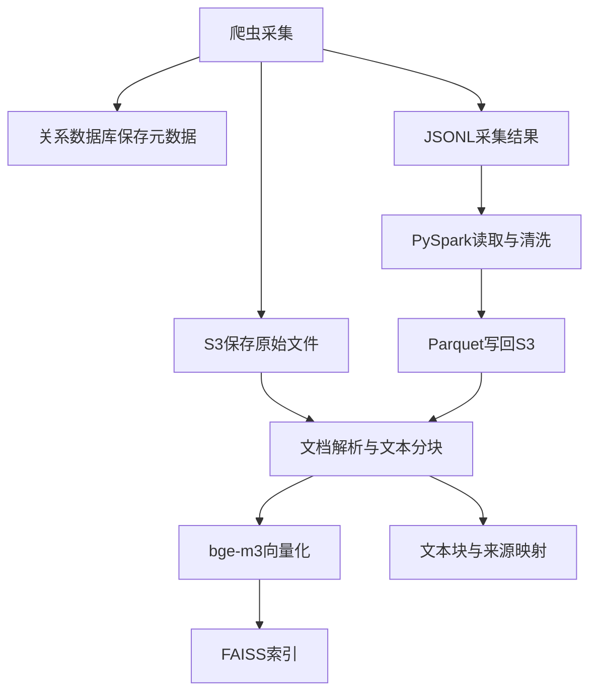
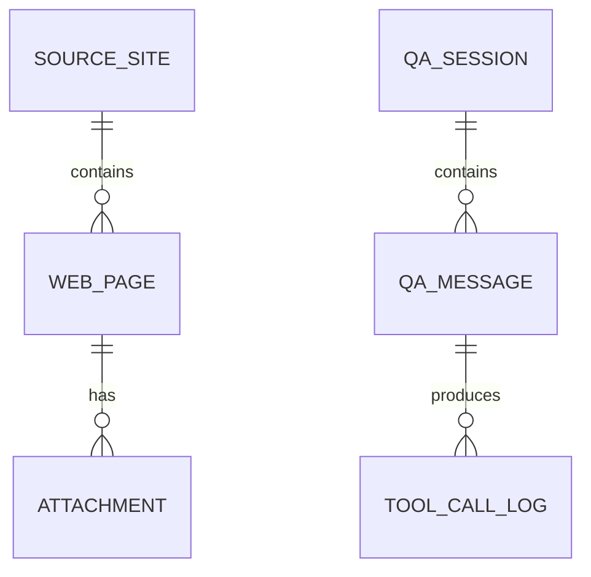
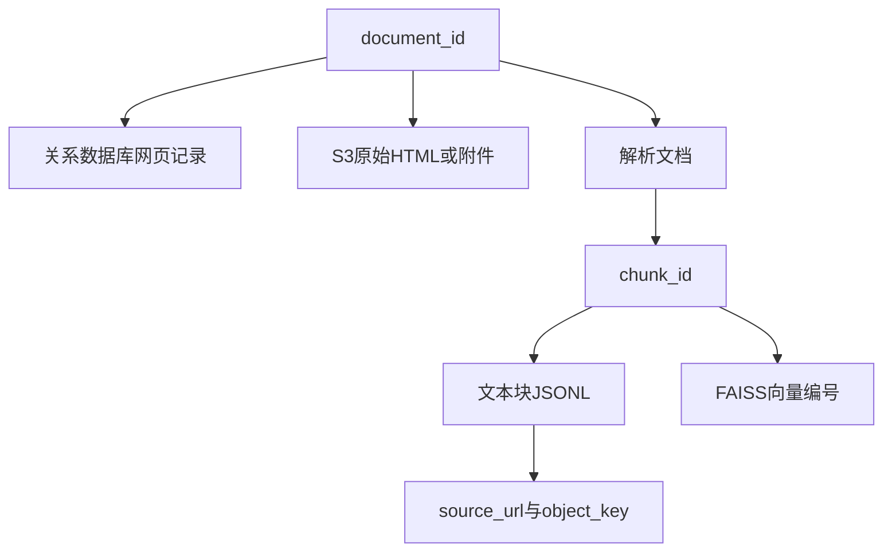
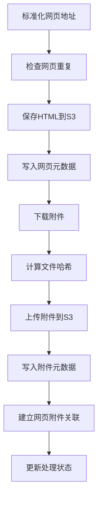

# 3.1 数据存储方案设计

### （一）存储方案说明

大数据智能问答系统会产生网页记录、附件文件、清洗结果、解析文本、向量索引、会话记录和运行日志。不同数据的结构和使用方式不同，不适合全部保存到同一种存储系统中。

本项目采用组合式存储方案：

- 关系数据库保存网页、附件、会话和工具调用等结构化数据；
- S3 兼容对象存储保存 HTML、PDF、Word、Excel 和处理结果；
- JSONL 保存爬虫结果、文本块和日志；
- Parquet 保存 PySpark 清洗与转换结果；
- FAISS 保存文本向量索引；
- JSONL 或数据库保存向量编号与文本来源的映射关系。



------

### （二）数据分类

系统数据主要分为以下四类。

| 数据类型   | 主要内容                         | 推荐存储       |
| ---------- | -------------------------------- | -------------- |
| 结构化数据 | 网页、附件、任务、会话、工具调用 | 关系数据库     |
| 原始文件   | HTML、PDF、Word、Excel、图片     | S3兼容对象存储 |
| 中间数据   | JSONL、Parquet、解析文本、日志   | S3或本地目录   |
| 向量数据   | 文本向量、FAISS索引、来源映射    | FAISS与JSONL   |

关系数据库不直接保存大型附件。数据库只记录文件名称、类型、大小和 `object_key`，文件本体保存到 S3。

------

### （三）关系数据库职责

关系数据库用于保存需要查询和关联的数据。

课程项目可以设计以下核心表：

| 数据表            | 主要内容                       |
| ----------------- | ------------------------------ |
| `source_site`     | 数据源网站和栏目               |
| `web_page`        | 网页标题、时间、正文和来源地址 |
| `attachment`      | 附件名称、类型和对象存储路径   |
| `crawl_task`      | 爬虫任务和执行状态             |
| `crawl_error`     | 请求、解析和下载异常           |
| `qa_session`      | 问答会话                       |
| `qa_message`      | 用户问题和系统回答             |
| `tool_call_log`   | Agent工具调用记录              |

一个网页可以包含多个附件，附件通过 `document_id` 关联到所属网页。实际表结构见 **3.3**。



------

### （四）网页与附件数据

课程项目至少需要 `web_page` 和 `attachment` 两张核心表。`web_page` 保存网页标题、正文、时间和来源地址等结构化信息；`attachment` 保存附件名称、类型和 S3 对象路径。附件通过 `document_id` 关联到所属网页。

完整的建表语句、字段定义和约束详见 **3.3（三）（四）**。

------

### （五）S3对象存储角色

S3 兼容对象存储在整体方案中负责保存 HTML、PDF、Word、Excel 和 Parquet 等原始文件与中间数据。数据库只记录 `object_key`，文件本体全部存放在 S3 中。

S3 存储桶的完整目录结构、对象路径规范和客户端连接方式详见 **3.2（三）至（七）**。

------

### （六）JSONL与Parquet

不同阶段使用不同的数据格式。

#### 1. JSONL

JSONL 每行保存一条 JSON 记录，适合：

- 爬虫采集结果；
- 错误日志；
- 文档解析结果；
- 文本块；
- FAISS编号映射。

```jsonl
{"document_id":"doc_0001","title":"通知A","source_url":"https://example.edu.cn/a.htm"}
{"document_id":"doc_0002","title":"通知B","source_url":"https://example.edu.cn/b.htm"}
```

JSONL 支持逐条追加，程序中断时不容易丢失全部结果。

#### 2. Parquet

Parquet 适合保存 PySpark 清洗和转换后的数据。

```text
datasets/
├── raw/pages.jsonl
└── cleaned/pages.parquet
```

PySpark 可以通过 `s3a://` 路径直接读取和写入 S3 数据。

```python
df = spark.read.json(
    "s3a://bigdata-qa/datasets/raw/pages.jsonl"
)

df.write.mode("overwrite").parquet(
    "s3a://bigdata-qa/datasets/cleaned/pages.parquet"
)
```

------

### （七）FAISS索引与来源映射

本项目使用 `BAAI/bge-m3` 生成文本向量，使用 FAISS 完成相似度检索。

FAISS 主要保存向量，不负责保存完整文档信息。因此，需要同时保存向量编号与文本块之间的映射。

文本块记录示例：

```json
{
  "chunk_id": "doc_0001_chunk_0001",
  "document_id": "doc_0001",
  "chunk_index": 0,
  "chunk_text": "用于知识检索的文本内容",
  "source_url": "https://example.edu.cn/a.htm",
  "attachment_id": null,
  "object_key": "raw/html/2026/06/doc_0001.html",
  "page_number": null,
  "sheet_name": null
}
```

索引文件和映射文件可以保存为：

```text
indexes/
├── faiss.index
└── chunk_mapping.jsonl
```

检索时，FAISS 返回向量编号，程序再从映射文件中获取：

- `chunk_id`；
- 文本内容；
- 原始网页地址；
- 附件编号；
- 对象存储路径；
- 页码或工作表名称。

这样可以保证问答结果能够追溯到原始网页或附件。

------

### （八）数据关联关系

系统通过统一编号连接不同存储中的数据。



核心关联规则如下：

- `document_id` 标识网页或文档；
- `attachment_id` 标识附件；
- `chunk_id` 标识文本块；
- `object_key` 定位 S3 文件；
- FAISS 向量编号映射到 `chunk_id`。

这些字段应保持稳定，不应在不同模块中重复生成或随意修改。

------

### （九）数据状态

网页和附件会经过采集、清洗、解析和索引等多个阶段，可以使用状态字段记录处理进度。

网页状态可以包括：

| 状态      | 含义       |
| --------- | ---------- |
| `pending` | 等待采集   |
| `fetched` | 已采集     |
| `cleaned` | 已清洗     |
| `parsed`  | 已解析     |
| `indexed` | 已建立索引 |
| `failed`  | 处理失败   |

附件状态可以包括：

| 状态         | 含义       |
| ------------ | ---------- |
| `pending`    | 等待下载   |
| `downloaded` | 已下载     |
| `uploaded`   | 已上传S3   |
| `parsed`     | 已解析     |
| `indexed`    | 已建立索引 |
| `failed`     | 处理失败   |

状态字段可以帮助后续程序只处理尚未完成的记录。

------

### （十）数据写入顺序

采集网页时，建议按照以下顺序处理：



文件上传成功后，才能将状态更新为 `uploaded`。数据库中的 `object_key` 应与 S3 中的真实文件一致。

------

### （十一）数据一致性检查

系统集成时，应重点检查：

- 数据库中的 `object_key` 是否能够定位真实文件；
- 网页记录是否能够查询到对应附件；
- 文本块是否能够追溯到原始文档；
- FAISS向量编号是否能够映射到 `chunk_id`；
- 文档重新解析后，旧索引是否已经更新；
- 重复附件是否只保存一份文件；
- 前端下载链接是否能够返回正确附件。

可以使用 `document_id`、`attachment_id`、`chunk_id` 和 `file_hash` 检查不同存储之间的关联关系。

------

### （十二）配置与备份

数据库和对象存储连接信息通过环境变量保存。

```env
DB_HOST=
DB_PORT=
DB_NAME=
DB_USER=
DB_PASSWORD=

S3_ENDPOINT=
S3_ACCESS_KEY=
S3_SECRET_KEY=
S3_BUCKET=
```

项目至少应保留：

- 数据库建表脚本；
- 数据库测试数据或导出文件；
- 对象存储目录说明；
- 原始采集数据；
- PySpark处理脚本；
- 文档解析脚本；
- FAISS索引重建脚本。

FAISS索引可以通过文本块和向量化程序重新构建，因此应优先保存原始文件、元数据、文本块和构建程序。

------

### （十三）本节任务

完成本节后，应形成以下成果：

- 完成系统数据分类；
- 明确关系数据库、S3、JSONL、Parquet和FAISS的职责；
- 设计网页表、附件表和关联表；
- 设计S3存储桶目录；
- 确定中间数据格式；
- 设计文本块和FAISS来源映射；
- 确定统一编号和状态字段；
- 绘制主要数据关联关系；
- 编写数据库建表脚本；
- 检查不同存储之间的数据一致性。

完成存储方案设计后，可以继续进行 S3 兼容对象存储的配置和文件操作。
