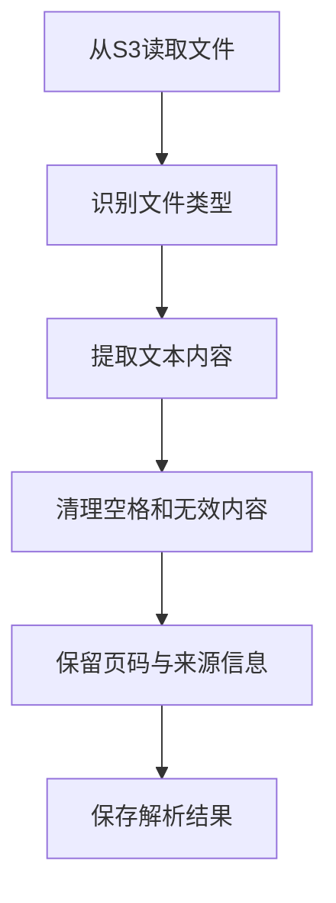
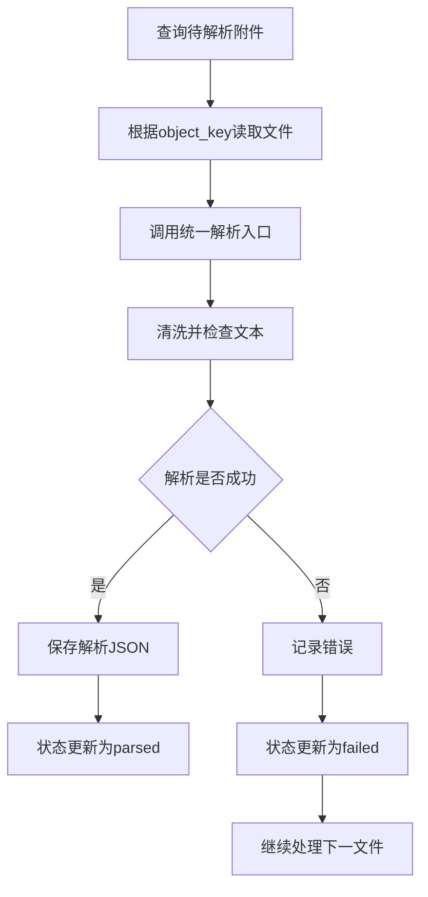

# 4.1 文档解析与文本清洗

### （一）本节目标

知识库不仅需要网页正文，还需要处理 PDF、Word、Excel 等附件。不同文件的内容结构不同，因此需要先将其转换为统一文本格式。

解析过程中应保留：

- 文档编号；
- 文件名称；
- 文件类型；
- 原始网页地址；
- S3 对象路径；
- PDF 页码；
- Excel 工作表名称；
- 文本内容。

基本流程如下：



本节输出的解析文本将作为 4.2 文本分块与向量化的输入。

------

### （二）统一解析结果格式

网页和附件解析后，应转换为统一的数据结构。

一条解析结果至少包含：

```json
{
  "document_id": "doc_0001",
  "attachment_id": "att_0001",
  "document_type": "pdf",
  "file_name": "研究生培养方案.pdf",
  "source_url": "https://example.edu.cn/info/1234.htm",
  "object_key": "raw/attachments/pdf/plan.pdf",
  "units": [
    {
      "unit_index": 0,
      "unit_type": "page",
      "text": "第一章 总则……",
      "page_number": 1,
      "sheet_name": null
    }
  ]
}
```

其中，`units` 表示文档中的文本单元：

| 文件类型 | 文本单元   |
| -------- | ---------- |
| 网页     | 正文       |
| PDF      | 页面       |
| Word     | 段落或表格 |
| Excel    | 工作表     |
| TXT      | 全文或段落 |

统一格式可以减少后续分块程序对不同文件类型的判断。

------

### （三）读取待处理文档列表

文档解析的输入来源有两类，读取方式已在 **3.4** 和 **3.3** 中详细说明，此处仅做简要归纳：

- **网页正文**：优先使用 PySpark 清洗后 Parquet 中 `data_status="valid"` 的 `content` 字段（详见 **3.4**）；如需重新解析 HTML，可根据 `html_object_key` 从 S3 读取原始文件；
- **附件文件**：从 MySQL `attachment` 表或附件 JSONL 中读取 `attachment_id`、`document_id`、`file_name` 和 `object_key`，再根据 `object_key` 从 S3 获取原始文件（详见 **3.3**）；

从 S3 读取文件的通用方法：

```python
def read_object(
    s3_client,
    bucket_name: str,
    object_key: str
) -> bytes:
    response = s3_client.get_object(
        Bucket=bucket_name,
        Key=object_key
    )

    return response["Body"].read()
```

> 为便于阅读，本节示例中的 `object_key` 使用简短文件名。实际项目中应遵循 **3.2** 和 **8.1** 推荐的路径规范，如 `raw/attachments/pdf/2026/06/{file_hash}.pdf`（按日期和文件哈希组织），避免文件名冲突。

------

### （四）识别文档类型

可以根据文件扩展名判断文档类型。

```python
from pathlib import Path


def detect_document_type(file_name: str) -> str:
    suffix = Path(file_name).suffix.lower()

    if suffix == ".pdf":
        return "pdf"

    if suffix == ".docx":
        return "word"

    if suffix in {".xlsx", ".xls"}:
        return "excel"

    if suffix in {".txt", ".md"}:
        return "text"

    if suffix in {".html", ".htm"}:
        return "html"

    return "unknown"
```

课程基础项目重点支持：

- HTML；
- PDF；
- DOCX；
- XLSX；
- TXT。

旧版 `.doc`、复杂扫描 PDF 和加密文件可以标记为不支持，不要求必须解析。

------

### （五）使用清洗后的网页正文

网页正文在爬虫阶段已提取到 `content` 字段，并经过 PySpark 清除了残留 HTML 标签和多余空白。文档解析阶段直接使用 PySpark 输出中 `data_status="valid"` 的 `content`，无需重新从 S3 读取 HTML 文件。

只有在需要提取更细致的段落结构或表格数据时，才从 S3 读取原始 HTML 重新解析：

```python
from bs4 import BeautifulSoup


def parse_html(html: str) -> str:
    soup = BeautifulSoup(html, "lxml")

    content_node = soup.select_one(
        ".article-content, .content, article"
    )

    if content_node is None:
        return ""

    return content_node.get_text(
        "\n",
        strip=True
    )
```

实际项目应根据目标网站修改正文选择器，并尽量排除导航栏、页脚和相关推荐等内容。

网页解析结果示例：

```json
{
  "unit_index": 0,
  "unit_type": "body",
  "text": "网页正文内容",
  "page_number": null,
  "sheet_name": null
}
```

------

### （六）解析PDF文档

文本型 PDF 可以使用 `pypdf` 按页提取文本。

安装依赖：

```bash
pip install pypdf
```

解析代码：

```python
from io import BytesIO
from pypdf import PdfReader


def parse_pdf(file_bytes: bytes) -> list[dict]:
    reader = PdfReader(
        BytesIO(file_bytes)
    )

    units = []

    for page_number, page in enumerate(
        reader.pages,
        start=1
    ):
        text = page.extract_text() or ""

        units.append({
            "unit_index": page_number - 1,
            "unit_type": "page",
            "text": text,
            "page_number": page_number,
            "sheet_name": None
        })

    return units
```

如果对排版质量要求较高（如双栏论文、含表格的公文），也可以使用 `pdfplumber`。它同样是纯 Python 库，基于 pdfminer.six，文本提取质量更好，并且内置表格提取功能。

安装依赖：

```bash
pip install pdfplumber
```

解析代码：

```python
import pdfplumber
from io import BytesIO


def parse_pdf(file_bytes: bytes) -> list[dict]:
    units = []

    with pdfplumber.open(BytesIO(file_bytes)) as pdf:
        for page_number, page in enumerate(
            pdf.pages,
            start=1
        ):
            text = page.extract_text() or ""

            units.append({
                "unit_index": page_number - 1,
                "unit_type": "page",
                "text": text,
                "page_number": page_number,
                "sheet_name": None
            })

    return units
```

`pdfplumber` 还可以直接提取页面中的表格，适合处理培养方案课程表、奖学金名额分配表等结构化内容：

```python
tables = page.extract_tables()
for table in tables:
    for row in table:
        print(" | ".join(row))
```

按页保存可以在检索结果中显示：

```text
来源：研究生培养方案.pdf，第3页
```

扫描版 PDF 通常无法直接提取文字，可以将解析状态标记为：

```text
ocr_required
```

OCR 不作为基础项目的必做内容。

> **拓展阅读：LangChain 文档加载器**
>
> LangChain 的 `document_loaders` 模块封装了上述解析库，提供了统一的加载接口：
>
> ```python
> from langchain_community.document_loaders import (
>     PyPDFLoader,          # 对应 pypdf
>     PDFPlumberLoader,     # 对应 pdfplumber
>     PyMuPDFLoader,        # 对应 PyMuPDF
> )
> ```
>
> 使用 `UnstructuredFileLoader` 甚至可以自动识别文件类型，一条语句加载 PDF、DOCX、XLSX 等多种格式。但由于封装层次较深，不利于理解底层解析原理，本课程建议先掌握原生的 `pypdf` / `pdfplumber` 用法，LangChain 加载器可在熟悉基础后再了解。

------

### （七）解析Word文档

DOCX 文件可以使用 `python-docx` 提取段落和表格。

安装依赖：

```bash
pip install python-docx
```

解析段落：

```python
from io import BytesIO
from docx import Document


def parse_docx(file_bytes: bytes) -> list[dict]:
    document = Document(
        BytesIO(file_bytes)
    )

    units = []
    unit_index = 0

    for paragraph in document.paragraphs:
        text = paragraph.text.strip()

        if not text:
            continue

        units.append({
            "unit_index": unit_index,
            "unit_type": "paragraph",
            "text": text,
            "page_number": None,
            "sheet_name": None
        })

        unit_index += 1

    return units
```

还可以提取 Word 表格：

```python
for table in document.tables:
    rows = []

    for row in table.rows:
        cells = [
            cell.text.strip()
            for cell in row.cells
        ]

        rows.append(" | ".join(cells))

    table_text = "\n".join(rows)

    if table_text.strip():
        units.append({
            "unit_index": unit_index,
            "unit_type": "table",
            "text": table_text,
            "page_number": None,
            "sheet_name": None
        })

        unit_index += 1
```

基础项目只要求支持 `.docx`。旧版 `.doc` 文件可以先转换为 `.docx`。

------

### （八）解析Excel文档

Excel 文件可以使用 `openpyxl` 按工作表读取。

安装依赖：

```bash
pip install openpyxl
```

解析代码：

```python
from io import BytesIO
from openpyxl import load_workbook


def parse_excel(file_bytes: bytes) -> list[dict]:
    workbook = load_workbook(
        BytesIO(file_bytes),
        data_only=True,
        read_only=True
    )

    units = []

    for unit_index, sheet in enumerate(
        workbook.worksheets
    ):
        rows = []

        for row in sheet.iter_rows(
            values_only=True
        ):
            values = [
                "" if value is None else str(value)
                for value in row
            ]

            if any(value.strip() for value in values):
                rows.append(" | ".join(values))

        if rows:
            units.append({
                "unit_index": unit_index,
                "unit_type": "sheet",
                "text": "\n".join(rows),
                "page_number": None,
                "sheet_name": sheet.title
            })

    return units
```

Excel 解析结果保留工作表名称，便于显示来源：

```text
来源：奖学金名额.xlsx，工作表“名额分配”
```

------

### （九）解析文本文件

TXT 和 Markdown 文件需要先处理字符编码。

```python
def decode_text(file_bytes: bytes) -> str:
    for encoding in (
        "utf-8",
        "gb18030",
        "gbk"
    ):
        try:
            return file_bytes.decode(encoding)
        except UnicodeDecodeError:
            continue

    return file_bytes.decode(
        "utf-8",
        errors="ignore"
    )
```

解析结果：

```python
def parse_text(file_bytes: bytes) -> list[dict]:
    text = decode_text(file_bytes)

    return [{
        "unit_index": 0,
        "unit_type": "body",
        "text": text,
        "page_number": None,
        "sheet_name": None
    }]
```

------

### （十）文本基础清洗

解析文本中可能包含多余空格、空行、HTML 实体和特殊字符。

```python
import html
import re
import unicodedata


def clean_text(text: str) -> str:
    text = html.unescape(text)

    text = unicodedata.normalize(
        "NFKC",
        text
    )

    text = text.replace("\u00a0", " ")
    text = text.replace("\u3000", " ")

    text = re.sub(
        r"[ \t]+",
        " ",
        text
    )

    text = re.sub(
        r"\n{3,}",
        "\n\n",
        text
    )

    return text.strip()
```

清洗时应注意：

- 保留段落换行；
- 保留列表编号和条款编号；
- 保留表格行之间的换行；
- 不随意删除中文标点；
- 不把整篇文档合并为一个连续字符串。

------

### （十一）清理常见无效内容

网页或文档中可能包含“上一篇”“下一篇”和版权信息等无效文本。

```python
INVALID_PATTERNS = [
    r"上一篇[:：]?.*",
    r"下一篇[:：]?.*",
    r"版权所有.*"
]


def remove_invalid_content(text: str) -> str:
    result = text

    for pattern in INVALID_PATTERNS:
        result = re.sub(
            pattern,
            "",
            result
        )

    return clean_text(result)
```

清理规则应根据实际数据源调整，避免误删正文。

对于 PDF 中单独出现的页码，可以使用简单规则删除：

```python
def remove_page_number(text: str) -> str:
    lines = []

    for line in text.splitlines():
        value = line.strip()

        if re.fullmatch(
            r"第?\s*\d+\s*页",
            value
        ):
            continue

        if re.fullmatch(
            r"-?\s*\d+\s*-?",
            value
        ):
            continue

        lines.append(value)

    return "\n".join(lines)
```

复杂页眉页脚识别不作为基础要求。

------

### （十二）文本质量检查

解析完成后，应检查文本是否能够用于后续知识库构建。

```python
def evaluate_text(text: str) -> str:
    if not text.strip():
        return "empty"

    if len(text.strip()) < 20:
        return "too_short"

    return "valid"
```

常用解析状态如下：

| 状态           | 含义             |
| -------------- | ---------------- |
| `parsed`       | 解析成功         |
| `empty`        | 未提取到文本     |
| `too_short`    | 文本过短         |
| `unsupported`  | 文件格式不支持   |
| `ocr_required` | 扫描PDF，需要OCR |
| `failed`       | 解析异常         |

文本为空或过短时，应保留文档记录，但不直接进入向量知识库。

------

### （十三）统一解析入口

根据文件类型调用不同解析函数。

```python
def parse_document(
    file_bytes: bytes,
    file_name: str
) -> list[dict]:
    document_type = detect_document_type(
        file_name
    )

    if document_type == "pdf":
        units = parse_pdf(file_bytes)

    elif document_type == "word":
        units = parse_docx(file_bytes)

    elif document_type == "excel":
        units = parse_excel(file_bytes)

    elif document_type == "text":
        units = parse_text(file_bytes)

    else:
        raise ValueError(
            f"不支持的文档类型：{document_type}"
        )

    for unit in units:
        unit["text"] = remove_invalid_content(
            unit["text"]
        )

        unit["text_status"] = evaluate_text(
            unit["text"]
        )

    return units
```

该入口统一完成：

```text
类型判断 → 格式解析 → 文本清洗 → 质量检查
```

> **💡 简化示例：使用 LangChain 统一加载器**
>
> 上述 `parse_document`（含 `detect_document_type` + 4 个 `parse_*` 函数，约 50 行）可用 LangChain 的 `UnstructuredFileLoader` 替代为约 5 行。适合快速原型开发：
>
> ```bash
> pip install langchain-community unstructured
> ```
>
> ```python
> from langchain_community.document_loaders import UnstructuredFileLoader
>
> loader = UnstructuredFileLoader(
>     file_path="raw/attachments/pdf/plan.pdf",
>     mode="elements",          # 按页面/段落切分
> )
> docs = loader.load()
>
> # docs 为 list[Document]，每条自动携带 page_content 和 metadata
> for doc in docs:
>     print(doc.metadata.get("page_number"), doc.page_content[:100])
> ```
>
> `UnstructuredFileLoader` 自动识别 PDF、DOCX、XLSX、TXT、HTML 等格式，一条语句替代类型判断和格式解析。但封装层次深、依赖 `unstructured` 库较大（~数百MB），课程基础项目推荐先掌握原生 `pypdf`/`pdfplumber`/`python-docx`/`openpyxl` 用法。详见本节 (六) 末尾的拓展阅读。

------

### （十四）保存来源信息

每个文本单元都应保留来源字段。

```python
def build_parsed_result(
    document_id: str,
    attachment_id: str,
    file_name: str,
    source_url: str,
    object_key: str,
    units: list[dict]
) -> dict:
    return {
        "document_id": document_id,
        "attachment_id": attachment_id,
        "file_name": file_name,
        "source_url": source_url,
        "object_key": object_key,
        "units": units
    }
```

后续分块时，应将以下字段复制到每个文本块：

- `document_id`；
- `attachment_id`；
- `file_name`；
- `source_url`；
- `object_key`；
- `page_number`；
- `sheet_name`；
- `unit_index`。

这样才能在问答结果中准确展示网页、附件、页码或工作表来源。

------

### （十五）保存解析结果

解析结果建议保存为 JSON 或 JSONL，并上传到 S3。

```python
import json


def serialize_result(result: dict) -> bytes:
    return json.dumps(
        result,
        ensure_ascii=False,
        indent=2
    ).encode("utf-8")
```

推荐对象路径：

```text
parsed/web/doc_0001.json
parsed/attachments/att_0001.json
```

解析结果示例：

```json
{
  "document_id": "doc_0001",
  "attachment_id": "att_0001",
  "file_name": "研究生培养方案.pdf",
  "source_url": "https://example.edu.cn/info/1234.htm",
  "object_key": "raw/attachments/pdf/plan.pdf",
  "units": [
    {
      "unit_index": 0,
      "unit_type": "page",
      "text": "第一章 总则……",
      "page_number": 1,
      "sheet_name": null,
      "text_status": "valid"
    }
  ]
}
```

------

### （十六）批量解析流程

批量解析时，可以从数据库查询状态为 `uploaded` 的附件。



单个文件失败时，不应终止全部解析任务。

------

### （十七）结果检查

完成解析后，应检查：

| 检查项目 | 检查要求                   |
| -------- | -------------------------- |
| 文件类型 | 能正确识别PDF、DOCX和XLSX  |
| PDF      | 文本按页提取并保留页码     |
| Word     | 段落和表格能够读取         |
| Excel    | 工作表名称和内容能够读取   |
| 文本清洗 | 无大量空格、空行和乱码     |
| 来源字段 | 保留网页地址和对象路径     |
| 文本质量 | 空文本和过短文本被正确标记 |
| JSON结果 | 能够正常保存和重新读取     |

应至少选择一份 PDF、一份 Word 和一份 Excel 文件进行测试。

------

### （十八）本节任务

完成本节后，应形成以下成果：

- 从 S3 读取网页或附件文件；
- 识别 PDF、DOCX、XLSX 和文本文件；
- 按页提取 PDF 文本；
- 提取 Word 段落和表格；
- 提取 Excel 工作表内容；
- 清理多余空格、空行和无效内容；
- 保留页码、工作表和来源地址；
- 标记空文本、过短文本和不支持格式；
- 将解析结果保存为 JSON；
- 更新附件解析状态；
- 完成多种文件格式的解析测试。

完成本节后，应获得结构统一、来源完整、能够用于文本分块的文档数据。

------

### （十九）拓展：LangChain 多文档解析

掌握了原生解析库（pypdf、pdfplumber、python-docx、openpyxl）之后，可以了解 LangChain 提供的统一封装方式。LangChain 的 `document_loaders` 模块内置了数十种文档加载器，支持一条语句加载多种格式的文件。

#### 1. 单文件加载

LangChain 为每种格式提供了专用加载器，底层封装了前面介绍的原生库：

```python
from langchain_community.document_loaders import (
    PyPDFLoader,                  # 基于 pypdf
    PDFPlumberLoader,             # 基于 pdfplumber
    Docx2txtLoader,               # 基于 docx2txt
    UnstructuredExcelLoader,      # 基于 unstructured
    TextLoader,                   # 纯文本
)

# PDF 加载（按页返回 Document 对象列表）
loader = PDFPlumberLoader("plan.pdf")
documents = loader.load()

for doc in documents:
    print(doc.page_content)       # 页面文本
    print(doc.metadata)           # {"page": 1, "source": "plan.pdf"}
```

#### 2. 目录批量加载

`DirectoryLoader` 可自动遍历目录，根据文件扩展名匹配对应的加载器：

```python
from langchain_community.document_loaders import DirectoryLoader

loader = DirectoryLoader(
    "./attachments/",
    glob="**/*.pdf",              # 匹配所有 PDF 文件
    loader_cls=PyPDFLoader,       # 使用 pypdf 加载器
    show_progress=True,           # 显示进度条
    use_multithreading=True,      # 多线程加速
)

documents = loader.load()
print(f"共加载 {len(documents)} 个文档")
```

#### 3. 自动识别格式：UnstructuredFileLoader

`UnstructuredFileLoader` 可以自动检测文件类型，无需为每种格式单独指定加载器：

```bash
pip install "unstructured[pdf,docx,xlsx]"
```

```python
from langchain_community.document_loaders import UnstructuredFileLoader

# 一条语句加载任意格式
loader = UnstructuredFileLoader("document.pdf")   # PDF
# loader = UnstructuredFileLoader("document.docx") # Word
# loader = UnstructuredFileLoader("document.xlsx") # Excel

documents = loader.load()
```

`UnstructuredFileLoader` 还能识别文档中的结构元素，每个 `Document` 的 `metadata` 中包含 `category` 字段（`Title`、`NarrativeText`、`Table` 等），便于后续按内容类型分类处理。

#### 4. 从 S3 远程加载

LangChain 也支持直接从 S3 读取文件：

```python
from langchain_community.document_loaders import S3FileLoader

loader = S3FileLoader(
    bucket="bigdata-qa",
    key="raw/attachments/pdf/plan.pdf",
)
documents = loader.load()
```

> **建议**：课程基础项目使用本节原生方式，以便深入理解解析原理并灵活控制输出格式。学有余力时，可尝试用 LangChain 的 `DirectoryLoader` + `PyPDFLoader` 替代手写遍历逻辑，减少批量处理的样板代码。
