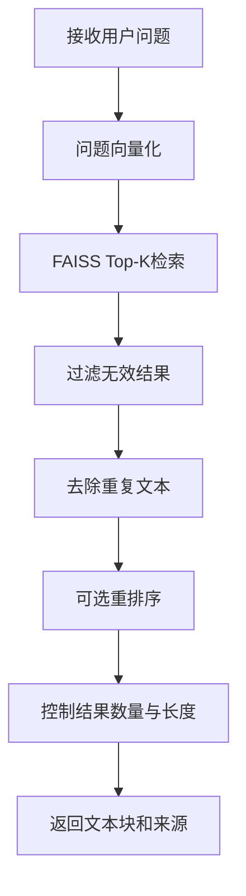

# 4.4 知识检索与结果排序

### （一）本节目标

上一节已经完成 FAISS 索引构建和基础 Top-K 检索。本节进一步对检索结果进行整理、过滤和排序，从知识库中选出更适合回答用户问题的文本块。

本节主要完成：

- 使用用户问题检索相关文本块；
- 设置 Top-K 返回数量；
- 过滤无效结果；
- 去除重复或高度相似的文本块；
- 保留文本块的来源信息；
- 可选使用重排序模型优化结果；
- 输出可供大语言模型使用的知识上下文。

基本流程如下：



------

### （二）检索结果结构

FAISS 返回的是向量编号和相似度分数。程序需要根据编号查询对应的文本块和来源信息。

统一检索结果可以包含：

```json
{
  "rank": 1,
  "score": 0.82,
  "chunk_id": "doc_0001_chunk_0003",
  "chunk_text": "申请人应提交学位论文、答辩申请表和审核意见表。",
  "document_id": "doc_0001",
  "attachment_id": "att_0001",
  "file_name": "研究生学位管理办法.pdf",
  "source_url": "https://example.edu.cn/info/1234.htm",
  "object_key": "raw/attachments/pdf/rule.pdf",
  "page_number": 8,
  "sheet_name": null
}
```

其中，`score` 越大，表示文本块与用户问题越相似。

------

### （三）执行Top-K检索

Top-K 表示从知识库中返回相似度最高的前 K 个文本块。

```python
import numpy as np


def retrieve_chunks(
    question: str,
    model,
    index,
    chunks: list[dict],
    top_k: int = 5
) -> list[dict]:
    query_vector = model.encode(
        [question],
        normalize_embeddings=True
    )

    query_vector = np.asarray(
        query_vector,
        dtype="float32"
    )

    scores, indices = index.search(
        query_vector,
        top_k
    )

    results = []

    for rank, (score, chunk_index) in enumerate(
        zip(scores[0], indices[0]),
        start=1
    ):
        if chunk_index < 0:
            continue

        chunk = chunks[chunk_index]

        results.append({
            "rank": rank,
            "score": float(score),
            "chunk_id": chunk["chunk_id"],
            "chunk_text": chunk["chunk_text"],
            "document_id": chunk["document_id"],
            "attachment_id": chunk.get(
                "attachment_id"
            ),
            "file_name": chunk.get("file_name"),
            "source_url": chunk.get("source_url"),
            "object_key": chunk.get("object_key"),
            "page_number": chunk.get(
                "page_number"
            ),
            "sheet_name": chunk.get(
                "sheet_name"
            )
        })

    return results
```

课程项目可以先设置：

```python
TOP_K = 5
```

如果问题较复杂，可以增加到 8 或 10，但返回过多内容可能引入无关信息。

------

### （四）过滤低质量结果

检索结果中可能包含空文本、过短文本或相似度过低的内容。

```python
def filter_results(
    results: list[dict],
    min_length: int = 20,
    min_score: float = 0.3
) -> list[dict]:
    filtered = []

    for item in results:
        text = item["chunk_text"].strip()

        if len(text) < min_length:
            continue

        if item["score"] < min_score:
            continue

        filtered.append(item)

    return filtered
```

其中：

- `min_length` 用于过滤过短文本；
- `min_score` 用于过滤相关性较低的结果。

相似度阈值需要根据实际检索结果调整。如果不确定，可以先不设置固定阈值，只保留 Top-K 结果。

------

### （五）检索结果去重

相邻文本块之间存在重叠，同一段内容可能被多次召回。可以根据 `chunk_id` 或文本内容进行简单去重。

```python
def deduplicate_results(
    results: list[dict]
) -> list[dict]:
    selected = []
    seen_texts = set()

    for item in results:
        normalized_text = "".join(
            item["chunk_text"].split()
        )

        if normalized_text in seen_texts:
            continue

        seen_texts.add(normalized_text)
        selected.append(item)

    return selected
```

也可以使用文档编号和页码去重：

```python
key = (
    item["document_id"],
    item.get("page_number"),
    item["chunk_text"]
)
```

去重时不应限制每篇文档只能返回一个文本块，因为一个问题可能需要同一文档中的多个相关段落。

------

### （六）来源信息整理

检索结果必须保留来源信息，以便后续展示引用和下载附件。

```python
def build_source(item: dict) -> dict:
    return {
        "document_id": item["document_id"],
        "attachment_id": item.get(
            "attachment_id"
        ),
        "file_name": item.get("file_name"),
        "source_url": item.get("source_url"),
        "object_key": item.get("object_key"),
        "page_number": item.get(
            "page_number"
        ),
        "sheet_name": item.get(
            "sheet_name"
        )
    }
```

来源展示示例：

```text
来源：研究生学位管理办法.pdf，第8页
网页：https://example.edu.cn/info/1234.htm
```

附件下载链接不需要长期保存到文本块中。后端可以根据 `object_key` 临时生成下载链接。

------

### （七）基础排序

FAISS 已经按照相似度从高到低返回结果。过滤和去重后，应重新设置排名。

```python
def reset_rank(
    results: list[dict]
) -> list[dict]:
    for rank, item in enumerate(
        results,
        start=1
    ):
        item["rank"] = rank

    return results
```

完整基础排序流程如下：

```python
results = retrieve_chunks(
    question=question,
    model=model,
    index=index,
    chunks=chunks,
    top_k=10
)

results = filter_results(
    results,
    min_length=20,
    min_score=0.3
)

results = deduplicate_results(
    results
)

results = reset_rank(
    results[:5]
)
```

这里先召回 10 个候选结果，再经过过滤和去重后保留前 5 个。

------

### （八）可选重排序

向量检索适合快速寻找候选文本，但排名结果不一定完全准确。可以使用重排序模型重新计算用户问题与候选文本之间的相关性。

本项目可以选用：

```text
BAAI/bge-reranker-base
```

安装依赖：

```bash
pip install sentence-transformers
```

加载重排序模型：

```python
from sentence_transformers import CrossEncoder

reranker = CrossEncoder(
    "BAAI/bge-reranker-base"
)
```

对候选结果重新评分：

```python
def rerank_results(
    question: str,
    results: list[dict],
    reranker,
    top_n: int = 5
) -> list[dict]:
    pairs = [
        [question, item["chunk_text"]]
        for item in results
    ]

    scores = reranker.predict(
        pairs
    )

    for item, score in zip(
        results,
        scores
    ):
        item["rerank_score"] = float(score)

    results.sort(
        key=lambda item: item["rerank_score"],
        reverse=True
    )

    return reset_rank(
        results[:top_n]
    )
```

推荐流程：

```text
FAISS召回10个候选文本块
        ↓
重排序模型重新评分
        ↓
保留前5个文本块
```

重排序属于增强功能。基础课程项目完成 FAISS Top-K 检索即可，运行条件允许时再加入重排序模型。

------

### （九）为什么先召回再重排序

FAISS 和重排序模型的职责不同：

| 阶段      | 作用                                 |
| --------- | ------------------------------------ |
| FAISS检索 | 从全部文本块中快速找出候选结果       |
| 重排序    | 对少量候选结果进行更准确的相关性判断 |
| 结果筛选  | 控制最终进入大模型的文本数量         |

重排序模型不适合直接比较知识库中的全部文本块，因为计算速度较慢。因此，应先通过 FAISS 缩小候选范围。

------

### （十）控制上下文长度

最终送入大语言模型的文本不能过多，应限制文本块数量或总字符数。

```python
def limit_context(
    results: list[dict],
    max_chars: int = 3000
) -> list[dict]:
    selected = []
    total_length = 0

    for item in results:
        text_length = len(
            item["chunk_text"]
        )

        if (
            selected
            and total_length + text_length
            > max_chars
        ):
            break

        selected.append(item)
        total_length += text_length

    return selected
```

课程项目可以先设置：

```python
FINAL_TOP_K = 5
MAX_CONTEXT_CHARS = 3000
```

具体数值可根据使用的大语言模型和测试效果进行调整。

------

### （十一）构建知识上下文

将最终检索结果整理为大语言模型能够读取的上下文。

```python
def build_context(
    results: list[dict]
) -> str:
    context_parts = []

    for item in results:
        source_name = (
            item.get("file_name")
            or item.get("source_url")
            or "未知来源"
        )

        page_number = item.get(
            "page_number"
        )

        source_text = source_name

        if page_number:
            source_text += (
                f"，第{page_number}页"
            )

        context_parts.append(
            f"[来源：{source_text}]\n"
            f"{item['chunk_text']}"
        )

    return "\n\n".join(
        context_parts
    )
```

输出示例：

```text
[来源：研究生学位管理办法.pdf，第8页]
申请人应提交学位论文、答辩申请表和审核意见表。

[来源：研究生答辩工作通知]
答辩申请应在规定时间内提交。
```

该内容将在 4.5 中与用户问题一起组成提示词。

> `build_context` 使用 `[来源：xxx]` 格式，适合检索结果检查和调试。构建 RAG 提示词时，应使用带编号的 `[资料1]...[资料2]...` 格式（4.5（四）`build_knowledge_context`），便于模型在回答中引用 `[资料1]` 等编号。

------

### （十二）统一检索流程

可以将检索、过滤、去重和上下文控制封装为一个函数。

```python
def search_knowledge(
    question: str,
    model,
    index,
    chunks: list[dict],
    candidate_k: int = 10,
    final_k: int = 5
) -> list[dict]:
    results = retrieve_chunks(
        question=question,
        model=model,
        index=index,
        chunks=chunks,
        top_k=candidate_k
    )

    results = filter_results(
        results,
        min_length=20,
        min_score=0.3
    )

    results = deduplicate_results(
        results
    )

    results = results[:final_k]

    return reset_rank(
        results
    )
```

调用示例：

```python
results = search_knowledge(
    question="申请答辩需要哪些材料？",
    model=model,
    index=index,
    chunks=chunks,
    candidate_k=10,
    final_k=5
)

context = build_context(
    results
)

print(context)
```

加入重排序时，可以在去重后调用 `rerank_results()`。

------

### （十三）检索结果测试

应准备若干能够从知识库中找到答案的问题。

```python
test_questions = [
    "申请论文答辩需要提交哪些材料？",
    "奖学金申请时间是什么时候？",
    "培养方案在哪里下载？",
    "奖学金名额如何分配？"
]
```

对每个问题检查：

- 前 5 个结果是否包含相关内容；
- 相似度排序是否基本合理；
- 是否存在大量重复文本；
- 是否返回正确网页或附件；
- PDF 页码是否正确；
- Excel 工作表名称是否保留；
- 最终上下文是否超过长度限制。

测试结果可以记录为：

| 测试问题             | Top-5是否命中 | 来源是否正确 | 重复情况   |
| -------------------- | ------------- | ------------ | ---------- |
| 申请答辩需要哪些材料 | 是            | 是           | 无明显重复 |
| 奖学金申请时间       | 是            | 是           | 少量重复   |
| 培养方案下载地址     | 是            | 是           | 无明显重复 |

------

### （十四）常见问题

#### 1. 返回结果重复较多

可能是文本分块重叠过大。可以减小 4.2 中的重叠长度，或对结果进行去重。

#### 2. 相关文本没有进入前5名

可以将候选数量由 5 增加到 10，再进行筛选或重排序。

#### 3. 检索结果与问题无关

应检查：

- 文本块内容是否正确；
- 文档与问题是否使用同一向量模型；
- 向量是否都进行了归一化；
- 文本块长度是否合理；
- 知识库中是否确实存在相关内容。

#### 4. 来源信息不完整

应检查 4.1 和 4.2 中是否将 `source_url`、`file_name`、`page_number` 和 `object_key` 保存到文本块。

------

### （十五）本节任务

完成本节后，应形成以下成果：

- 使用 FAISS 执行 Top-K 检索；
- 将向量编号映射为文本块；
- 过滤空文本和过短文本；
- 去除重复检索结果；
- 保留网页、附件、页码和工作表来源；
- 对检索结果重新编号；
- 控制最终文本块数量和上下文长度；
- 构建可供大语言模型使用的知识上下文；
- 使用多个测试问题检查检索效果；
- 选做：使用重排序模型优化候选结果。

完成本节后，系统应能够从 FAISS 候选结果中选出相关、完整且来源清晰的知识片段，为后续提示词构建和大模型问答提供输入。

------

> **💡 简化示例：LangChain Retriever 检索链**
>
> 本节手写的 `search_knowledge`（检索 → 过滤 → 去重 → 排序 → 截断，约 30 行）在引入 LangChain 后可大幅简化。前提是 4.3 已用 `FAISS.from_documents` 构建了 `vectorstore`：
>
> ```bash
> pip install langchain-core langchain-community
> ```
>
> ```python
> from langchain_core.retrievers import BaseRetriever
> from langchain_community.vectorstores import FAISS
>
> # 加载 4.3 构建的向量存储（替代 load_chunks + faiss.read_index）
> vectorstore = FAISS.load_local(
>     "data/faiss_index",
>     embedding_model,          # 同 4.2/4.3 的 HuggingFaceBgeEmbeddings
>     allow_dangerous_deserialization=True,
> )
>
> # 直接调用相似度检索（替代 index.search + 手动映射 chunks）
> docs_with_scores = vectorstore.similarity_search_with_score(
>     question, k=10
> )
>
> # 转为 retriever 接口（统一 get_relevant_documents）
> retriever = vectorstore.as_retriever(
>     search_kwargs={"k": 5}
> )
> relevant_docs = retriever.get_relevant_documents(question)
> ```
>
> LangChain `Document` 对象自动携带 `page_content`（文本）和 `metadata`（来源信息），无需像 4.4 手写方案中手动从 `chunks[chunk_index]` 逐字段提取。过滤和去重逻辑也可通过 `search_kwargs` 的 `filter` 参数在检索时完成。
>
> 课程基础项目推荐先掌握本节原生流程（检索 → 过滤 → 去重 → 排序），理解完整逻辑后再了解 Retriever 抽象。LangChain 相关模块：`langchain_core.retrievers.BaseRetriever`、`langchain_community.vectorstores.FAISS`。