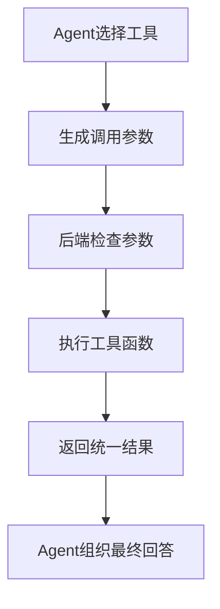
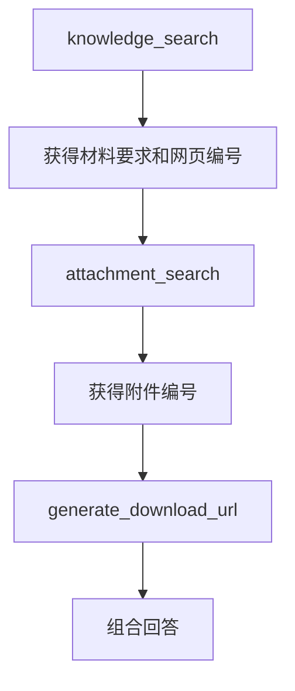

# 5.2 工具定义与参数设计

### （一）本节目标

Agent 负责判断任务和选择工具，但不能直接访问 FAISS、关系数据库和对象存储。具体操作需要由后端预先编写的工具函数完成。

本科课程项目不需要设计复杂的工具框架，只需实现以下核心工具：

| 工具名称                | 主要功能                         |
| ----------------------- | -------------------------------- |
| `knowledge_search`      | 从 FAISS 知识库检索相关文本      |
| `page_query`            | 查询网页标题、发布时间和来源地址 |
| `statistics_query`      | 完成数量、分类和时间范围统计     |
| `attachment_search`     | 查询网页关联的附件               |
| `generate_download_url` | 生成附件临时下载链接             |

基本调用流程如下：



------

### （二）工具基本结构

每个工具包括：

- 工具名称；
- 功能说明；
- 实际执行函数。

```python
class AgentTool:

    def __init__(
        self,
        name: str,
        description: str,
        function
    ):
        self.name = name
        self.description = description
        self.function = function

    def run(self, **kwargs) -> dict:
        return self.function(**kwargs)
```

其中：

- `name` 用于唯一标识工具；
- `description` 用于说明工具的作用；
- `function` 是实际执行查询的函数。

> **推荐方案：使用 LangChain @tool 装饰器**：上述手写 `AgentTool` 类（约 12 行样板代码）可以用 LangChain 的 `@tool` 装饰器替代，代码更简洁，且能自动从函数名和 docstring 生成工具名称和描述。两种方式与 4.5/6.1 中使用的 LangChain `ChatDeepSeek` 属于同一生态。
>
> 安装依赖（与 4.5/6.1 共用）：
>
> ```bash
> pip install langchain-core
> ```
>
> ```python
> from langchain_core.tools import tool
>
>
> @tool
> def knowledge_search(query: str, top_k: int = 5) -> dict:
>     """从 FAISS 知识库检索与 query 相关的文本块。
>
>     Args:
>         query: 用户问题或检索关键词
>         top_k: 返回的文本块数量，默认为 5
>
>     Returns:
>         {"success": True, "data": [...], "message": "..."}
>     """
>     # ... 具体实现同手写方案 ...
>     return success_result(results)
> ```
>
> `@tool` 装饰器的优势：
> - **自动提取元数据**：函数名 → 工具名，docstring → 工具描述，类型注解 → 参数 schema
> - **与 LangChain Agent 兼容**：`@tool` 装饰的工具可直接用于 `create_react_agent` 等 Agent 框架（见 5.1 拓展）
> - **减少样板代码**：无需手写 `AgentTool` 类和 `__init__`/`run` 方法
>
> 课程基础项目两种方式均可。手写 `AgentTool` 帮助理解工具的注册和调用机制，`@tool` 用于实际开发和后续扩展。两种方式必须保持相同的返回格式 `{"success": True/False, "data": ..., "message": "..."}`。

------

### （三）统一返回格式

所有工具采用相同的字典结构返回结果，便于 Agent 判断执行是否成功。

执行成功：

```python
{
    "success": True,
    "data": result,
    "message": "执行成功"
}
```

执行失败：

```python
{
    "success": False,
    "data": None,
    "message": "执行失败原因"
}
```

可以封装两个辅助函数：

```python
def success_result(data) -> dict:
    return {
        "success": True,
        "data": data,
        "message": "执行成功"
    }


def error_result(message: str) -> dict:
    return {
        "success": False,
        "data": None,
        "message": message
    }
```

统一返回格式可以减少不同工具之间的处理差异。

------

### （四）知识检索工具

知识检索工具根据用户问题，从 FAISS 索引中返回相关文本块。

主要参数如下：

| 参数    | 类型   | 说明           |
| ------- | ------ | -------------- |
| `query` | 字符串 | 用户问题       |
| `top_k` | 整数   | 返回文本块数量 |

```python
def knowledge_search(
    query: str,
    top_k: int = 5
) -> dict:
    if not isinstance(query, str):
        return error_result(
            "query必须是字符串"
        )

    if not query.strip():
        return error_result(
            "检索问题不能为空"
        )

    top_k = max(
        1,
        min(int(top_k), 10)
    )

    results = search_knowledge(
        question=query,
        # embedding_model、faiss_index、chunks 由应用启动时从 4.2/4.3 加载
        model=embedding_model,
        index=faiss_index,
        chunks=chunks,
        candidate_k=10,
        final_k=top_k
    )

    return success_result(results)
```

调用示例：

```python
result = knowledge_search(
    query="申请论文答辩需要哪些材料？",
    top_k=5
)
```

返回结果应包含文本内容和来源信息：

```json
{
  "success": true,
  "data": [
    {
      "chunk_id": "doc_0001_chunk_0003",
      "chunk_text": "申请人应提交学位论文和答辩申请表。",
      "file_name": "研究生学位管理办法.pdf",
      "page_number": 8,
      "source_url": "https://example.edu.cn/info/1234.htm"
    }
  ],
  "message": "执行成功"
}
```

------

### （五）网页查询工具

网页查询工具用于查询网页标题、发布时间和来源地址。

为简化参数设计，可以根据网页编号或标题关键词查询。

```python
def page_query(
    document_id: str | None = None,
    keyword: str | None = None
) -> dict:
    if not document_id and not keyword:
        return error_result(
            "必须提供网页编号或关键词"
        )

    records = page_service.query(
        document_id=document_id,
        keyword=keyword
    )

    if not records:
        return error_result(
            "未查询到相关网页"
        )

    return success_result(records)
```

返回示例：

```json
{
  "success": true,
  "data": [
    {
      "document_id": "doc_0001",
      "title": "关于开展研究生论文答辩工作的通知",
      "publish_time": "2026-05-10",
      "source_url": "https://example.edu.cn/info/120.htm"
    }
  ],
  "message": "执行成功"
}
```

数据库查询应由 `page_service` 中预先写好的方法完成，不允许 Agent 直接生成 SQL。

------

### （六）统计查询工具

统计查询工具用于完成网页数量、栏目分布、时间范围等聚合统计。

```python
def statistics_query(
    stat_type: str,
    category: str | None = None,
    start_date: str | None = None,
    end_date: str | None = None
) -> dict:
    if not stat_type:
        return error_result(
            "统计类型不能为空"
        )

    valid_types = {
        "total_count",
        "category_count",
        "time_range",
        "attachment_count"
    }

    if stat_type not in valid_types:
        return error_result(
            f"不支持的统计类型：{stat_type}，"
            f"可选：{valid_types}"
        )

    result = statistics_service.query(
        stat_type=stat_type,
        category=category,
        start_date=start_date,
        end_date=end_date
    )

    return success_result(result)
```

主要参数如下：

| 参数         | 类型   | 说明                     |
| ------------ | ------ | ------------------------ |
| `stat_type`  | 字符串 | 统计类型                 |
| `category`   | 字符串 | 可选，按栏目过滤         |
| `start_date` | 字符串 | 可选，起始日期           |
| `end_date`   | 字符串 | 可选，结束日期           |

返回示例：

```json
{
  "success": true,
  "data": {
    "stat_type": "category_count",
    "result": [
      {"category": "通知公告", "count": 25},
      {"category": "培养管理", "count": 18}
    ]
  },
  "message": "执行成功"
}
```

统计查询由 `statistics_service` 中预先编写的查询方法完成，不允许 Agent 直接生成 SQL。

------

### （七）附件查询工具

附件查询工具根据网页编号或附件名称查询文件信息。

```python
def attachment_search(
    document_id: str | None = None,
    file_name: str | None = None
) -> dict:
    if not document_id and not file_name:
        return error_result(
            "必须提供网页编号或附件名称"
        )

    attachments = attachment_service.search(
        document_id=document_id,
        file_name=file_name
    )

    if not attachments:
        return error_result(
            "未查询到相关附件"
        )

    return success_result(attachments)
```

返回示例：

```json
{
  "success": true,
  "data": [
    {
      "attachment_id": "att_0001",
      "document_id": "doc_0001",
      "file_name": "答辩申请表.docx",
      "file_type": "docx"
    }
  ],
  "message": "执行成功"
}
```

附件查询工具只返回附件元数据，不直接返回对象存储密钥或服务器文件路径。

------

### （八）下载链接工具

附件存储在 S3 中，通常不能直接公开访问。下载工具根据附件编号查询 `object_key`，再生成临时链接。

```python
def generate_download_url(
    attachment_id: str
) -> dict:
    if not attachment_id:
        return error_result(
            "附件编号不能为空"
        )

    attachment = (
        attachment_service.find_by_id(
            attachment_id
        )
    )

    if attachment is None:
        return error_result(
            "附件不存在"
        )

    download_url = (
        storage_service.generate_download_url(
            object_key=attachment.object_key,
            expires_in=600
        )
    )

    return success_result({
        "attachment_id": attachment.attachment_id,
        "file_name": attachment.file_name,
        "download_url": download_url,
        "expires_in": 600
    })
```

调用示例：

```python
result = generate_download_url(
    attachment_id="att_0001"
)
```

Agent 只能传入 `attachment_id`，不能直接传入 `object_key`，更不能传入服务器本地路径。

------

### （九）注册工具

课程项目可以使用字典保存所有工具。

```python
tools = {
    "knowledge_search": AgentTool(
        name="knowledge_search",
        description=(
            "从知识库检索制度、流程、"
            "条件和材料要求"
        ),
        function=knowledge_search
    ),

    "page_query": AgentTool(
        name="page_query",
        description=(
            "查询网页标题、发布时间"
            "和来源地址"
        ),
        function=page_query
    ),

    "statistics_query": AgentTool(
        name="statistics_query",
        description=(
            "完成数量、分类和"
            "时间范围统计"
        ),
        function=statistics_query
    ),

    "attachment_search": AgentTool(
        name="attachment_search",
        description=(
            "根据网页编号或文件名"
            "查询附件"
        ),
        function=attachment_search
    ),

    "generate_download_url": AgentTool(
        name="generate_download_url",
        description=(
            "根据附件编号生成"
            "临时下载链接"
        ),
        function=generate_download_url
    )
}
```

Agent 只能调用字典中已经注册的工具。

如果使用 LangChain `@tool` 装饰器（见本节 (二) 末推荐方案），工具注册可以简化为列表：

```python
# LangChain 方式：直接使用 @tool 装饰后的函数列表
lc_tools = [
    knowledge_search,
    page_query,
    statistics_query,
    attachment_search,
    generate_download_url,
]
```

`lc_tools` 可直接传递给 LangChain Agent 框架（见 5.1 拓展），工具的名称、描述和参数 schema 由 `@tool` 自动提取。两种注册方式（字典 vs 列表）可以共存，课程基础项目选择一种即可。

------

### （十）统一执行工具

根据工具名称找到并执行对应函数。

```python
def execute_tool(
    tool_name: str,
    arguments: dict
) -> dict:
    tool = tools.get(tool_name)

    if tool is None:
        return error_result(
            f"工具不存在：{tool_name}"
        )

    if not isinstance(arguments, dict):
        return error_result(
            "工具参数必须是字典"
        )

    try:
        return tool.run(**arguments)

    except TypeError:
        return error_result(
            "工具参数名称或类型错误"
        )

    except Exception as exc:
        print(
            "工具执行异常：",
            exc
        )

        return error_result(
            "工具执行失败"
        )
```

调用示例：

```python
result = execute_tool(
    "knowledge_search",
    {
        "query": "答辩需要哪些材料？",
        "top_k": 5
    }
)
```

------

### （十一）工具参数设计要求

工具参数应尽量简单，方便 Agent 正确生成。

| 工具                    | 核心参数                   |
| ----------------------- | -------------------------- |
| `knowledge_search`      | `query`、`top_k`           |
| `page_query`            | `document_id`或`keyword`   |
| `statistics_query`      | `stat_type`、`category`、`start_date`、`end_date` |
| `attachment_search`     | `document_id`或`file_name` |
| `generate_download_url` | `attachment_id`            |

参数设计应遵循以下要求：

- 参数数量尽量少；
- 参数名称容易理解；
- 必填参数不能为空；
- `top_k` 限制在合理范围；
- 使用业务编号查询网页和附件；
- 不允许直接传入 SQL；
- 不允许直接传入本地文件路径；
- 不允许直接传入对象存储密钥；
- 工具失败时返回明确原因。

------

### （十二）多工具顺序调用

用户提出：

```text
查询申请论文答辩需要提交哪些材料，并提供申请表。
```

Agent 可以按以下步骤执行。

#### 1. 检索材料要求

```python
knowledge_result = execute_tool(
    "knowledge_search",
    {
        "query": (
            "申请论文答辩"
            "需要提交哪些材料"
        ),
        "top_k": 5
    }
)
```

#### 2. 查询相关附件

假设知识检索结果中得到网页编号 `doc_0001`：

```python
attachment_result = execute_tool(
    "attachment_search",
    {
        "document_id": "doc_0001",
        "file_name": "申请表"
    }
)
```

#### 3. 生成下载链接

假设附件查询结果中得到附件编号 `att_0001`：

```python
download_result = execute_tool(
    "generate_download_url",
    {
        "attachment_id": "att_0001"
    }
)
```

最后将材料要求、网页来源和附件链接整理后返回用户。



------

### （十三）模型工具描述

如果使用支持 Tool Calling 的模型，需要向模型提供工具名称、说明和参数。

知识检索工具示例：

```python
tool_definitions = [
    {
        "type": "function",
        "function": {
            "name": "knowledge_search",
            "description": (
                "从知识库检索制度、"
                "流程和材料要求"
            ),
            "parameters": {
                "type": "object",
                "properties": {
                    "query": {
                        "type": "string",
                        "description": (
                            "需要检索的问题"
                        )
                    },
                    "top_k": {
                        "type": "integer",
                        "description": (
                            "返回结果数量"
                        ),
                        "minimum": 1,
                        "maximum": 10
                    }
                },
                "required": ["query"]
            }
        }
    }
]
```

基础课程项目不要求为所有工具建立复杂配置中心。能够提供清晰的名称、说明和参数即可。

------

### （十三-扩展）使用 LangChain `@tool` 装饰器简化

前面（二）到（十）节使用手动 `AgentTool` 类 + 字典注册的方式定义工具。LangChain 提供了 `@tool` 装饰器，可以更简洁地完成相同工作。

#### 对比：手动方式 vs `@tool` 装饰器

**手动方式（当前教学方式）：**

```python
# 步骤1：定义工具函数
def knowledge_search(query: str, top_k: int = 5) -> dict:
    """检索知识库"""
    # ...执行逻辑
    return success_result(results)

# 步骤2：手动包装为 AgentTool
knowledge_tool = AgentTool(
    name="knowledge_search",
    description="从知识库检索制度、流程、条件和材料要求",
    function=knowledge_search
)

# 步骤3：手动注册到字典
tools = {
    "knowledge_search": knowledge_tool,
    "statistics_query": AgentTool(
        name="statistics_query",
        description="完成数量、分类和时间范围统计",
        function=statistics_query
    ),
    # ...逐个注册
}
```

**`@tool` 装饰器方式：**

```python
from langchain_core.tools import tool


@tool
def knowledge_search(query: str, top_k: int = 5) -> dict:
    """从 FAISS 知识库检索制度、流程、条件和材料要求。

    Args:
        query: 需要检索的问题
        top_k: 返回文本块数量，范围 1-10
    """
    if not query.strip():
        return {"success": False, "data": None, "message": "检索问题不能为空"}

    top_k = max(1, min(int(top_k), 10))
    results = search_knowledge(
        question=query,
        model=embedding_model,
        index=faiss_index,
        chunks=chunks,
        final_k=top_k
    )
    return {"success": True, "data": results, "message": "执行成功"}


@tool
def page_query(document_id: str | None = None, keyword: str | None = None) -> dict:
    """查询网页标题、发布时间和来源地址。

    Args:
        document_id: 网页编号
        keyword: 标题关键词
    """
    if not document_id and not keyword:
        return {"success": False, "data": None, "message": "必须提供网页编号或关键词"}
    # ...查询逻辑（与（五）相同）
    return {"success": True, "data": records, "message": "执行成功"}


@tool
def statistics_query(
    stat_type: str,
    category: str | None = None,
    start_date: str | None = None,
    end_date: str | None = None
) -> dict:
    """完成网页数量、分类分布和时间范围统计。

    Args:
        stat_type: 统计类型（total_count / category_count / time_range / attachment_count）
        category: 可选，按栏目过滤
        start_date: 可选，起始日期（YYYY-MM-DD）
        end_date: 可选，结束日期（YYYY-MM-DD）
    """
    if stat_type not in {"total_count", "category_count", "time_range", "attachment_count"}:
        return {"success": False, "data": None, "message": f"不支持的统计类型：{stat_type}"}
    # ...统计逻辑（与（六）相同）
    return {"success": True, "data": result, "message": "执行成功"}


@tool
def attachment_search(
    document_id: str | None = None,
    file_name: str | None = None
) -> dict:
    """根据网页编号或附件名称查询文件信息，如"申请表""答辩材料"。

    Args:
        document_id: 网页编号
        file_name: 附件名称关键词
    """
    if not document_id and not file_name:
        return {"success": False, "data": None, "message": "必须提供网页编号或附件名称"}
    # ...查询逻辑（与（七）相同）
    return {"success": True, "data": attachments, "message": "执行成功"}


@tool
def generate_download_url(attachment_id: str) -> dict:
    """根据附件编号生成 S3 临时下载链接（有效期 10 分钟）。

    Args:
        attachment_id: 附件编号
    """
    if not attachment_id:
        return {"success": False, "data": None, "message": "附件编号不能为空"}
    # ...生成逻辑（与（八）相同）
    return {"success": True, "data": {"download_url": url}, "message": "执行成功"}
```

然后直接组成列表即可，**无需手动注册字典**：

```python
# 一行即可，LangChain 自动从装饰器提取名称、描述和参数 schema
tools = [
    knowledge_search,
    page_query,
    statistics_query,
    attachment_search,
    generate_download_url
]
```

- **注意事项**：
  - `@tool` 装饰器不改变工具函数的内部逻辑，只是简化了注册和描述
  - 安全规则不变：不允许直接传入 SQL、文件路径或对象存储密钥
  - 统一返回格式（`success`/`data`/`message`）保持不变
  - 工具函数仍然通过 `execute_tool()` 或直接调用执行

------

### （十四）工具测试

每个工具至少完成一次正常测试和一次异常测试。

知识检索正常测试：

```python
def test_knowledge_search():
    result = knowledge_search(
        query="学位论文答辩材料",
        top_k=5
    )

    assert result["success"] is True
```

空问题测试：

```python
def test_empty_query():
    result = knowledge_search(
        query="",
        top_k=5
    )

    assert result["success"] is False
```

不存在工具测试：

```python
def test_unknown_tool():
    result = execute_tool(
        "unknown_tool",
        {}
    )

    assert result["success"] is False
```

还应测试：

- `top_k` 超出范围；
- 网页编号不存在；
- 附件名称查询无结果；
- 附件编号不存在；
- 参数名称错误；
- 下载链接生成失败。

------

### （十五）结果检查

完成工具开发后，应检查：

| 检查项目   | 检查要求               |
| ---------- | ---------------------- |
| 工具名称   | 唯一且容易理解         |
| 工具说明   | 能准确描述工具作用     |
| 输入参数   | 数量少、名称清晰       |
| 返回格式   | 所有工具保持一致       |
| 参数校验   | 空值和错误类型能够拦截 |
| 数据访问   | 通过服务层执行         |
| 下载安全   | 只接收附件编号         |
| 异常处理   | 失败时返回明确提示     |
| 多工具调用 | 前一步结果可传给下一步 |
| 测试结果   | 正常和异常情况均能处理 |

------

### （十六）本节任务

完成本节后，应形成以下成果：

- 定义统一的 `AgentTool` 类；
- 定义成功和失败返回格式；
- 实现知识检索工具；
- 实现网页查询工具；
- 实现附件查询工具；
- 实现下载链接生成工具；
- 使用字典注册工具；
- 根据工具名称执行对应函数；
- 检查空参数和错误参数；
- 禁止 Agent 直接执行 SQL 和访问对象路径；
- 完成多个工具的顺序调用；
- 为每个工具编写正常和异常测试；
- 保存工具代码、调用结果和测试截图；
- （扩展）使用 `@tool` 装饰器改写工具定义，对比手动 `AgentTool` 方式的差异。

完成本节后，Agent 应能够通过少量核心工具完成知识检索、网页查询、附件查找和文件下载任务。