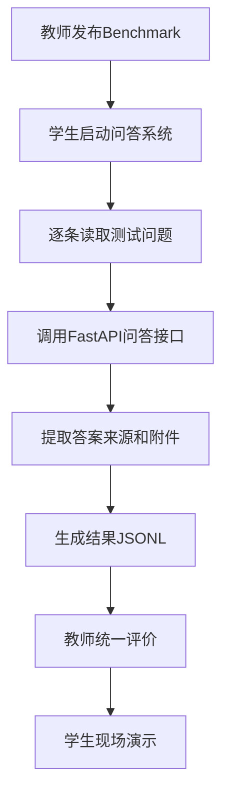

# 7.1 Benchmark综合测试与系统演示

### （一）本节目标

Benchmark 综合测试用于统一评价系统的知识检索、智能问答、来源返回、附件查询和 Agent 任务完成效果。

教师提供只包含测试编号和测试问题的 Benchmark 文件。学生运行自己的系统完成全部测试，并按照统一格式生成结果文件。

教师保存以下标准数据，不向学生公开：

- 参考答案；
- 正确来源网址；
- 预期附件名称。

测试只评价系统最终输出，不要求提交 Agent 的任务判断、工具选择和内部调用过程。

基本流程如下：



------

### （二）教师提供的Benchmark格式

#### 1. 文件格式

教师提供的文件采用 JSONL 格式，每行表示一条独立测试用例。

文件名称可以设置为：

```text
data/benchmark.jsonl
```

每条记录只包含以下字段：

| 字段       | 说明         |
| ---------- | ------------ |
| `id`       | 测试用例编号 |
| `question` | 测试问题     |

示例：

```json
{"id":"test_001","question":"研究生奖学金申请截止时间是什么时候？"}
{"id":"test_002","question":"请提供研究生奖学金申请表。"}
{"id":"test_003","question":"统计近三年发布的招生通知数量。"}
```

测试问题可以覆盖：

- 知识问答；
- 时间、条件和流程查询；
- 来源查询；
- 附件查找；
- 数据统计；
- 多工具组合任务；
- 知识库中不存在的问题。

#### 2. 执行要求

学生执行 Benchmark 时应遵守以下要求：

- 不得修改测试编号；
- 不得修改测试问题；
- 每个测试编号必须生成一条结果；
- 每条问题使用独立会话；
- 不使用上一条问题的聊天历史；
- 不人工修改系统生成的答案；
- 测试失败时也必须保留该记录。

独立会话编号可以设置为：

```text
benchmark_test_001
benchmark_test_002
benchmark_test_003
```

这样可以避免多轮对话内容影响测试结果。

------

### （三）学生提交结果格式

#### 1. 结果字段

学生提交文件也采用 JSONL 格式，每条记录包含：

| 字段          | 说明           |
| ------------- | -------------- |
| `id`          | 原始测试编号   |
| `question`    | 原始测试问题   |
| `answer`      | 系统最终回答   |
| `sources`     | 来源网址数组   |
| `attachments` | 附件文件名数组 |

示例：

```json
{"id":"test_001","question":"研究生奖学金申请截止时间是什么时候？","answer":"研究生奖学金申请截止时间为10月15日。","sources":["https://example.edu.cn/notice/001"],"attachments":[]}
{"id":"test_002","question":"请提供研究生奖学金申请表。","answer":"已找到研究生奖学金申请表。","sources":["https://example.edu.cn/notice/001"],"attachments":["研究生奖学金申请表.docx"]}
```

没有来源或附件时，必须填写空数组：

```json
{
  "sources": [],
  "attachments": []
}
```

#### 2. 来源填写要求

`sources` 只填写完整网址。

正确示例：

```text
https://example.edu.cn/notice/001
```

错误示例：

```text
研究生奖学金申请通知
/notice/001
doc_001
```

如果系统返回多个相同网址，提交前需要去重。

#### 3. 附件填写要求

`attachments` 只填写附件文件名称。

正确示例：

```text
研究生奖学金申请表.docx
```

错误示例：

```text
附件：研究生奖学金申请表.docx
/files/研究生奖学金申请表.docx
https://example.edu.cn/download/att_001
att_001
```

不得填写：

- 附件编号；
- S3对象路径；
- 本地文件路径；
- 临时下载网址；
- “附件：”等额外前缀。

#### 4. 失败结果

系统无法回答或接口调用失败时，不能删除该测试记录，应提交空结果：

```json
{"id":"test_004","question":"查询某项不存在的通知。","answer":"","sources":[],"attachments":[]}
```

提交文件不需要包含：

- 响应时间；
- HTTP状态码；
- 错误堆栈；
- 模型名称；
- 工具调用过程；
- Agent执行步骤。

------

### （四）Benchmark执行流程

学生执行 Benchmark 的步骤如下：

1. 启动 MySQL、S3 和模型服务；
2. 启动 FastAPI 后端；
3. 检查 FAISS 索引是否加载成功；
4. 读取教师提供的 `benchmark.jsonl`；
5. 为每个问题生成独立会话编号；
6. 调用 `/api/qa` 问答接口；
7. 提取最终答案；
8. 提取完整来源网址；
9. 提取附件文件名；
10. 写入结果 JSONL；
11. 检查结果数量和字段格式；
12. 提交结果文件。

执行过程中不能跳过测试问题。

------

### （五）Benchmark执行程序

下面的程序读取教师提供的 Benchmark，调用 FastAPI 接口，并生成提交结果。

```python
import json
from pathlib import Path

import requests


BENCHMARK_FILE = Path(
    "./data/benchmark.jsonl"
)

RESULT_FILE = Path(
    "./outputs/benchmark_result.jsonl"
)

QA_API = "http://127.0.0.1:8000/api/qa"

REQUEST_TIMEOUT = 120
```

#### 1. 读取Benchmark

```python
def load_jsonl(
    file_path: Path
) -> list[dict]:
    records = []

    with file_path.open(
        "r",
        encoding="utf-8"
    ) as file:
        for line_number, line in enumerate(
            file,
            start=1
        ):
            line = line.strip()

            if not line:
                continue

            try:
                record = json.loads(line)
            except json.JSONDecodeError as exc:
                raise ValueError(
                    f"第{line_number}行JSON格式错误"
                ) from exc

            if (
                "id" not in record
                or "question" not in record
            ):
                raise ValueError(
                    f"第{line_number}行缺少"
                    "id或question字段"
                )

            records.append(record)

    return records
```

#### 2. 调用问答接口

```python
def call_qa_api(
    question: str,
    session_id: str
) -> dict:
    response = requests.post(
        QA_API,
        json={
            "question": question,
            "session_id": session_id,
            "use_agent": True
        },
        timeout=REQUEST_TIMEOUT
    )

    response.raise_for_status()

    return response.json()
```

设置 `use_agent=True` 后，后端可以根据问题自动选择 RAG 或 Agent 工具。

#### 3. 提取来源网址

```python
def extract_source_urls(
    sources: list
) -> list[str]:
    urls = []

    for source in sources:
        if isinstance(source, str):
            url = source

        elif isinstance(source, dict):
            url = source.get(
                "source_url",
                ""
            )

        else:
            continue

        url = str(url).strip()

        if url.startswith(
            ("http://", "https://")
        ):
            urls.append(url)

    return list(dict.fromkeys(urls))
```

该函数只保留完整网址，并删除重复地址。

#### 4. 提取附件名称

```python
def extract_attachment_names(
    attachments: list
) -> list[str]:
    names = []

    for attachment in attachments:
        if isinstance(attachment, str):
            file_name = attachment

        elif isinstance(attachment, dict):
            file_name = attachment.get(
                "file_name",
                ""
            )

        else:
            continue

        file_name = Path(
            str(file_name).strip()
        ).name

        if file_name:
            names.append(file_name)

    return list(dict.fromkeys(names))
```

使用 `Path(...).name` 可以去掉目录，只保留文件名称。

#### 5. 执行全部测试

```python
def run_benchmark() -> None:
    records = load_jsonl(
        BENCHMARK_FILE
    )

    if not records:
        print(
            "Benchmark中没有有效测试数据。"
        )
        return

    RESULT_FILE.parent.mkdir(
        parents=True,
        exist_ok=True
    )

    with RESULT_FILE.open(
        "w",
        encoding="utf-8"
    ) as result_file:

        for index, record in enumerate(
            records,
            start=1
        ):
            test_id = str(record["id"])

            question = str(
                record["question"]
            ).strip()

            try:
                response_data = call_qa_api(
                    question=question,
                    session_id=(
                        f"benchmark_{test_id}"
                    )
                )

                result = {
                    "id": test_id,
                    "question": question,
                    "answer": str(
                        response_data.get(
                            "answer",
                            ""
                        )
                    ).strip(),
                    "sources":
                        extract_source_urls(
                            response_data.get(
                                "sources",
                                []
                            )
                        ),
                    "attachments":
                        extract_attachment_names(
                            response_data.get(
                                "attachments",
                                []
                            )
                        )
                }

                print(
                    f"[{index}/{len(records)}] "
                    f"{test_id}执行完成"
                )

            except requests.RequestException as exc:
                result = {
                    "id": test_id,
                    "question": question,
                    "answer": "",
                    "sources": [],
                    "attachments": []
                }

                print(
                    f"[失败] {test_id}：{exc}"
                )

            result_file.write(
                json.dumps(
                    result,
                    ensure_ascii=False
                )
                + "\n"
            )

    print("-" * 40)
    print("测试数量：", len(records))
    print("结果文件：", RESULT_FILE)


if __name__ == "__main__":
    run_benchmark()
```

安装依赖：

```bash
pip install requests
```

执行程序：

```bash
python run_benchmark.py
```

输出文件：

```text
outputs/benchmark_result.jsonl
```

------

### （六）提交结果检查

提交前应检查以下内容：

| 检查项目      | 要求                   |
| ------------- | ---------------------- |
| 结果数量      | 与教师测试数量一致     |
| 测试编号      | 不缺失、不重复、不修改 |
| 原始问题      | 与教师文件完全一致     |
| JSON格式      | 每行可以独立解析       |
| `answer`      | 必须为字符串           |
| `sources`     | 必须为网址数组         |
| `attachments` | 必须为文件名数组       |
| 空结果        | 使用空字符串和空数组   |
| 文件编码      | 使用UTF-8              |
| 文件名称      | 按教师要求命名         |

可以增加一个简单检查函数：

```python
def validate_results(
    benchmark_records: list[dict],
    result_records: list[dict]
) -> None:
    if len(benchmark_records) != len(
        result_records
    ):
        raise ValueError(
            "结果数量与Benchmark数量不一致"
        )

    for source, result in zip(
        benchmark_records,
        result_records
    ):
        if str(source["id"]) != str(
            result.get("id")
        ):
            raise ValueError(
                "测试编号不一致"
            )

        if source["question"] != result.get(
            "question"
        ):
            raise ValueError(
                "测试问题被修改"
            )

        if not isinstance(
            result.get("sources"),
            list
        ):
            raise ValueError(
                "sources必须是数组"
            )

        if not isinstance(
            result.get("attachments"),
            list
        ):
            raise ValueError(
                "attachments必须是数组"
            )
```

------

### （七）Benchmark评价指标

教师根据未公开的标准数据统一评价学生结果。

核心指标包括：

- 答案 F1；
- 来源命中率；
- 附件命中率；
- 测试完成率。

#### 1. 答案F1

答案 F1 用于评价系统答案与参考答案的内容重合程度。

设：

- 系统答案包含的有效内容单元数量为 (P)；
- 参考答案包含的有效内容单元数量为 (R)；
- 两者匹配的内容单元数量为 (M)。

精确率为：

$$
Precision=\frac{M}{P}
$$


召回率为：

$$
Recall=\frac{M}{R}
$$


F1 值为：

$$
F1=\frac{2\times Precision\times Recall}
{Precision+Recall}
$$


当精确率和召回率都为 0 时，F1 记为 0。

全部测试的平均 F1 为：

$$
Macro\text{-}F1=
\frac{1}{N}
\sum_{i=1}^{N}F1_i
$$


其中，(N) 表示测试用例数量。

中文回答可以使用：

- 字符级 F1；
- 分词后的词语级 F1。

计算前应统一处理：

- 多余空格；
- 换行；
- 常见标点；
- 字母大小写。

日期、数字、人名和文件名等短答案，还可以结合完全匹配进行人工复核。

词级别 F1 计算实现如下：

```python
def compute_f1(target_answer: str, answer: str) -> float:
    """计算词级别 F1，返回 0~1，同时支持中英文。"""
    import re
    import string
    from collections import Counter

    # 中文标点
    CN_PUNCT = (
        "，。！？…—""''【】《》（）　"
        "；：、·～"
    )

    def normalize(text: str) -> list[str]:
        # 统一小写
        text = text.lower()
        # 换行替换为空格，防止词语粘连
        text = text.replace("\n", " ").replace("\r", " ")
        # 移除中文标点
        for ch in CN_PUNCT:
            text = text.replace(ch, " ")
        # 移除英文标点
        for ch in string.punctuation:
            text = text.replace(ch, " ")
        # 合并多余空白
        text = re.sub(r"\s+", " ", text).strip()
        # 分词：优先 jieba，回退 split
        try:
            import jieba
            tokens = jieba.lcut(text)
        except ImportError:
            tokens = text.split()
        # 去除空 token
        tokens = [t.strip() for t in tokens if t.strip()]
        return tokens

    target_tokens = normalize(target_answer)
    answer_tokens = normalize(answer)

    if not target_tokens or not answer_tokens:
        return float(target_tokens == answer_tokens)

    common = Counter(target_tokens) & Counter(answer_tokens)
    same_count = sum(common.values())

    if same_count == 0:
        return 0.0

    precision = same_count / len(answer_tokens)
    recall = same_count / len(target_tokens)

    return 2 * precision * recall / (precision + recall)
```

调用示例：

```python
# 英文示例
score = compute_f1(
    target_answer="Alexander Fleming",
    answer="Fleming"
)

# 中文示例
score = compute_f1(
    target_answer="研究生奖学金申请截止时间为10月15日。",
    answer="奖学金申请截止时间是10月15日。"
)
```

该函数对中英文文本做小写转换、去标点、去停用词后，按词级别计算 F1。
中文场景使用 jieba 分词；若 jieba 未安装则自动回退为按空白分词。

#### 2. 来源命中率

来源命中率用于评价系统是否返回正确网页。

对于第 (i) 条测试：

$$
SourceHit_i=
\begin{cases}
1, & \text{提交来源中包含正确网址}\
0, & \text{否则}
\end{cases}
$$


总体来源命中率为：

$$
SourceHitRate=
\frac{\sum_{i=1}^{N}SourceHit_i}{N}
$$


如果某条测试不要求来源，可以不计入来源指标的分母。

来源网址应进行基础规范化，例如去除网址末尾多余的 `/`，但不能将不同网页视为同一来源。

#### 3. 附件命中率

附件命中率用于评价系统是否返回正确附件名称。

对于第 (i) 条测试：

$$
AttachmentHit_i=
\begin{cases}
1, & \text{提交附件中包含正确文件名}\
0, & \text{否则}
\end{cases}
$$


总体附件命中率为：

$$
AttachmentHitRate=
\frac{\sum_{i=1}^{N}AttachmentHit_i}{N}
$$


如果某条测试不要求附件，可以不计入附件指标的分母。

文件名比较时可以统一处理前后空格，但文件名称和扩展名应保持正确。

#### 4. 测试完成率

测试完成率用于检查学生是否为每个测试编号生成结果。

$$
CompletionRate=
\frac{\text{已提交测试数量}}
{\text{教师发布测试数量}}
$$


即使系统回答为空，只要保留了测试编号，也视为已提交该测试。

#### 5. 指标说明

不同指标评价系统的不同能力：

| 指标       | 评价内容                 |
| ---------- | ------------------------ |
| 答案F1     | 回答内容是否接近参考答案 |
| 来源命中率 | 是否找到正确网页         |
| 附件命中率 | 是否找到正确附件         |
| 测试完成率 | 是否完成全部测试         |

教师可以根据课程要求设置各指标权重。

------

### （八）结果分析

完成测试后，学生应对错误结果进行简单分析。

常见错误类型包括：

| 错误类型   | 可能原因                           |
| ---------- | ---------------------------------- |
| 答案错误   | 检索结果不相关或模型生成错误       |
| 答案不完整 | Top-K过小或上下文不足              |
| 来源错误   | 元数据未正确保存或来源映射错误     |
| 附件缺失   | 附件关联查询失败                   |
| 统计错误   | 查询范围或时间条件错误             |
| 空结果     | 接口失败、索引未加载或知识库无内容 |
| 重复来源   | 相邻文本块来源未去重               |
| 文件名错误 | 提交了路径或下载链接               |

学生只需选择几条典型错误进行分析，不需要对每条测试逐一解释。

------

### （九）系统现场演示

完成 Benchmark 测试后，还需要进行系统现场演示。

演示内容包括：

1. 展示采集的网页和附件；
2. 展示 S3 兼容对象存储中的原始文件；
3. 展示 MySQL 中的网页和附件记录；
4. 展示 PySpark 清洗或统计结果；
5. 展示文档解析结果；
6. 展示文本块和 FAISS 索引；
7. 演示普通知识问答；
8. 演示答案来源和 PDF 页码；
9. 演示打开原始网页；
10. 演示查询并下载附件；
11. 演示统计或多步骤 Agent 任务；
12. 演示知识库中不存在的问题；
13. 演示接口失败或附件不存在时的提示。

演示时应重点说明：

```text
用户输入了什么
        ↓
系统调用了什么能力
        ↓
最终返回了什么结果
```

不要求逐行讲解全部源代码。

------

### （十）推荐演示问题

可以准备以下几类问题：

```text
研究生奖学金申请截止时间是什么时候？
申请学位论文答辩需要提交哪些材料？
该规定来自哪个网页和文件？
请提供研究生奖学金申请表。
统计近三年发布的招生通知数量。
查询答辩条件并提供相关申请表。
查询一项知识库中不存在的制度。
```

演示问题应覆盖 RAG、来源、附件和 Agent 功能。

------

### （十一）本节任务

完成本节后，应形成以下成果：

- 理解教师 Benchmark 文件格式；
- 不修改测试编号和测试问题；
- 为每条问题创建独立会话；
- 编写 Benchmark 执行程序；
- 批量调用 FastAPI 问答接口；
- 提取最终回答；
- 提取完整来源网址；
- 提取附件文件名称；
- 生成统一 JSONL 结果文件；
- 保留执行失败的测试记录；
- 检查结果数量和字段格式；
- 理解答案 F1、来源命中率和附件命中率；
- 对典型错误进行简单分析；
- 完成系统现场演示；
- 保存结果文件、测试截图和演示材料。

完成本节后，学生应能够使用统一 Benchmark 测试完整系统，并生成符合要求的结果文件，用于教师统一评价和课程项目验收。
